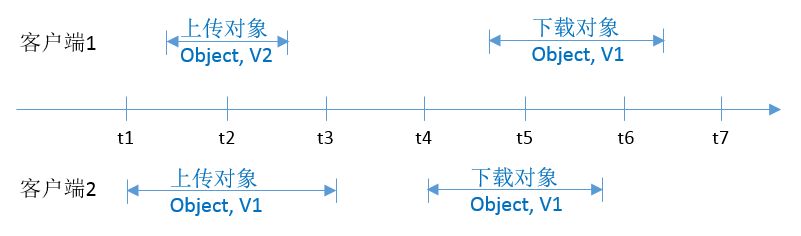
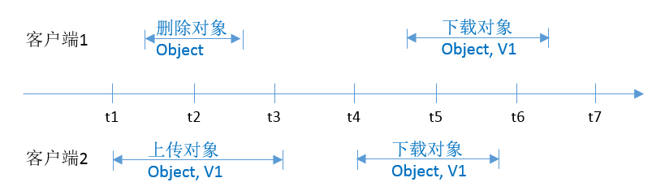
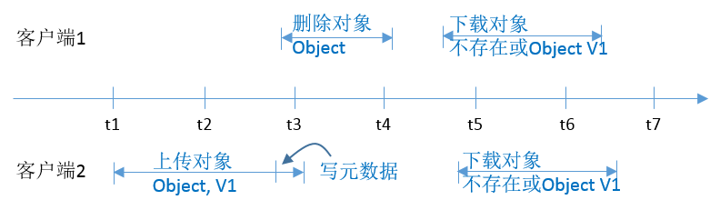
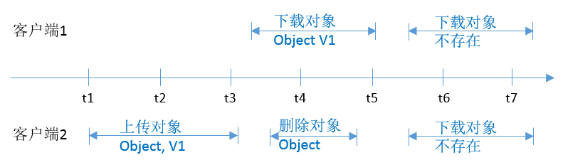
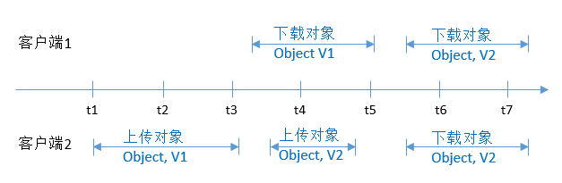
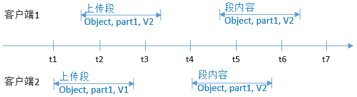

# 并发一致性说明

当客户端发起的写/删除请求返回成功之后，客户端可以获取到最新数据。当写操作客户端等待超时、服务端返回500或者503的HTTP响应错误码时，之后的读取操作有可能成功读取到数据，也有可能读不到数据。建议客户端在出现上述错误时，查询数据是否已经上传成功，如果不成功则重新上传。

针对同一个对象或桶的操作，比如多个客户端对同一个对象并行上传、查询和删除时，具体操作结果依赖于操作到达系统的时间和系统内部处理的时延，可能返回不一致的结果。比如，当多个客户端并行上传同一个对象时，系统最后收到的上传请求会覆盖前一个上传的对象。如果需要避免同一个对象被并行访问，需要在上层应用中增加对象的锁机制。

## 并发操作举例

1. 当客户端2正在上传一个对象v1时，客户端1同时上传一个同名的对象v2成功后，不管是客户端1还是客户端2都能够读取最新的对象数据v1，如[图1](#fig143262124514)所示。

**图 1**  并发成功上传同一个对象  

2. 当客户端2上传一个对象v1的时候，如果在对象数据上传且还没有写入对象元数据的过程中，客户端1删除同名的对象成功后，客户端2的上传对象操作仍然返回成功，并且不论客户端1还是客户端2都能读取到对象数据v1，如[图2](#fig143141034184518)所示。

**图 2**  并发上传和删除同一个对象（1）  

3. 当客户端2上传一个对象v1的时候，如果在对象数据上传完成，系统写入对象元数据的短暂过程中，客户端1发起删除同名的对象成功后，客户端2的上传对象操作仍然返回成功，但是客户端1和客户端2下载对象Object1时，有可能读到对象数据v1，也有可能返回对象不存在，如[图3](#fig017318519469)所示。

**图 3**  并发上传和删除同一个对象（2）  

4. 当客户端1下载一个对象的过程中，客户端2发起删除同名对象操作，此时客户端1可能下载到完整的对象数据，也有可能只能下载到对象的一部分数据。当客户端2的删除操作返回成功后，再发起下载对象请求，则返回对象不存在，如[图4](#fig17810203484616)所示。

**图 4**  并发下载和删除同一个对象  

5. 当客户端1下载一个对象的过程中，客户端2发起更新同名对象操作，此时客户端1可能下载到完整的对象数据，也有可能只能下载到对象的一部分数据。当客户端2的更新操作返回成功后，再发起下载对象请求，则返回最新的对象数据，如[图5](#fig16197219472)所示。

**图 5**  并发下载和更新同一个对象  

6. 当客户端2正在上传一个对象的段v1时，客户端1同时上传同一个对象的相同段号的段v2成功后，不管是客户端1还是客户端2列举段时都能够列举etag为v2的段信息，如[图6](#fig097482816477)所示。

**图 6**  并发上传同名对象的同名段  

