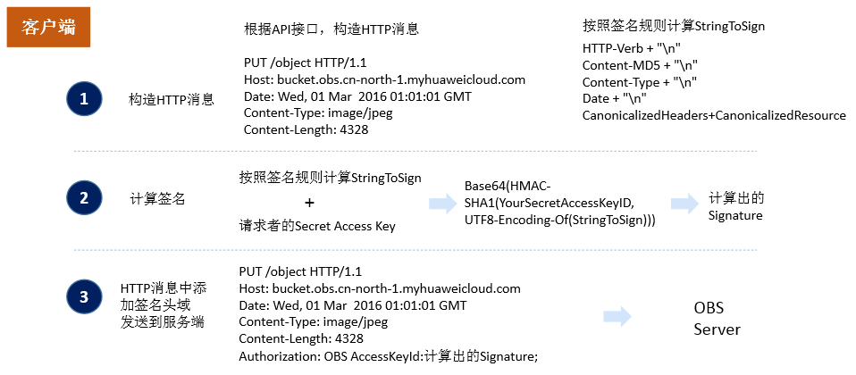

# 用户签名验证

用户注册后，可以在IAM服务中获取AK（Access Key ID）和SK（Secret Key），用于后续访问各个服务时（包括OBS）服务端进行用户身份认证。在向OBS发送请求时，客户端发送的每个消息头需要包含由SK、请求时间、请求类型等信息生成的签名信息。

OBS根据应用场景，提供了Header中携带签名、URL中携带签名和基于浏览器上传的表单中携带签名 3种签名计算方式。

OBS提供的SDK已集成了签名计算，建议您使用SDK进行开发。

OBS签名计算流程如[图1](#fig172071124498)和[图2](#fig1863744764912)所示：

**图 1**  OBS客户端签名计算流程（1）  

1. 客户端在调用OBS API接口前，根据OBS定义的API接口格式，构造HTTP消息。消息构造完成后，客户端可以根据签名计算规则，从HTTP消息中取特定的字符串，构造出签名所需的StringToSign。

2. 客户端使用自己的Secret Key和构造出的StringToSign计算出签名字符串。

3. 客户端在构造出HTTP消息头域中增加一个签名头域，将用户的Access Key ID和计算出的签名字符串放在签名头域中。客户端将携带签名头域的HTTP消息发送给OBS，等待OBS验证结果。

**图 2**  OBS服务端签名计算流程（2）  

4. OBS服务端收到客户端发来的请求后，先根据签名头域中的Access Key ID从IAM取回用户的Secret Key。

5. OBS服务端根据签名计算规则，从HTTP消息中取特定的字符串，构造出签名所需的StringToSign。OBS将Secret Key和服务端构造出的StringToSign计算得到签名字符串。

6. OBS用服务端计算出的签名字符串和请求头域中携带的客户端计算出的签名字符串做对比。如果服务端和客户端签名一致，则说明客户端使用的Secret Key正确，客户端的身份可以被确认，OBS会按照接口定义进行后续处理。如服务端和客户端签名不一致，说明客户端使用的Secret Key不正确，客户端的身份不能被确认，OBS会直接拒绝该请求。参考：[错误响应列表](错误码列表.md)

