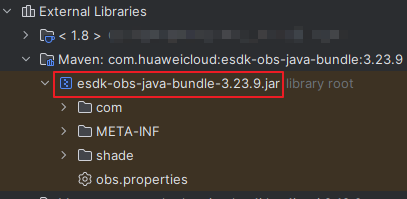
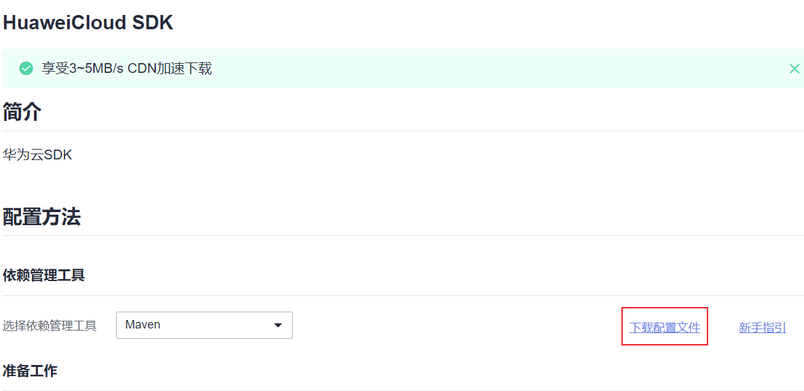

# 下载与安装SDK\(Java SDK\)<a name="obs_21_0001"></a>

## 下载SDK<a name="section10285185142912"></a>

-   OBS Java SDK最新版本源码：[最新版本源码下载](https://github.com/huaweicloud/huaweicloud-sdk-java-obs)
-   OBS Java SDK历史版本下载地址：[历史版本下载](https://github.com/huaweicloud/huaweicloud-sdk-java-obs/releases)

> **说明：** 
>如需采用Maven依赖方式获取SDK，请参见[安装SDK](#section38258207308)章节。

## 安装方式概览<a name="section38258207308"></a>

如[表1](#table6377143115452)所示，Java SDK以下安装方式。

**表 1**  Java SDK安装方式概览

|序号|方式|
|--|--|
|1|使用Maven中央仓库和Maven工程下载安装OBS Java SDK|
|2|使用Gradle中央仓库和Gradle工程下载安装OBS Java SDK|
|3|使用镜像库下载安装OBS Java SDK|
|4|自行编译 Jar 包|


## 方式一：使用Maven中央仓库和Maven工程下载安装OBS Java SDK<a name="section1594210710378"></a>

使用本方式安装SDK前，请确保Java环境和Maven环境正确配置并能正常使用。

1.  <a name="li8603323193713"></a>访问Maven中央仓库获取OBS Java SDK版本号。获取Bundle版本请访问[链接](https://mvnrepository.com/artifact/com.huaweicloud/esdk-obs-java-bundle)，获取普通版本请访问[链接](https://mvnrepository.com/artifact/com.huaweicloud/esdk-obs-java)，建议使用最新版本的SDK。例如，此处选择Bundle 3.23.9版本。

    > **说明：** 
    >-   Bundle版本与普通版本源代码相同，区别在于 Bundle 版将所有三方依赖打包并重定向至包内，不再依赖外部三方包，可避免因依赖冲突导致的问题，相应的 Bundle 版 SDK 占用的空间也更大（7M+）。
    >-   在使用普通版本的过程中遇到依赖冲突问题时，可参考  [依赖缺失和依赖冲突的解决\(Java SDK\)](依赖缺失和依赖冲突的解决(Java-SDK).md)  解决。

2.  打开Maven工程的pom.xml文件，在“<dependencies\>”节点中加入依赖配置。

    如果您选择使用Bundle版本，请将以下配置添加到“<dependencies\>”节点中，并将“bundleVersionNumber”修改为步骤[1](#li8603323193713)中获取的Java SDK版本号：

    ```
    <dependency>
       <groupId>com.huaweicloud</groupId>
       <artifactId>esdk-obs-java-bundle</artifactId>
       <version>bundleVersionNumber</version>
    </dependency>
    ```

    例如您如果选择使用Bundle 3.23.9版本，那么您的pom.xml文件应该插入以下配置：

    ```
    <dependency>
       <groupId>com.huaweicloud</groupId>
       <artifactId>esdk-obs-java-bundle</artifactId>
       <version>3.23.9</version>
    </dependency>
    ```

    如果您选择使用普通版本，请将以下配置添加到“<dependencies\>”节点，并将“VersionNumber”修改为为步骤[1](#li8603323193713)中获取的Java SDK版本号：

    ```
    <dependency>
       <groupId>com.huaweicloud</groupId>
       <artifactId>esdk-obs-java</artifactId>
       <version>versionNumber</version>
    </dependency>
    ```

3.  刷新Maven配置，即Reload All Maven Projects。
4.  如果在您的依赖路径下，下载了Java SDK的jar包，则说明Java SDK安装成功。如果未下载jar包，请检查是否正确配置了pom.xml文件，版本号是否正确替换。如仍未解决，请[提交工单](https://console.huaweicloud.com/ticket/#/ticketindex/createIndex)寻求技术支持。

    

## 方式二：使用Gradle中央仓库和Gradle工程下载安装OBS Java SDK<a name="section19757131210283"></a>

使用本方式安装SDK前，请确保Java环境和Gradle环境正确配置并能正常使用。

1.  <a name="li17357131722813"></a>获取OBS Java SDK版本号。获取Bundle版本请访问[链接](https://mvnrepository.com/artifact/com.huaweicloud/esdk-obs-java-bundle)，获取普通版本请访问[链接](https://mvnrepository.com/artifact/com.huaweicloud/esdk-obs-java)，建议使用最新版本的SDK。例如，此处选择Bundle 3.23.9版本。

    > **说明：** 
    >-   Bundle版本与普通版本源代码相同，区别在于 Bundle 版将所有三方依赖打包并重定向至包内，不再依赖外部三方包，可避免因依赖冲突导致的问题，相应的 Bundle 版 SDK 占用的空间也更大（7M+）。
    >-   在使用普通版本的过程中遇到依赖冲突问题时，可参考  [依赖缺失和依赖冲突的解决\(Java SDK\)](依赖缺失和依赖冲突的解决(Java-SDK).md)  解决。

2.  打开Gradle工程的build.gradle文件，在“dependencies”中加入依赖配置。

    如果您选择使用Bundle版本，请将以下配置添加到“dependencies”节点中，并将“bundleVersionNumber”修改为步骤[1](#li17357131722813)中获取的Java SDK版本号：

    ```
    api 'com.huaweicloud:esdk-obs-java-bundle:bundleVersionNumber'
    ```

    例如您如果选择使用Bundle 3.23.9版本，那么您的pom.xml文件应该插入以下配置：

    ```
    api 'com.huaweicloud:esdk-obs-java-bundle:3.23.9'
    ```

    如果您选择使用普通版本，请将以下配置添加到“<dependencies\>”节点，并将“VersionNumber”修改为步骤[1](#li17357131722813)中获取的Java SDK版本号：

    ```
    api 'com.huaweicloud:esdk-obs-java:versionNumber'
    ```

3.  刷新Gradle配置，即Reload All Gradle Projects。
4.  如果在您的依赖路径下，下载了Java SDK的jar包，则说明Java SDK安装成功。如果未生成jar包，请检查是否正确配置了build.gradle文件，版本号是否正确替换。如仍未解决，请[提交工单](https://console.huaweicloud.com/ticket/#/ticketindex/createIndex)寻求技术支持。

## 方式三：使用镜像库下载安装OBS Java SDK<a name="section65131517101213"></a>

使用本方式安装SDK前，请确保Java环境和Maven环境正确配置并能正常使用，详细步骤如下：

1.  使用浏览器打开华为开源镜像站：[https://mirrors.huaweicloud.com](https://mirrors.huaweicloud.com)。
2.  从打开站点的网页中，找到“HuaweiCloud SDK”面板并单击进入依赖管理工具配置说明页面。
3.  在依赖管理工具配置说明页面，单击右上方的“下载配置文件”，下载并保存Maven配置文件。

    

4.  使用下载好的Maven配置文件（settings.xml）替换本地Maven的全局配置文件，例如windows系统中该文件通常位于**“C:\\Users\\<administrator\>\\.m2”**下。
5.  打开Maven工程的pom.xml文件，在“<dependencies\>”节点中加入依赖配置。

    如果您选择使用Bundle版本，请将以下配置添加到“<dependencies\>”节点中，并将“bundleVersionNumber”修改为您正在使用的Java SDK版本号：

    ```
    <dependency>
       <groupId>com.huaweicloud</groupId>
       <artifactId>esdk-obs-java-bundle</artifactId>
       <version>bundleVersionNumber</version>
    </dependency>
    ```

    例如您如果选择使用Bundle 3.23.9版本，那么您的pom.xml文件应该插入以下配置：

    ```
    <dependency>
       <groupId>com.huaweicloud</groupId>
       <artifactId>esdk-obs-java-bundle</artifactId>
       <version>3.23.9</version>
    </dependency>
    ```

    如果您选择使用普通版本，请将以下配置添加到“<dependencies\>”节点，并将“VersionNumber”修改为您正在使用的Java SDK版本号：

    ```
    <dependency>
       <groupId>com.huaweicloud</groupId>
       <artifactId>esdk-obs-java</artifactId>
       <version>versionNumber</version>
    </dependency>
    ```

6.  运行Maven命令（如：mvn package）下载SDK。

## 方式四：自行编译 Jar 包<a name="section148723251129"></a>

您可以下载Java SDK源码，然后自行编译 Jar 包。使用本方式安装SDK前，请确保Java环境和Maven环境正确配置并能正常使用，详细步骤如下：

1.  [下载](#section10285185142912)SDK源码并解压。
2.  通过命令行进入源码解压目录。
3.  运行如下命令

    ```
    mvn clean package -Dmaven.test.skip=true -f pom-java.xml
    ```

4.  构建产物位于解压目录中的target目录下。
5.  将生成的jar包放置于本地工程的依赖路径。

