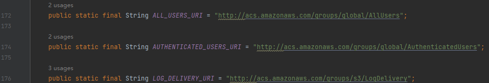

# 为什么SDK源码中包含acs.amazonaws.com关键字？\(Java SDK\)

OBS SDK 为了兼容访问aws s3服务，在源码中会包含acs.amazonaws.com关键字的固定格式，SDK仅作常量使用，不会向该格式有其他处理，也不会对其访问。SDK会自动兼容该场景，用户可不感知。比如[Java SDK](https://github.com/huaweicloud/huaweicloud-sdk-java-obs/blob/1b8a70d9b0481b154fa8acf726befce631e4ac42/app/src/main/java/com/obs/services/internal/Constants.java#L172C2-L172C2):

