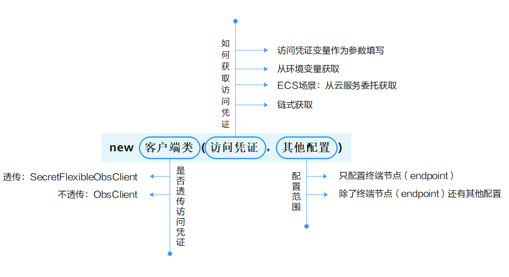

# 创建并配置客户端\(Java SDK\)<a name="obs_21_0202"></a>

## 操作场景<a name="section18593105310108"></a>

本章节指导客户创建并配置客户端，该任务是使用SDK与OBS交互的必备前置任务。如果您已有客户端，请跳过该节，直接参考[Java SDK接口概览\(Java SDK\)](Java-SDK接口概览(Java-SDK).md)获取接口信息。

## 前提条件<a name="section12389152570"></a>

初始化客户端之前，您需要先完成以下几项准备工作：

1.  [使用前须知\(Java SDK\)](使用前须知(Java-SDK).md)：了解并选择合适的SDK版本。
2.  [使用前准备\(Java SDK\)](使用前准备(Java-SDK).md)：完成服务环境和开发环境准备。
3.  [下载与安装SDK\(Java SDK\)](下载与安装SDK(Java-SDK).md)：下载SDK并完成安装。

## 注意事项<a name="section3462114016918"></a>

-   客户端在创建时必须同步完成客户端配置，配置机会仅有一次，创建完成后，不能对客户端进行二次配置。
-   在使用临时aksk时，aksk会有过期时间，可调用ObsClient.refresh\("yourAccessKey", "yourSecretKey", "yourSecurityToken"\)刷新ObsClient的aksk，不必重新创建ObsClient。
-   建议整个代码工程全局使用一个ObsClient客户端，只在程序初始化时创建一次，因为创建多个ObsClient客户端在高并发场景下会影响性能。
-   ObsClient是线程安全的，可在并发场景下使用。
-   ObsClient在调用ObsClient.close方法关闭后不能再次使用，保证全局使用一个ObsClient客户端的情况下，不建议主动关闭ObsClient客户端。

## 配置概览<a name="section235154316127"></a>

**图 1**  创建并配置客户端概览<a name="fig1811454193012"></a>  


如[图](#fig1811454193012)所示，请根据需要选择客户端类、选择获取访问密钥的方法，以及进行其他配置：

**表 1**  创建并配置客户端概览

|**选择项**|**可选项**|**说明**|**示例代码**|
|--|--|--|--|
|客户端类|不透传密钥的客户端类|如果您只想配置一次访问凭证，不想在每一次调用OBS接口时都为客户端设置一次访问密钥，请使用普通客户端类ObsClient创建客户端。|ObsClient示例代码|
|透传密钥的客户端类|如果您需要在每次调用接口时，都为客户端设置一次访问凭证，OBS Java SDK提供了直接在接口方法中透传AK和SK的OBS客户端类SecretFlexibleObsClient，SecretFlexibleObsClient继承自ObsClient。|SecretFlexibleObsClient示例代码|
|访问凭证获取方式|从变量传入|创建OBS客户端实例，并使用变量传入方式的访问凭证。|访问凭证变量直接作为参数示例代码BasicObsCredentialsProvider示例代码|
|从环境变量获取|创建OBS客户端实例，并使用EnvironmentVariableObsCredentialsProvider从环境变量获取访问凭证。|EnvironmentVariableObsCredentialsProvider示例代码|
|ECS场景从云服务委托获取|创建OBS客户端实例，并使用EcsObsCredentialsProvider从ECS服务器自动获取临时访问密钥，并且访问凭证会定期自动刷新。使用EcsObsCredentialsProvider的前提，应用程序须运行在ECS服务器上，并且ECS绑定了IAM对ECS的云服务委托（该委托拥有OBS权限）。请确保服务端和应用程序部署所在环境的UTC时间一致，否则可能会导致临时访问密钥无法及时刷新。使用该方式创建客户端时，SDK会请求固定IP（169.254.169.254）的API获取临时AKSK，具体请参见在ECS上获取Security Key。|EnvironmentVariableObsCredentialsProvider示例代码|
|链式获取|以链式的方式从预定义方式列表中搜索访问密钥，以第一组成功获取到的访问密钥创建OBS客户端。当前顺序是默认先从环境变量，再从ECS服务器委托中进行搜索，暂不支持自定义获取方式和顺序。|OBSCredentialsProviderChain示例代码|
|其他配置|只配置终端节点（endpoint）|除了访问凭证外，只配置中终端节点（endpoint）参数。|除访问凭证外只配置endpoint示例代码|
|除了配置终端节点（endpoint）还有其他配置|除了配置终端节点（endpoint）还需要配置HTTP代理、Socket层传输数据超时时间等参数，您可通过ObsConfiguration配置类对ObsClient进行配置，支持的配置项参见表2。|ObsConfiguration示例代码|


## 示例代码<a name="section1238720468352"></a>

-   <a name="li17517354514"></a>**使用不透传访问凭证的客户端类，直接配置访问凭证，除访问凭证外只配置终端节点（endpoint）的示例代码**
    -   永久访问密钥（AK/SK）创建OBS客户端的代码如下:

        ```
        // Endpoint以北京四为例，其他地区请按实际情况填写。
        String endPoint = "https://obs.cn-north-4.myhuaweicloud.com";
        // 认证用的ak和sk硬编码到代码中或者明文存储都有很大的安全风险，建议在配置文件或者环境变量中密文存放，使用时解密，确保安全；本示例以ak和sk保存在环境变量中为例，运行本示例前请先在本地环境中设置环境变量ACCESS_KEY_ID和SECRET_ACCESS_KEY_ID。
        // 您可以登录访问管理控制台获取访问密钥AK/SK，获取方式请参见https://support.huaweicloud.com/usermanual-ca/ca_01_0003.html
        String ak = System.getenv("ACCESS_KEY_ID");
        String sk = System.getenv("SECRET_ACCESS_KEY_ID");
        // 创建ObsClient实例
        ObsClient obsClient = new ObsClient(ak, sk, endPoint);
         
        // 使用访问OBS
                
        // 关闭obsClient
        obsClient.close();
        ```

    -   临时访问密钥（AK/SK/SecurityToken）创建OBS客户端的代码如下：

        ```
        // Endpoint以北京四为例，其他地区请按实际情况填写。
        String endPoint = "https://obs.cn-north-4.myhuaweicloud.com";
        // 认证用的ak和sk硬编码到代码中或者明文存储都有很大的安全风险，建议在配置文件或者环境变量中密文存放，使用时解密，确保安全；本示例以ak和sk保存在环境变量中为例，运行本示例前请先在本地环境中设置环境变量ACCESS_KEY_ID和SECRET_ACCESS_KEY_ID。
        // 您可以登录访问管理控制台获取访问密钥AK/SK，获取方式请参见https://support.huaweicloud.com/usermanual-ca/ca_01_0003.html
        String ak = System.getenv("ACCESS_KEY_ID");
        String sk = System.getenv("SECRET_ACCESS_KEY_ID");
        String securityToken = System.getenv("SECRET_TOKEN");
        // 创建ObsClient实例
        ObsClient obsClient = new ObsClient(ak, sk, securityToken, endPoint);
         
        // 使用访问OBS
                
        // 关闭obsClient
        obsClient.close();
        
        ```

    -   <a name="li15332171519"></a>BasicObsCredentialsProvider示例代码

        ```
        // Endpoint以北京四为例，其他地区请按实际情况填写。
        String endPoint = "https://obs.cn-north-4.myhuaweicloud.com";
        // 认证用的ak和sk硬编码到代码中或者明文存储都有很大的安全风险，建议在配置文件或者环境变量中密文存放，使用时解密，确保安全；本示例以ak和sk保存在环境变量中为例，运行本示例前请先在本地环境中设置环境变量ACCESS_KEY_ID和SECRET_ACCESS_KEY_ID。
        // 您可以登录访问管理控制台获取访问密钥AK/SK，获取方式请参见https://support.huaweicloud.com/usermanual-ca/ca_01_0003.html
        String ak = System.getenv("ACCESS_KEY_ID");
        String sk = System.getenv("SECRET_ACCESS_KEY_ID");
        // 创建ObsClient实例
        ObsClient obsClient = new ObsClient(new BasicObsCredentialsProvider(ak, sk), endPoint);
         
        // 使用访问OBS
                
        // 关闭obsClient
        obsClient.close();
        ```

-   <a name="li4583124514"></a>**透传密钥客户端类（SecretFlexibleObsClient）示例代码**

    ```
    // Endpoint以北京四为例，其他地区请按实际情况填写。
    String endPoint = "https://obs.cn-north-4.myhuaweicloud.com";
    // 创建ObsConfiguration配置类实例
    ObsConfiguration config = new ObsConfiguration();
    config.setEndPoint(endPoint);
    
    // 创建SecretFlexibleObsClient实例
    SecretFlexibleObsClient obsClient = new SecretFlexibleObsClient(config);
    // 使用访问OBS
    // 认证用的ak和sk硬编码到代码中或者明文存储都有很大的安全风险，建议在配置文件或者环境变量中密文存放，使用时解密，确保安全；本示例以ak和sk保存在环境变量中为例，运行本示例前请先在本地环境中设置环境变量ACCESS_KEY_ID和SECRET_ACCESS_KEY_ID。
    // 您可以登录访问管理控制台获取访问密钥AK/SK，获取方式请参见https://support.huaweicloud.com/usermanual-ca/ca_01_0003.html
    String ak1 = System.getenv("ACCESS_KEY_ID");
    String sk1 = System.getenv("SECRET_ACCESS_KEY_ID");
    obsClient.listBuckets(ak1, sk1);
    
    String ak2 = System.getenv("ACCESS_KEY_ID");
    String sk2 = System.getenv("SECRET_ACCESS_KEY_ID");
    obsClient.listBuckets(ak2, sk2);
    
    // 关闭obsClient
    obsClient.close();
    ```

-   <a name="li11510319451"></a>**从环境变量获取访问凭证（EnvironmentVariableObsCredentialsProvider）示例代码**

    使用该方法需要在环境变量中定义OBS\_ACCESS\_KEY\_ID和OBS\_SECRET\_ACCESS\_KEY分别代表永久的AK和SK。

    ```
    // Endpoint以北京四为例，其他地区请按实际情况填写。
    String endPoint = "https://obs.cn-north-4.myhuaweicloud.com";
    // 创建ObsClient实例
    ObsClient obsClient = new ObsClient(new EnvironmentVariableObsCredentialsProvider(), endPoint);
     
    // 使用访问OBS
            
    // 关闭obsClient
    obsClient.close();
    ```

-   **ECS场景从云服务委托获取访问凭证（EcsObsCredentialsProvider）示例代码**

    ```
    // Endpoint以北京四为例，其他地区请按实际情况填写。
    String endPoint = "https://obs.cn-north-4.myhuaweicloud.com";
    // 创建ObsClient实例
    ObsClient obsClient = new ObsClient(new EcsObsCredentialsProvider(), endPoint);
     
    // 使用访问OBS
            
    // 关闭obsClient
    obsClient.close();
    ```

-   <a name="li14515324519"></a>**链式获取访问凭证（OBSCredentialsProviderChain）示例代码**

    ```
    // Endpoint以北京四为例，其他地区请按实际情况填写。
    String endPoint = "https://obs.cn-north-4.myhuaweicloud.com";
    // 创建ObsClient实例
    ObsClient obsClient = new ObsClient(new OBSCredentialsProviderChain(), endPoint);
     
    // 使用访问OBS
            
    // 关闭obsClient
    obsClient.close();
    ```

-   <a name="li3518394513"></a>**使用ObsConfiguration配置参数示例代码**
    -   配置KeyManagerFactory，配置后可以在本地保存证书，并校验服务端返回证书是否正确。

        ```
        // Endpoint以北京四为例，其他地区请按实际情况填写。
        String endPoint = "https://obs.cn-north-4.myhuaweicloud.com";
        // 认证用的ak和sk硬编码到代码中或者明文存储都有很大的安全风险，建议在配置文件或者环境变量中密文存放，使用时解密，确保安全；本示例以ak和sk保存在环境变量中为例，运行本示例前请先在本地环境中设置环境变量ACCESS_KEY_ID和SECRET_ACCESS_KEY_ID。
        // 您可以登录访问管理控制台获取访问密钥AK/SK，获取方式请参见https://support.huaweicloud.com/usermanual-ca/ca_01_0003.html
        String ak = System.getenv("ACCESS_KEY_ID");
        String sk = System.getenv("SECRET_ACCESS_KEY_ID");
        
        String jksPassword = "you-jks-password";
        String jksPath = "/path/to/your/keystore/file";
        KeyStore ks = KeyStore.getInstance("JKS");
        char[] passArray = jksPassword.toCharArray();
        FileInputStream inputStream = new FileInputStream(jksPath);
        ks.load(inputStream, passArray);
        KeyManagerFactory kmf = KeyManagerFactory.getInstance(KeyManagerFactory.getDefaultAlgorithm());
        kmf.init(ks, passArray);
        
        String trustJKSPassword = "you-trustJKS-password";
        String trustJKSPath = "/path/to/your/trustKeyStore/file";
        KeyStore trustKeyStore = KeyStore.getInstance("JKS");
        char[] trustPassArray = trustJKSPassword.toCharArray();
        FileInputStream trustInputStream = new FileInputStream(trustJKSPath);
        trustKeyStore.load(trustInputStream, trustPassArray);
        TrustManagerFactory tmf = TrustManagerFactory.getInstance(TrustManagerFactory.getDefaultAlgorithm());
        tmf.init(trustKeyStore);
        
        ObsConfiguration config = new ObsConfiguration();
        config.setEndPoint(endPoint);
        config.setKeyManagerFactory(kmf);
        config.setTrustManagerFactory(tmf);
        
        ObsClient obsClient = new ObsClient(ak, sk, config);
        ```

        > **说明：** 
        >本地证书保存格式应为 jks 格式，可以运行以下命令调用 Java 自带的 keytool 工具将 cer 证书转换为 jks 证书。
        >```
        >keytool -import -file your-cer-file.cer -keystore your-keystore-file.jks
        >```

    -   配置 HTTP 代理，配置后SDK 将会通过的代理访问服务端。

        ```
        // Endpoint以北京四为例，其他地区请按实际情况填写。
        String endPoint = "https://obs.cn-north-4.myhuaweicloud.com";
        // 认证用的ak和sk硬编码到代码中或者明文存储都有很大的安全风险，建议在配置文件或者环境变量中密文存放，使用时解密，确保安全；本示例以ak和sk保存在环境变量中为例，运行本示例前请先在本地环境中设置环境变量ACCESS_KEY_ID和SECRET_ACCESS_KEY_ID。
        // 您可以登录访问管理控制台获取访问密钥AK/SK，获取方式请参见https://support.huaweicloud.com/usermanual-ca/ca_01_0003.html
        String ak = System.getenv("ACCESS_KEY_ID");
        String sk = System.getenv("SECRET_ACCESS_KEY_ID");
        
        String proxyUrl = "proxy.com";
        int proxyPort = 8080;
        String proxyUser = "userName";
        String proxyPassword = "password";
        ObsConfiguration config = new ObsConfiguration();
        config.setEndPoint(endPoint);
        config.setHttpProxy(proxyUrl, proxyPort, proxyUser, proxyPassword);
        ObsClient obsClient = new ObsClient(ak, sk,config);
        ```

## ObsConfiguration类支持配置的参数列表<a name="section13701553181613"></a>

> **说明：** 
>-   如需提高文件上传下载性能，在网络带宽满足的情况下，可对socketWriteBufferSize，sockeReadBufferSize，readBufferSize，writeBufferSize四个参数进行调优。
>-   如网络状况不佳，建议增大connectionTimeout和socketTimeout的值。

**表 2**  ObsConfiguration类支持配置的参数列表

|**参数**|**描述**|**方法**|**建议值**|
|--|--|--|--|
|connectionTimeout|**参数解释：**建立HTTP/HTTPS连接的超时时间。**默认取值：**60000，单位：毫秒。|ObsConfiguration.setConnectionTimeout|[10000, 60000]|
|socketTimeout|**参数解释：**Socket层传输数据的超时时间（单位：毫秒）。**默认取值：**60000，单位：毫秒。|ObsConfiguration.setSocketTimeout|[10000, 60000]|
|idleConnectionTime|**参数解释：**如果空闲时间超过此参数的设定值，则关闭连接。**默认取值：**30000，单位：毫秒。|ObsConfiguration.setIdleConnectionTime|根据实际情况设置|
|maxIdleConnections|**参数解释：**连接池中最大空闲连接数。**默认取值：**1000，单位：个。|ObsConfiguration.setMaxIdleConnections|根据实际情况设置|
|maxConnections|**参数解释：**最大允许的HTTP并发请求数。**默认取值：**1000，单位：个。|ObsConfiguration.setMaxConnections|默认|
|maxErrorRetry|**参数解释：**请求失败（请求异常、服务端报500或503错误等）后最大的重试次数。**约束限制：**该参数对于上传对象和下载对象接口时，当上传或下载已经进入数据流处理阶段后产生异常中断，此时将不会重试。**默认取值：**3，单位：次。|ObsConfiguration.setMaxErrorRetry|[0, 5]|
|endPoint|**参数解释：**连接OBS的服务地址。可包含协议类型、域名、端口号。示例：https://your-endpoint:443。（出于安全性考虑，建议使用https协议）**约束限制：**出于DNS解析性能和OBS服务可靠性的考虑，不允许将endPoint设置为IP，必须使用域名访问OBS服务。**默认取值：**无|ObsConfiguration.setEndPoint|根据实际情况设置|
|httpProxy|**参数解释：**HTTP代理配置。**默认取值：**默认为空|ObsConfiguration.setHttpProxy|根据实际情况设置|
|validateCertificate|**参数解释：**是否验证服务端证书。**取值范围：**true：验证服务端证书。false：不验证服务端证书。**默认取值：**false|ObsConfiguration.setValidateCertificate|根据实际情况设置|
|verifyResponseContentType|**参数解释：**是否验证响应头信息的ContentType。**取值范围：**true：验证响应头信息的ContentType。false：不验证响应头信息的ContentType。**默认取值：**true|ObsConfiguration.setVerifyResponseContentType|默认|
|readBufferSize|**参数解释：**从Socket流下载对象的缓存大小，-1表示不设置缓存。**默认取值：**-1，单位：字节。|ObsConfiguration.setReadBufferSize|根据实际情况设置|
|writeBufferSize|**参数解释：**上传对象到Socket流时的缓存大小，-1表示不设置缓存。**默认取值：**-1，单位：字节。|ObsConfiguration.setWriteBufferSize|根据实际情况设置|
|socketWriteBufferSize|**参数解释：**Socket发送缓冲区大小，对应java.net.SocketOptions.SO_SNDBUF参数。**默认取值：**默认为-1，单位：字节，表示不设置。|ObsConfiguration.setSocketWriteBufferSize|默认|
|socketReadBufferSize|**参数解释：**Socket接收缓冲区大小，对应java.net.SocketOptions.SO_RCVBUF参数。**默认取值：**默认为-1，单位：字节，表示不设置。|ObsConfiguration.setSocketReadBufferSize|默认|
|keyManagerFactory|**参数解释：**用于生成javax.net.ssl.KeyManager的工厂。**默认取值：**默认为空。|ObsConfiguration.setKeyManagerFactory|根据实际情况设置|
|trustManagerFactory|**参数解释：**用于生成javax.net.ssl.TrustManager的工厂。**默认取值：**默认为空。|ObsConfiguration.setTrustManagerFactory|根据实际情况设置|
|isStrictHostnameVerification|**参数解释：**是否严格验证服务端主机名。设置为true后，需要通过javax.net.ssl.HttpsURLConnection.setDefaultHostnameVerifier去设置一个实现javax.net.ssl.HostnameVerifier接口的对象，用于验证主机名**取值范围：**true：严格验证服务端主机名。false：不严格验证服务端主机名。**默认取值：**false|ObsConfiguration.setIsStrictHostnameVerification|根据实际情况设置|
|keepAlive|**参数解释：**是否使用长连接访问OBS服务。**取值范围：**true：使用长连接访问OBS服务。false：不使用长连接访问OBS服务。**默认取值：**true|ObsConfiguration.setKeepAlive|根据实际情况设置|
|cname|**参数解释：**是否通过自定义域名访问OBS服务。**取值范围：**true：通过自定义域名访问OBS服务。false：不通过自定义域名访问OBS服务。**默认取值：**false|ObsConfiguration.setCname|根据实际情况设置|
|sslProvider|**参数解释：**SSLContext的Provider。**默认取值：**使用JDK提供的SSLContext。|ObsConfiguration.setSslProvider|根据实际情况设置|
|httpProtocolType|**参数解释：**访问OBS服务端时使用的HTTP协议类型。**默认取值：**HTTP1.1如果设置的endPoint不带协议类型，则默认使用HTTPS协议。|ObsConfiguration.setHttpProtocolType|根据实际情况设置|
|httpDispatcher|**参数解释：**自定义分发器。**默认取值：**无|ObsConfiguration.setHttpDispatcher|根据实际情况设置|
|secureRandom|**参数解释：**配置随机数生成器，支持设置为自定义的随机数生成器。**默认取值：**默认为 new SecureRandom()在某些平台上new SecureRandom()可能会使用不安全实现。出于安全考虑，建议通过ObsConfiguration.setSecureRandom()设置一个种子是真随机数的SecureRandom。当操作系统没有足够的熵来生成随机数时（比如系统刚启动时），那么生成真随机数的SecureRandom可能会阻塞，直到足够的熵可用为止。建议同时通过相关措施补充熵（例如linux下的haveged），改善熵源不足时生成真随机数阻塞的问题。|ObsConfiguration.setSecureRandom|根据实际情况设置|


