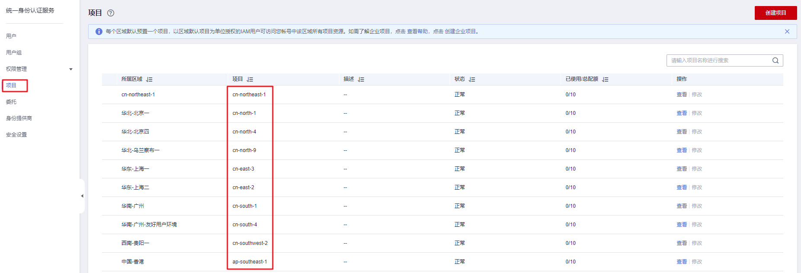

# 如何获取账号ID和用户ID?

## 获取账号、IAM用户、项目的名称和ID

-   **从控制台获取账号名、账号ID、用户名、用户ID、项目名称、项目ID**
    1.  在华为云首页右上角，单击“控制台”。
    2.  在右上角的用户名中选择“我的凭证“。

        **图 1**  进入我的凭证  
        

    3.  在“我的凭证”界面，API凭证页签中，查看账号名、账号ID、用户名、用户ID、项目名称、项目ID。

        每个区域的项目ID有所不同，需要根据业务所在的区域获取对应的项目ID。

        **图 2**  查看账号名、账号ID、用户名、用户ID、项目名称、项目ID  
        

-   **调用API获取用户ID、项目ID**
    -   获取用户ID请参考：[管理员查询IAM用户列表](https://support.huaweicloud.com/api-iam/iam_08_0001.html)。
    -   获取项目ID请参考：[查询指定条件下的项目列表](https://support.huaweicloud.com/api-iam/iam_06_0001.html)。

## 获取用户组名称和ID

1.  登录华为云，进入IAM控制台，选择“用户组”页签。
2.  单击需要查询的用户组前的下拉框，即可查询用户组名称、用户组ID。

    **图 3**  查询用户组名称、用户组ID  
    

## 获取区域ID

1.  登录华为云，进入IAM控制台，选择“项目”页签。
2.  “项目”列的内容即为所属区域对应的ID。

    **图 4**  查看区域ID  
    

## 获取委托名称和ID

1.  登录华为云，进入IAM控制台，选择“委托”页签。
2.  鼠标移动到需要查询名称和ID的委托上，黑色框中出现的第一行为委托名称，第二行为委托ID。

    **图 5**  查看委托ID  
    

