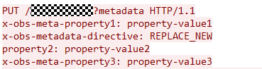

# 设置对象元数据\(Java SDK\)<a name="obs_21_0806"></a>

## 功能说明<a name="section829014011383"></a>

元数据（Metadata）为描述对象属性的信息，是一组名称值对，用作对象管理的一部分。

当前仅支持系统定义的元数据。

系统定义的元数据又分为两种类别：系统控制和用户控制。如Last-Modified日期等数据由系统控制，不可修改；如为对象配置的ContentLanguage，用户可以通过接口进行修改。

对指定桶中的对象发送HEAD请求，设置对象的元数据信息。

> **须知：** 
>开发过程中，您有任何问题可以在github上[提交issue](https://github.com/huaweicloud/huaweicloud-sdk-java-obs/issues)，或者在[华为云对象存储服务论坛](https://bbs.huaweicloud.com/forum/forum-620-1.html)中发帖求助。

## 接口约束<a name="section14184218191312"></a>

-   您必须是桶拥有者或拥有设置对象元数据的权限，才能设置对象元数据。建议使用IAM或桶策略进行授权，如果使用IAM则需授予obs:object:ModifyObjectMetaData权限，如果使用桶策略则需授予ModifyObjectMetaData权限。相关授权方式介绍可参见[OBS权限控制概述](https://support.huaweicloud.com/perms-cfg-obs/obs_40_0001.html)，配置方式详见[使用IAM自定义策略](https://support.huaweicloud.com/usermanual-obs/obs_03_0121.html)、[配置对象策略](https://support.huaweicloud.com/usermanual-obs/obs_03_0075.html)。
-   OBS支持的region以及region与endPoint的对应关系，详细信息请参见[地区与终端节点](https://developer.huaweicloud.com/endpoint?OBS)。
-   一个对象可以有多个元数据，总大小不能超过8KB。
-   当前元数据名称不支持非ASCII码字符，元数据值包含非ASCII码字符时需进行Base64编码。
-   当桶开启多版本控制时，最新版本的对象支持设置元数据，历史版本的对象不支持设置元数据。
-   对于存储类别为归档存储对象，不能对其设置对象的元数据。
-   当文件夹或目录是实际的对象时，对象桶支持对其元数据的修改；如果是创建对象test/test1.txt时带的模拟目录test/ ，对象桶不支持模拟目录修改元数据。

## 方法定义<a name="section54232412"></a>

obsClient.setObjectMetadata\([SetObjectMetadataRequest](#table14455523) [request](#table1210700)\)

## 请求参数说明<a name="section29858833"></a>

**表 1**  请求参数列表

|**参数名称**|**参数类型**|**是否必选**|**描述**|
|--|--|--|--|
|request|SetObjectMetadataRequest|必选|**参数解释：**设置对象元数据请求参数，详见表2。|


**表 2**  SetObjectMetadataRequest

|**参数名称**|**参数类型**|**是否必选**|**描述**|
|--|--|--|--|
|bucketName|String|必选|**参数解释：**桶名。**约束限制：**桶的名字需全局唯一，不能与已有的任何桶名称重复，包括其他用户创建的桶。桶命名规则如下：3～63个字符，数字或字母开头，支持小写字母、数字、“-”、“.”。禁止使用IP地址。禁止以“-”或“.”开头及结尾。禁止两个“.”相邻（如：“my..bucket”）。禁止“.”和“-”相邻（如：“my-.bucket”和“my.-bucket”）。同一用户在同一个区域多次创建同名桶不会报错，创建的桶属性以第一次请求为准。**默认取值：**无|
|objectKey|String|必选|**参数解释：**对象名。对象名是对象在存储桶中的唯一标识。对象名是对象在桶中的完整路径，路径中不包含桶名。例如，您对象的访问地址为examplebucket.obs.cn-north-4.myhuaweicloud.com/folder/test.txt 中，对象名为folder/test.txt。**取值范围：**长度大于0且不超过1024的字符串。**默认取值：**无|
|versionId|String|可选|**参数解释：**对象的版本号。**取值范围：**长度为32的字符串。**默认取值：**无|
|storageClass|StorageClassEnum|可选|**参数解释：**指定对象的存储类别。**取值范围：**可选择的存储类别参见StorageClassEnum。**默认取值：**无|
|removeUnset|boolean|可选|**参数解释：**以前设置的元数据是否被移除。**取值范围：**true：设置为true后，此次设置元数据请求调用成功后，会把其他以前设置的元数据删除（标准元数据不受影响）。false：设置为false后，此次设置元数据请求调用成功后，保留以前设置元数据（标准元数据不受影响）。**默认取值：**false|
|userMetadata|Map<String, String>|可选|**参数解释：**对象的自定义元数据。OBS支持用户使用以“x-obs-meta-”开头的消息头来加入自定义的元数据，以便对对象进行自定义管理。Map中第一个String代表以“x-obs-meta-”开头的自定义元数据名称，第二个String代表自定义元数据的值。当用户获取此对象或查询此对象元数据时，加入的自定义元数据将会在返回的消息头中出现。**约束限制：**所有自定义元数据大小的总和不超过8K。单个自定义元数据大小的计算方式为：每个键和值的UTF-8 编码中的字节总数。自定义元数据的key值不区分大小写，OBS统一转为小写进行存储。value值区分大小写。自定义元数据key-value对都必须符合US-ASCII。如果一定要使用非ASCII码或不可识别字符，需要客户端自行做编解码处理，可以采用URL编码或者Base64编码，服务端不会做解码处理。例如x-obs-meta-中文：中文 经URL编码后发送，“中文”的URL编码为：%E4%B8%AD%E6%96%87，则响应为x-obs-meta-%E4%B8%AD%E6%96%87: %E4%B8%AD%E6%96%87。**默认取值：**无|
|userHeaders|HashMap<String, String>|可选|**参数解释：**用户头域列表。HashMap中第一个String代表用户头域名称，第二个String代表用户头域对应的取值。通过每个SDK设置的用户头域userHeader透传给服务端，使SDK不做处理，让后续使用更灵活。**默认取值：**无|
|encodeHeaders|boolean|可选|**参数解释：**是否开启OBS对请求头域的自动编码。由于HTTP编码规范限制，无法发送非ASCII码字符，SDK会在发送请求时对您头域中的**中文汉字**进行url编码，发送编码后数据。如您设置的值content-disposition为“attachment; filename="中文.txt"”，则对象元数据中存储的信息为“attachment; filename="%E4%B8%AD%E6%96%87.txt"”。使用浏览器访问时浏览器将会自动解码。**取值范围：**true：启用SDK编码。false：不启用SDK编码。**默认取值：**true|
|replaceMetadata|ObjectRepleaceMetadata|可选|**参数解释：**指定Object被下载时的相关元数据，详见ObjectRepleaceMetadata。|
|webSiteRedirectLocation|String|可选|**参数解释：**当桶设置了Website配置，可以将获取这个对象的请求重定向到桶内另一个对象或一个外部的URL。例如，重定向请求到桶内另一对象：WebsiteRedirectLocation:/anotherPage.html或重定向请求到一个外部URL：WebsiteRedirectLocation:http://www.example.com/OBS将这个值从头域中取出，保存在对象的元数据“WebsiteRedirectLocation”中。**约束限制：**必须以“/”、“http://”或“https://”开头，长度不超过2KB。OBS仅支持为桶根目录下的对象设置重定向，不支持为桶中文件夹下的对象设置重定向。**默认取值：**无|


**表 3**  StorageClassEnum

|**常量名**|**原始值**|**说明**|
|--|--|--|
|STANDARD|STANDARD|标准存储。|
|WARM|WARM|低频访问存储。|
|COLD|COLD|归档存储。|


**表 4**  ObjectRepleaceMetadata

|**参数名称**|**参数类型**|**是否必选**|**描述**|
|--|--|--|--|
|contentType|String|可选|**参数解释：**对象的文件类型（MIME类型）。contentType（MIME）用于标识发送或接收数据的类型，浏览器根据该参数来决定数据的打开方式。**取值范围：**常见的contentType（MIME）列表参见如何理解Content-Type（MIME）？(Java SDK)。**默认取值：**无|
|contentLanguage|String|可选|**参数解释：**说明访问者希望采用的语言或语言组合，以根据自己偏好的语言来定制。详情请参见HTTP协议中关于ContentLanguage的定义。**默认取值：**无|
|expires|String|可选|**参数解释：**响应中的Expires头。指定对象被下载时的网页的缓存过期时间。**默认取值：**无|
|cacheControl|String|可选|**参数解释：**响应中的Cache-Control头，指定对象被下载时的网页的缓存行为。**默认取值：**无|
|contentDisposition|String|可选|**参数解释：**为请求的对象提供一个默认的文件名赋值给该对象，当下载对象或者访问对象时，以默认文件名命名的文件将直接在浏览器上显示或在访问时弹出文件下载对话框。**默认取值：**无|
|contentEncoding|String|可选|**参数解释：**响应中的Content-Encoding头。指定对象被下载时的内容编码格式。**默认取值：**无|


## 返回结果说明<a name="section1155011051819"></a>

**表 5**  ObjectMetadata

|**参数名称**|**参数类型**|**是否必选**|**描述**|
|--|--|--|--|
|contentLength|Long|可选|**参数解释：**对象数据的长度。**约束限制：**单次上传对象大小范围是[0, 5GB]。如果需要上传超过5GB的大文件，需要通过多段操作来分段上传。**默认取值：**如果不设置，则SDK会自动计算对象数据的长度。|
|contentType|String|可选|**参数解释：**对象的文件类型（MIME类型）。contentType（MIME）用于标识发送或接收数据的类型，浏览器根据该参数来决定数据的打开方式。**取值范围：**常见的contentType（MIME）列表参见如何理解Content-Type（MIME）？(Java SDK)。**默认取值：**无|
|contentEncoding|String|可选|**参数解释：**指定对象被下载时的内容编码格式。**默认取值：**无|
|contentDisposition|String|可选|**参数解释：**为请求的对象提供一个默认的文件名赋值给该对象，当下载对象或者访问对象时，以默认文件名命名的文件将直接在浏览器上显示或在访问时弹出文件下载对话框。**默认取值：**无|
|cacheControl|String|可选|**参数解释：**指定对象被下载时的网页的缓存行为。**默认取值：**无|
|contentLanguage|String|可选|**参数解释：**说明访问者希望采用的语言或语言组合，以根据自己偏好的语言来定制。详情请参见HTTP协议中关于ContentLanguage的定义。**默认取值：**无|
|expires|String|可选|**参数解释：**指对象在网页中的缓存过期时间。**约束限制：**日期格式为GMT的格式。**默认取值：**无|
|contentMd5|String|可选|**参数解释：**对象数据的MD5值（经过Base64编码），提供给OBS服务端，校验数据完整性。**取值范围：**按照RFC 1864标准计算出消息体的MD5摘要字符串，即消息体128-bit MD5值经过Base64编码后得到的字符串。示例：n58IG6hfM7vqI4K0vnWpog==**默认取值：**无|
|storageClass|StorageClassEnum|可选|**参数解释：**对象的存储类别。如果未设置此头域，则以桶的默认存储类别作为对象的存储类别。**取值范围：**可选择的存储类别参见StorageClassEnum。**默认取值：**无|
|webSiteRedirectLocation|String|可选|**参数解释：**当桶设置了Website配置，可以将获取这个对象的请求重定向到桶内另一个对象或一个外部的URL，该参数指明对象的重定向地址。例如，重定向请求到桶内另一对象：WebsiteRedirectLocation:/anotherPage.html或重定向请求到一个外部URL：WebsiteRedirectLocation:http://www.example.com/**约束限制：**必须以“/”、“http://”或“https://”开头，长度不超过2KB。OBS仅支持为桶根目录下的对象设置重定向，不支持为桶中文件夹下的对象设置重定向。**默认取值：**无|
|nextPosition|long|可选|**参数解释：**下次追加上传的位置。**取值范围：**0~对象长度，单位：字节。**默认取值：**无|
|appendable|boolean|可选|**参数解释：**对象是否为Appendable对象。**取值范围：**true：是，可追加上传。false：否，不可追加上传。**默认取值：**无|
|userMetadata|Map<String, Object>|可选|**参数解释：**对象的自定义元数据，OBS支持用户使用以“x-obs-meta-”开头的消息头来加入自定义的元数据，以便对对象进行自定义管理。Map中的String代表以“x-obs-meta-”开头的自定义元数据名称，Object代表自定义元数据的值。**默认取值：**无|
|statusCode|int|不需要手动设置，作为请求响应时自动设置|**参数解释：**HTTP状态码。**取值范围：**状态码是一组从2xx（成功）到4xx或5xx（错误）的数字代码，状态码表示了请求响应的状态。完整的状态码列表请参见状态码。**默认取值：**无|
|responseHeaders|Map<String, Object>|不需要手动设置，作为请求响应时自动设置|**参数解释：**响应消息头列表，由多个元组构成。元组中String代表响应消息头的名称，Object代表响应消息头的值。**默认取值：**无|


## 代码示例：设置对象元数据<a name="section22161170218"></a>

通过自定义元数据和利用用户头域userHeader透传两种方式，来展示如何设置examplebucket桶下objectname对象的元数据。

```
import com.obs.services.ObsClient;
import com.obs.services.exception.ObsException;
import com.obs.services.model.ObjectMetadata;
import com.obs.services.model.SetObjectMetadataRequest;
import java.util.HashMap;
public class SetObjectMetadata001 {
    public static void main(String[] args) {
        // 您可以通过环境变量获取访问密钥AK/SK，也可以使用其他外部引入方式传入。如果使用硬编码可能会存在泄露风险。
        // 您可以登录访问管理控制台获取访问密钥AK/SK
        String ak = System.getenv("ACCESS_KEY_ID");
        String sk = System.getenv("SECRET_ACCESS_KEY_ID");
        // 【可选】如果使用临时AK/SK和SecurityToken访问OBS，同样建议您尽量避免使用硬编码，以降低信息泄露风险。
        // 您可以通过环境变量获取访问密钥AK/SK/SecurityToken，也可以使用其他外部引入方式传入。
        // String securityToken = System.getenv("SECURITY_TOKEN");
        // endpoint填写桶所在的endpoint, 此处以华北-北京四为例，其他地区请按实际情况填写。
        String endPoint = "https://obs.cn-north-4.myhuaweicloud.com";
        // 您可以通过环境变量获取endPoint，也可以使用其他外部引入方式传入。
        //String endPoint = System.getenv("ENDPOINT");
        
        // 创建ObsClient实例
        // 使用永久AK/SK初始化客户端
        ObsClient obsClient = new ObsClient(ak, sk,endPoint);
        // 使用临时AK/SK和SecurityToken初始化客户端
        // ObsClient obsClient = new ObsClient(ak, sk, securityToken, endPoint);

        try {
            // 设置对象元数据
            SetObjectMetadataRequest request = new SetObjectMetadataRequest("examplebucket", "objectname");
            // 对象的 HTTP 标准头域
            request.setContentType("ContentType");
            request.setExpires("Expires");
            // 设置自定义元数据时，SDK会自动拼接x-obs-meta-。
            request.addUserMetadata("property1", "property-value1");
            HashMap<String, String> userHeaders = new HashMap<>();
            // SDK设置的用户头域userHeader是透传的，不做处理可让后续使用更灵活，所以如果userHeader需要在服务端以自定义元数据形式显示。在设置的用户头域userHeader前，请加上x-obs-meta-，便于服务端识别。
            userHeaders.put("property2", "property-value2");
            userHeaders.put("x-obs-meta-property3", "property-value3");
            request.setUserHeaders(userHeaders);
            ObjectMetadata metadata = obsClient.setObjectMetadata(request);
            System.out.println("setObjectMetadata successfully");
            System.out.println("UserMetadata:" + metadata.getUserMetadata("property1"));
        } catch (ObsException e) {
            System.out.println("setObjectMetadata failed");
            // 请求失败,打印http状态码
            System.out.println("HTTP Code:" + e.getResponseCode());
            // 请求失败,打印服务端错误码
            System.out.println("Error Code:" + e.getErrorCode());
            // 请求失败,打印详细错误信息
            System.out.println("Error Message:" + e.getErrorMessage());
            // 请求失败,打印请求id
            System.out.println("Request ID:" + e.getErrorRequestId());
            System.out.println("Host ID:" + e.getErrorHostId());
            e.printStackTrace();
        } catch (Exception e) {
            System.out.println("setObjectMetadata failed");
            // 其他异常信息打印
            e.printStackTrace();
        }
    }
}
```

运行以上示例代码，设置自定义元数据property1和用户头域property2、x-obs-meta-property3后，网络抓包HTTP协议的头域如下图所示：



## 代码示例：删除对象自定义元数据<a name="section7127125291010"></a>

如果需要删除某些自定义元数据，在调用设置对象元数据接口时，把需要保留的元数据设置一次，并设置SetObjectMetadataRequest.setRemoveUnset\(true\)。此时调用接口后，未设置元数据的数据会被删除，所以请慎重使用SetObjectMetadataRequest.setRemoveUnset\(true\)。

以下示例为删除examplebucket桶下objectname对象的自定义元数据，请参考以下示例代码：

```
import com.obs.services.ObsClient;
import com.obs.services.exception.ObsException;
import com.obs.services.model.SetObjectMetadataRequest;
import java.util.HashMap;
public class SetObjectMetadata002 {
    public static void main(String[] args) {
        // 您可以通过环境变量获取访问密钥AK/SK，也可以使用其他外部引入方式传入。如果使用硬编码可能会存在泄露风险。
        // 您可以登录访问管理控制台获取访问密钥AK/SK
        String ak = System.getenv("ACCESS_KEY_ID");
        String sk = System.getenv("SECRET_ACCESS_KEY_ID");
        // 【可选】如果使用临时AK/SK和SecurityToken访问OBS，同样建议您尽量避免使用硬编码，以降低信息泄露风险。
        // 您可以通过环境变量获取访问密钥AK/SK/SecurityToken，也可以使用其他外部引入方式传入。
        // String securityToken = System.getenv("SECURITY_TOKEN");
        // endpoint填写桶所在的endpoint, 此处以华北-北京四为例，其他地区请按实际情况填写。
        String endPoint = "https://obs.cn-north-4.myhuaweicloud.com";
        // 您可以通过环境变量获取endPoint，也可以使用其他外部引入方式传入。
        //String endPoint = System.getenv("ENDPOINT");
        
        // 创建ObsClient实例
        // 使用永久AK/SK初始化客户端
        ObsClient obsClient = new ObsClient(ak, sk,endPoint);
        // 使用临时AK/SK和SecurityToken初始化客户端
        // ObsClient obsClient = new ObsClient(ak, sk, securityToken, endPoint);

        try {
            SetObjectMetadataRequest request = new SetObjectMetadataRequest();
            request.setBucketName("examplebucket");
            request.setObjectKey("objectname");
            request.setRemoveUnset(true);
            HashMap<String, String> userHeaders = new HashMap<>();
            // 设置request.setRemoveUnset(true)后，服务端会保存元数据property1，原有已经保存的自定义元数据会被删除。
            userHeaders.put("x-obs-meta-property1", "property-value1");
            request.setUserHeaders(userHeaders);
            obsClient.setObjectMetadata(request);
            System.out.println("setObjectMetadata successfully");
        } catch (ObsException e) {
            System.out.println("setObjectMetadata failed");
            // 请求失败,打印http状态码
            System.out.println("HTTP Code:" + e.getResponseCode());
            // 请求失败,打印服务端错误码
            System.out.println("Error Code:" + e.getErrorCode());
            // 请求失败,打印详细错误信息
            System.out.println("Error Message:" + e.getErrorMessage());
            // 请求失败,打印请求id
            System.out.println("Request ID:" + e.getErrorRequestId());
            System.out.println("Host ID:" + e.getErrorHostId());
            e.printStackTrace();
        } catch (Exception e) {
            System.out.println("setObjectMetadata failed");
            // 其他异常信息打印
            e.printStackTrace();
        }
    }
}
```

## 相关链接<a name="section520381913719"></a>

-   关于设置对象的元数据的API说明，请参见[修改对象元数据](https://support.huaweicloud.com/api-obs/obs_04_0091.html)。
-   更多关于设置对象元数据的示例代码，请参见[Github示例](https://github.com/huaweicloud/huaweicloud-sdk-java-obs/blob/master/app/src/test/java/samples_java/ObjectMetaSample.java)。
-   设置对象元数据过程中返回的错误码含义、问题原因及处理措施可参考[OBS错误码](https://support.huaweicloud.com/api-obs/obs_04_0115.html#section1)。

