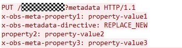

# 设置对象属性<a name="obs_21_0806"></a>

> **须知：** 
>开发过程中，您有任何问题可以在github上[提交issue](https://github.com/huaweicloud/huaweicloud-sdk-java-obs/issues)，或者在[华为云对象存储服务论坛](https://bbs.huaweicloud.com/forum/forum-620-1.html)中发帖求助。[接口参考文档](https://obssdk.obs.cn-north-1.myhuaweicloud.com/apidoc/cn/java/index.html)详细介绍了每个接口的参数和使用方法。

## 功能说明<a name="section829014011383"></a>

您可以通过ObsClient.setObjectMetadata来设置对象属性，包括对象自定义元数据等信息。

除了 HTTP 标准头域外，您也可以指定自定义元数据，自定义元数据仅支持英文字符、数字与中划线【-】。

## 请求参数<a name="section123091114385"></a>

<a name="table58575812"></a>
<table><thead align="left"><tr id="row9414935"><th class="cellrowborder" valign="top" width="25%" id="mcps1.1.5.1.1"><p id="p24412233"><a name="p24412233"></a><a name="p24412233"></a><strong id="b298383711264"><a name="b298383711264"></a><a name="b298383711264"></a>参数名</strong></p>
</th>
<th class="cellrowborder" valign="top" width="16%" id="mcps1.1.5.1.2"><p id="p31233872"><a name="p31233872"></a><a name="p31233872"></a><strong id="b198343415539"><a name="b198343415539"></a><a name="b198343415539"></a>类型</strong></p>
</th>
<th class="cellrowborder" valign="top" width="15%" id="mcps1.1.5.1.3"><p id="p46915732"><a name="p46915732"></a><a name="p46915732"></a><strong id="b11835184135320"><a name="b11835184135320"></a><a name="b11835184135320"></a>约束</strong></p>
</th>
<th class="cellrowborder" valign="top" width="44%" id="mcps1.1.5.1.4"><p id="p42077948"><a name="p42077948"></a><a name="p42077948"></a><strong id="b18836114118535"><a name="b18836114118535"></a><a name="b18836114118535"></a>说明</strong></p>
</th>
</tr>
</thead>
<tbody><tr id="row127301646152210"><td class="cellrowborder" valign="top" width="25%" headers="mcps1.1.5.1.1 "><p id="p127300469225"><a name="p127300469225"></a><a name="p127300469225"></a>bucketName</p>
</td>
<td class="cellrowborder" valign="top" width="16%" headers="mcps1.1.5.1.2 "><p id="p177306461222"><a name="p177306461222"></a><a name="p177306461222"></a>String</p>
</td>
<td class="cellrowborder" valign="top" width="15%" headers="mcps1.1.5.1.3 "><p id="p1573074612220"><a name="p1573074612220"></a><a name="p1573074612220"></a>必选</p>
</td>
<td class="cellrowborder" valign="top" width="44%" headers="mcps1.1.5.1.4 "><p id="p187303465228"><a name="p187303465228"></a><a name="p187303465228"></a>桶名。</p>
</td>
</tr>
<tr id="row133492050112320"><td class="cellrowborder" valign="top" width="25%" headers="mcps1.1.5.1.1 "><p id="p1034915509232"><a name="p1034915509232"></a><a name="p1034915509232"></a>objectKey</p>
</td>
<td class="cellrowborder" valign="top" width="16%" headers="mcps1.1.5.1.2 "><p id="p10349125052310"><a name="p10349125052310"></a><a name="p10349125052310"></a>String</p>
</td>
<td class="cellrowborder" valign="top" width="15%" headers="mcps1.1.5.1.3 "><p id="p193491450152316"><a name="p193491450152316"></a><a name="p193491450152316"></a>必选</p>
</td>
<td class="cellrowborder" valign="top" width="44%" headers="mcps1.1.5.1.4 "><p id="p10349150182316"><a name="p10349150182316"></a><a name="p10349150182316"></a>对象名。</p>
</td>
</tr>
<tr id="row13141155719340"><td class="cellrowborder" valign="top" width="25%" headers="mcps1.1.5.1.1 "><p id="p264334193511"><a name="p264334193511"></a><a name="p264334193511"></a>versionId</p>
</td>
<td class="cellrowborder" valign="top" width="16%" headers="mcps1.1.5.1.2 "><p id="p156441463510"><a name="p156441463510"></a><a name="p156441463510"></a>String</p>
</td>
<td class="cellrowborder" valign="top" width="15%" headers="mcps1.1.5.1.3 "><p id="p864654163516"><a name="p864654163516"></a><a name="p864654163516"></a>可选</p>
</td>
<td class="cellrowborder" valign="top" width="44%" headers="mcps1.1.5.1.4 "><p id="p13647845355"><a name="p13647845355"></a><a name="p13647845355"></a>对象的版本号。</p>
</td>
</tr>
<tr id="row612879103517"><td class="cellrowborder" valign="top" width="25%" headers="mcps1.1.5.1.1 "><p id="p1896661393517"><a name="p1896661393517"></a><a name="p1896661393517"></a>storageClass</p>
</td>
<td class="cellrowborder" valign="top" width="16%" headers="mcps1.1.5.1.2 "><p id="p396831319357"><a name="p396831319357"></a><a name="p396831319357"></a>StorageClassEnum</p>
</td>
<td class="cellrowborder" valign="top" width="15%" headers="mcps1.1.5.1.3 "><p id="p7969213153516"><a name="p7969213153516"></a><a name="p7969213153516"></a>可选</p>
</td>
<td class="cellrowborder" valign="top" width="44%" headers="mcps1.1.5.1.4 "><p id="p3218195344120"><a name="p3218195344120"></a><a name="p3218195344120"></a>对象的存储类型。</p>
<p id="p0218115310416"><a name="p0218115310416"></a><a name="p0218115310416"></a>说明：存储类型有3种：STANDARD（标准存储）、WARM（低频访问存储）、COLD（归档存储）。</p>
</td>
</tr>
<tr id="row4045982"><td class="cellrowborder" valign="top" width="25%" headers="mcps1.1.5.1.1 "><p id="p59289136"><a name="p59289136"></a><a name="p59289136"></a>removeUnset</p>
</td>
<td class="cellrowborder" valign="top" width="16%" headers="mcps1.1.5.1.2 "><p id="p37690735"><a name="p37690735"></a><a name="p37690735"></a>boolean</p>
</td>
<td class="cellrowborder" valign="top" width="15%" headers="mcps1.1.5.1.3 "><p id="p33050690"><a name="p33050690"></a><a name="p33050690"></a>可选</p>
</td>
<td class="cellrowborder" valign="top" width="44%" headers="mcps1.1.5.1.4 "><p id="p59860242"><a name="p59860242"></a><a name="p59860242"></a>默认false。设置为true后，此次设置元数据请求调用成功后，会把其他以前设置的元数据删除（标准元数据不受影响）。</p>
</td>
</tr>
<tr id="row1871268"><td class="cellrowborder" valign="top" width="25%" headers="mcps1.1.5.1.1 "><p id="p17355001"><a name="p17355001"></a><a name="p17355001"></a>userMetadata</p>
</td>
<td class="cellrowborder" valign="top" width="16%" headers="mcps1.1.5.1.2 "><p id="p3496174304612"><a name="p3496174304612"></a><a name="p3496174304612"></a>Map&lt;String, String&gt;</p>
</td>
<td class="cellrowborder" valign="top" width="15%" headers="mcps1.1.5.1.3 "><p id="p49532637"><a name="p49532637"></a><a name="p49532637"></a>可选</p>
</td>
<td class="cellrowborder" valign="top" width="44%" headers="mcps1.1.5.1.4 "><p id="p661216363215"><a name="p661216363215"></a><a name="p661216363215"></a>设置标准自定义元数据，SDK会自动拼接x-obs-meta-。</p>
</td>
</tr>
<tr id="row178461337232"><td class="cellrowborder" valign="top" width="25%" headers="mcps1.1.5.1.1 "><p id="p1684613313231"><a name="p1684613313231"></a><a name="p1684613313231"></a>userHeaders</p>
</td>
<td class="cellrowborder" valign="top" width="16%" headers="mcps1.1.5.1.2 "><p id="p1584614392318"><a name="p1584614392318"></a><a name="p1584614392318"></a>HashMap&lt;String, String&gt;</p>
</td>
<td class="cellrowborder" valign="top" width="15%" headers="mcps1.1.5.1.3 "><p id="p19846123162316"><a name="p19846123162316"></a><a name="p19846123162316"></a>可选</p>
</td>
<td class="cellrowborder" valign="top" width="44%" headers="mcps1.1.5.1.4 "><p id="p1684613318231"><a name="p1684613318231"></a><a name="p1684613318231"></a>用户头域，SDK设置的用户头域userHeader透传给服务端，SDK不做处理让后续使用更灵活。</p>
</td>
</tr>
<tr id="row1992974415386"><td class="cellrowborder" valign="top" width="25%" headers="mcps1.1.5.1.1 "><p id="p1991555173714"><a name="p1991555173714"></a><a name="p1991555173714"></a>encodeHeaders</p>
</td>
<td class="cellrowborder" valign="top" width="16%" headers="mcps1.1.5.1.2 "><p id="p1399110552378"><a name="p1399110552378"></a><a name="p1399110552378"></a>boolean</p>
</td>
<td class="cellrowborder" valign="top" width="15%" headers="mcps1.1.5.1.3 "><p id="p3991105515376"><a name="p3991105515376"></a><a name="p3991105515376"></a>可选</p>
</td>
<td class="cellrowborder" valign="top" width="44%" headers="mcps1.1.5.1.4 "><p id="p209351426105111"><a name="p209351426105111"></a><a name="p209351426105111"></a>设置对象元数据接口允许指定是否编解码 http 头域，默认为true，默认会进行编解码。</p>
</td>
</tr>
<tr id="row859314396189"><td class="cellrowborder" valign="top" width="25%" headers="mcps1.1.5.1.1 "><p id="p959493910185"><a name="p959493910185"></a><a name="p959493910185"></a>contentType</p>
</td>
<td class="cellrowborder" valign="top" width="16%" headers="mcps1.1.5.1.2 "><p id="p1059473971814"><a name="p1059473971814"></a><a name="p1059473971814"></a>String</p>
</td>
<td class="cellrowborder" valign="top" width="15%" headers="mcps1.1.5.1.3 "><p id="p18594113912182"><a name="p18594113912182"></a><a name="p18594113912182"></a>可选</p>
</td>
<td class="cellrowborder" valign="top" width="44%" headers="mcps1.1.5.1.4 "><p id="p1859483916189"><a name="p1859483916189"></a><a name="p1859483916189"></a>对象的MIME类型。</p>
</td>
</tr>
<tr id="row15626204574518"><td class="cellrowborder" valign="top" width="25%" headers="mcps1.1.5.1.1 "><p id="p1862744544514"><a name="p1862744544514"></a><a name="p1862744544514"></a>contentLanguage</p>
</td>
<td class="cellrowborder" valign="top" width="16%" headers="mcps1.1.5.1.2 "><p id="p062719455459"><a name="p062719455459"></a><a name="p062719455459"></a>String</p>
</td>
<td class="cellrowborder" valign="top" width="15%" headers="mcps1.1.5.1.3 "><p id="p962794554518"><a name="p962794554518"></a><a name="p962794554518"></a>可选</p>
</td>
<td class="cellrowborder" valign="top" width="44%" headers="mcps1.1.5.1.4 "><p id="p12627945134516"><a name="p12627945134516"></a><a name="p12627945134516"></a>说明访问者希望采用的语言或语言组合，以根据自己偏好的语言来定制。详情请参见HTTP协议中关于ContentLanguage的定义。</p>
</td>
</tr>
<tr id="row13582446171818"><td class="cellrowborder" valign="top" width="25%" headers="mcps1.1.5.1.1 "><p id="p16582546171814"><a name="p16582546171814"></a><a name="p16582546171814"></a>expires</p>
</td>
<td class="cellrowborder" valign="top" width="16%" headers="mcps1.1.5.1.2 "><p id="p17582546191817"><a name="p17582546191817"></a><a name="p17582546191817"></a>String</p>
</td>
<td class="cellrowborder" valign="top" width="15%" headers="mcps1.1.5.1.3 "><p id="p9582184651817"><a name="p9582184651817"></a><a name="p9582184651817"></a>可选</p>
</td>
<td class="cellrowborder" valign="top" width="44%" headers="mcps1.1.5.1.4 "><p id="p1058204671811"><a name="p1058204671811"></a><a name="p1058204671811"></a>过期时间。</p>
</td>
</tr>
<tr id="row0507150141815"><td class="cellrowborder" valign="top" width="25%" headers="mcps1.1.5.1.1 "><p id="p4507135016185"><a name="p4507135016185"></a><a name="p4507135016185"></a>cacheControl</p>
</td>
<td class="cellrowborder" valign="top" width="16%" headers="mcps1.1.5.1.2 "><p id="p150725019182"><a name="p150725019182"></a><a name="p150725019182"></a>String</p>
</td>
<td class="cellrowborder" valign="top" width="15%" headers="mcps1.1.5.1.3 "><p id="p1450705018182"><a name="p1450705018182"></a><a name="p1450705018182"></a>可选</p>
</td>
<td class="cellrowborder" valign="top" width="44%" headers="mcps1.1.5.1.4 "><p id="p1350775014185"><a name="p1350775014185"></a><a name="p1350775014185"></a>指定对象被下载时的网页的缓存行为。</p>
</td>
</tr>
<tr id="row1919314131194"><td class="cellrowborder" valign="top" width="25%" headers="mcps1.1.5.1.1 "><p id="p1419361317196"><a name="p1419361317196"></a><a name="p1419361317196"></a>contentDisposition</p>
</td>
<td class="cellrowborder" valign="top" width="16%" headers="mcps1.1.5.1.2 "><p id="p719321316191"><a name="p719321316191"></a><a name="p719321316191"></a>String</p>
</td>
<td class="cellrowborder" valign="top" width="15%" headers="mcps1.1.5.1.3 "><p id="p181931013171920"><a name="p181931013171920"></a><a name="p181931013171920"></a>可选</p>
</td>
<td class="cellrowborder" valign="top" width="44%" headers="mcps1.1.5.1.4 "><p id="p4193171351920"><a name="p4193171351920"></a><a name="p4193171351920"></a>为请求的对象提供一个默认的文件名赋值给该对象，当下载对象或者访问对象时，以默认文件名命名的文件将直接在浏览器上显示或在访问时弹出文件下载对话框。</p>
</td>
</tr>
<tr id="row9752516193"><td class="cellrowborder" valign="top" width="25%" headers="mcps1.1.5.1.1 "><p id="p27125121918"><a name="p27125121918"></a><a name="p27125121918"></a>contentEncoding</p>
</td>
<td class="cellrowborder" valign="top" width="16%" headers="mcps1.1.5.1.2 "><p id="p1471625141913"><a name="p1471625141913"></a><a name="p1471625141913"></a>String</p>
</td>
<td class="cellrowborder" valign="top" width="15%" headers="mcps1.1.5.1.3 "><p id="p14716256190"><a name="p14716256190"></a><a name="p14716256190"></a>可选</p>
</td>
<td class="cellrowborder" valign="top" width="44%" headers="mcps1.1.5.1.4 "><p id="p9117526579"><a name="p9117526579"></a><a name="p9117526579"></a>指定对象被下载时的内容编码格式，可以设置如下类型：</p>
<a name="ul611552105718"></a><a name="ul611552105718"></a><ul id="ul611552105718"><li>标准定义：compress、deflate、exi、identity、gzip、pack200-gzip</li><li>其他：br、bzip2、lzma 、peerdist、sdch、xpress、xz</li></ul>
</td>
</tr>
</tbody>
</table>

以下代码展示了如何设置对象属性：

```
// Endpoint以北京四为例，其他地区请按实际情况填写。
String endPoint = "https://obs.cn-north-4.myhuaweicloud.com";
String ak = "*** Provide your Access Key ***";
String sk = "*** Provide your Secret Key ***";

// 创建ObsClient实例
final ObsClient obsClient = new ObsClient(ak, sk, endPoint);

SetObjectMetadataRequest request = new SetObjectMetadataRequest("bucketname", "objectname");
// 对象的 HTTP 标准头域
request.setContentType("ContentType");
request.setExpires("Expires");
// 设置自定义元数据时，SDK会自动拼接x-obs-meta-。
request.addUserMetadata("property1", "property-value1");
HashMap<String, String> userHeaders = new HashMap<>();
// SDK设置的用户头域userHeader是透传的，不做处理可让后续使用更灵活，所以如果userHeader需要在服务端以自定义元数据形式显示。在设置的用户头域userHeader前，请加上x-obs-meta-，便于服务端识别。
userHeaders.put("property2","property-value2");
userHeaders.put("x-obs-meta-property3","property-value3");
request.setUserHeaders(userHeaders);

ObjectMetadata metadata = obsClient.setObjectMetadata(request);

System.out.println("\t" + metadata.getUserMetadata("property1"));
```

运行以上示例代码，设置自定义元数据property1和用户头域property2、x-obs-meta-property3后，网络抓包HTTP协议的头域如下图所示：



如果需要删除某些自定义元数据，在调用设置对象属性接口时，把需要保留的元数据设置一次，并设置SetObjectMetadataRequest.setRemoveUnset\(true\)。此时调用接口后，未设置元数据的数据会被删除，所以请慎重使用SetObjectMetadataRequest.setRemoveUnset\(true\)。

如何使用SetObjectMetadataRequest.setRemoveUnset\(true\)，请参考以下示例代码：

```
// Endpoint以北京四为例，其他地区请按实际情况填写。
String endPoint = "https://obs.cn-north-4.myhuaweicloud.com";
String ak = "*** Provide your Access Key ***";
String sk = "*** Provide your Secret Key ***";

// 创建ObsClient实例
final ObsClient obsClient = new ObsClient(ak, sk, endPoint);

SetObjectMetadataRequest request = new SetObjectMetadataRequest();
request.setBucketName(""bucketname"");
request.setObjectKey("objectname");
request.setRemoveUnset(true);
HashMap<String, String> userHeaders = new HashMap<>();
// 设置request.setRemoveUnset(true)后，服务端会保存元数据property1，原有已经保存的自定义元数据会被删除。
userHeaders.put("x-obs-meta-property1","property-value1");
request.setUserHeaders(userHeaders);
obsClient.setObjectMetadata(request);
```

> **说明：** 
>-   由于 HTTP 编码规范限制，无法发送非 ASCII 码字符，SDK 会在发送请求时对您头域中的**中文汉字**进行 url 编码，发送编码后数据。如您设置的值 content-disposition 为 ”attachment; filename="中文.txt"”，则对象元数据中存储的信息为”attachment; filename="%E4%B8%AD%E6%96%87.txt"”。使用浏览器访问时浏览器将会自动解码。
>-   如若不需要 SDK 帮您编码，可以调用 SetObjectMetadataRequest.setIsEncodeHeaders\(false\) 关闭自动编码。

