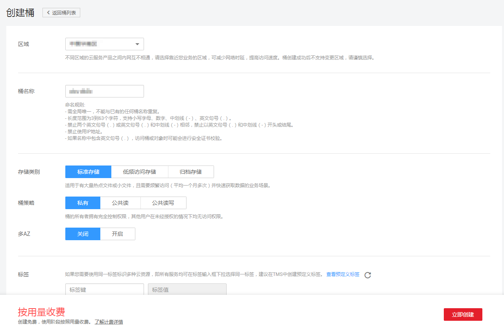

# 创建桶

您可以通过OBS管理控制台创建桶。桶是OBS中存储对象的容器。您需要先创建一个桶，然后才能在OBS中存储数据。

> **说明：**   
>一个账号可创建100个桶。  

## 操作步骤

1.  在OBS管理控制台页面右上角单击“创建桶”，系统弹出如[图1](#fig30207295194414)所示的对话框。

    **图 1**  创建桶  
    

2.  选择“区域”、“存储类别”，并输入“桶名称”。

    > **说明：**   
    >-   桶创建成功后，不能修改名称，创建时，请设置合适的桶名。  
    >-   由于通过URL访问桶时，桶名会作为URL的一部分，根据DNS标准，URL不支持大写字母，无法区分带大写字母的桶。因此，“桶名称”仅支持小写字母、数字、“-”、“.”作为桶的命名规则。例如：若想通过URL访问名为“MyBucket”的桶，该URL将解析成名为“mybucket”的桶，导致访问出错。  

3.  桶策略：您可以为桶配置私有、公共读、或公共读写的通用策略。
4.  多AZ：您可以开启或关闭多AZ。关闭多AZ时，桶内数据存储在单个AZ中；开启多AZ时，桶内数据在上传时同时复制双份，保存在3个AZ中。
5.  标签：标签用于标识OBS对象存储中的桶，以此达到对OBS对象存储中的桶进行分类的目的。OBS对象存储以键值对的形式来描述标签，每个标签有且只有一对键值。有关添加标签的信息，请参见[标签简介](标签简介.md)。
6.  单击“立即创建”。

