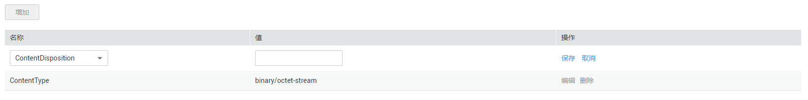

# 配置对象元数据

## 前提条件

已拥有对象的读取权限。

## 操作步骤

1.  在OBS管理控制台桶列表中，单击待操作的桶，进入“概览”页面。
2.  在左侧导航栏，单击“对象”。
3.  单击待操作的对象，并单击“元数据”。
4.  单击“增加”，如[图1](#fig23497413194123)所示。根据需要填写元数据信息。

    **图 1**  增加元数据  
    

5.  单击“保存”。

