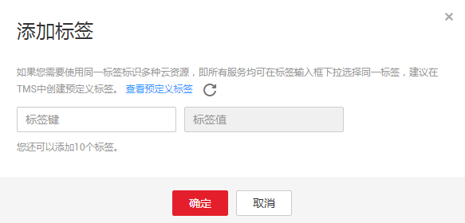

# 配置标签

您可以在创建桶时，配置其标签，详见[创建桶](创建桶（入门操作）.md)。您也可以在桶创建后，再配置其标签。本章节介绍桶创建后标签的配置方法。

## 操作步骤

1.  在OBS管理控制台桶列表中，单击待操作的桶，进入“概览”页面。
2.  在“基础配置”下，“标签”卡片显示其当前状态。鼠标滑过“标签”卡片，状态栏显示“配置”，单击“配置”，系统跳转至“标签”界面。

    或您可以直接在左侧导航栏单击“基础配置\>标签”，进入“标签”界面。

3.  单击“添加标签”，系统弹出“添加标签”对话框，如[图1](#fig8687910182820)所示。

    **图 1**  添加标签  
    

4.  按照[表1](#table4503491017244)要求输入标签的键和值。

    **表 1**  参数说明

    
    <table><thead align="left"><tr id="row2801826417244"><th class="cellrowborder" valign="top" width="18.8%" id="mcps1.2.3.1.1">
参数

    </th>
    <th class="cellrowborder" valign="top" width="81.2%" id="mcps1.2.3.1.2">
说明

    </th>
    </tr>
    </thead>
    <tbody><tr id="row684481517244"><td class="cellrowborder" valign="top" width="18.8%" headers="mcps1.2.3.1.1 ">
键

    </td>
    <td class="cellrowborder" valign="top" width="81.2%" headers="mcps1.2.3.1.2 ">
输入标签的键，同一个桶标签的键不能重复。可以自定义，也可以选择预先在标签管理服务（TMS）创建好的标签。

    
命名规则如下：

    <ul id="ul11950024193055"><li>长度范围为1到36个字符。</li><li>不能以空格开头或结尾，不能包含以下字符：=*&lt;&gt;\,|/</li></ul>
    </td>
    </tr>
    <tr id="row4991219117244"><td class="cellrowborder" valign="top" width="18.8%" headers="mcps1.2.3.1.1 ">
值

    </td>
    <td class="cellrowborder" valign="top" width="81.2%" headers="mcps1.2.3.1.2 ">
输入标签的值，标签的值可以重复，并且可以为空。

    
命名规则如下：

    <ul id="ul5803115119329"><li>长度范围为1到43个字符。</li><li>不能包含以下字符：=*&lt;&gt;\,|/</li></ul>
    </td>
    </tr>
    </tbody>
    </table>

5.  单击“确定”。

    设置桶标签后，可能需要等待一段时间后才能生效。等待时间最大为3分钟。

## 相关操作

您可以点击“编辑”，修改标签的“值”；也可以点击“删除”，删除标签。

