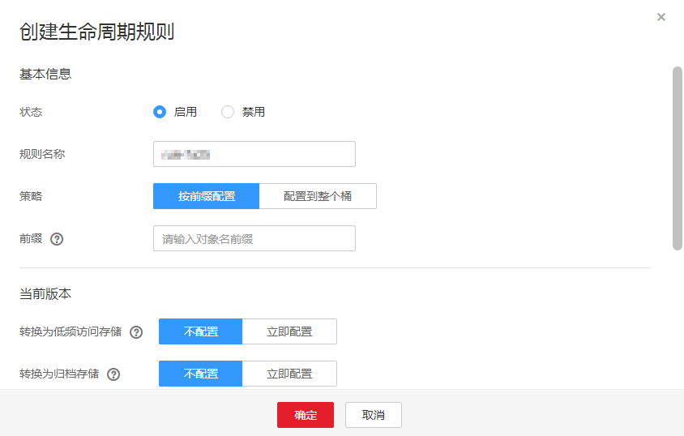

# 配置生命周期

您可以为某个桶或某些对象设置生命周期规则。您可以将标准对象转换为低频访问或归档对象，也可以将低频访问对象转换为归档对象，归档对象不能通过设置生命周期规则来转换存储类别。

## 操作步骤

1.  在OBS管理控制台桶列表中，单击待操作的桶，进入“概览”页面。
2.  在“基础配置”下，“生命周期规则”卡片显示其当前状态。鼠标滑过“生命周期规则”卡片，状态栏显示“配置”，单击“配置”，系统跳转至“生命周期规则”界面。

    或您可以直接在左侧导航栏单击“基础配置\>生命周期规则”，进入“生命周期规则”界面。

3.  单击“创建”，系统弹出如[图1](#fig30958876193536)所示对话框。

    **图 1**  创建生命周期规则  
    

4.  配置生命周期管理规则。

    基本信息：

    -   “状态”：选中“启用”，启用本条生命周期规则。
    -   “规则名称”：用于识别不同的生命周期配置，其长度需不超过255字符。
    -   “策略”：可以按前缀配置，也可以配置到整个桶。
        -   按前缀配置：满足该前缀的对象将受生命周期规则管理，输入的对象前缀不能包括\\\\:\*?\\"<\>|特殊字符，不能以/开头或结尾，不能两个/相邻。
        -   配置到整个桶：桶内所有对象都将受生命周期规则管理。

    > **说明：**   
    >-   当按前缀配置时，如果指定的前缀名与某条已配置的生命周期规则指定的前缀名存在包含关系，OBS会将两条规则视为同一条，而禁止您配置本条规则。例如，系统中已存在指定前缀名为“abc”的规则，则不允许再配置指定前缀以“abc”字段开头的规则。  
    >-   如果已存在按前缀配置的生命周期规则，则不允许再新增配置到整个桶的规则。  
    >-   如果已存在配置到整个桶的生命周期规则，则不允许再新增按前缀配置的规则，此时界面的“添加规则”按钮会变成灰色，表示不可操作。  

    当前版本或历史版本：

    -   转换为低频访问存储：指定在对象最后一次更新后多少天，受规则影响的对象将转换为低频访问存储。至少设置为30天。
    -   转换为归档存储：指定在对象最后一次更新后多少天，受规则影响的对象将转换为归档存储。若同时设置转换为低频访问存储和转换为归档存储，则转换为归档存储的时间要比转换为低频访问存储的时间至少长30天。若单独设置转换为归档存储，则没有时间限制。
    -   过期删除：指定在对象最后一次更新后多少天，受规则影响的对象将过期并自动被OBS删除。过期时间必须大于前两个转换时间的最大值。

        > **说明：**   
        >-   “当前版本”与“历史版本”是针对“多版本控制”而言的。若开启了“多版本控制”功能，同名的对象上传到同一路径下时，则会产生不同的版本号。最新版本的对象称之为“当前版本”，历史时间上传的对象称之为“历史版本”。  
        >-   可以同时配置这两个版本，也可以只配置一个版本，也可以都不配置。  

    例如，您于2015年1月7日在OBS中存储了以下几个文件：

    -   log/test1.log
    -   log/test2.log
    -   doc/example.doc
    -   doc/good.txt

    您于2015年1月10日在OBS中存储了以下几个文件：

    -   log/clientlog.log
    -   log/serverlog.log
    -   doc/work.doc
    -   doc/travel.txt

        在2015年1月10日设置前缀为“log”的对象，过期删除的时间设置为一天，OBS将会在2015年1月12日自动删除“log/clientlog.log”、“log/serverlog.log”、“log/test1.log”和“log/test2.log”这四个对象。

        在今天设置前缀为“log”的对象，转换为低频访问存储的时间设置为30天，转换为归档存储的时间设置为60天，过期删除的时间设置为100天，OBS将会第31天将“log/clientlog.log”、“log/serverlog.log”、“log/test1.log”和“log/test2.log”这四个对象转换为低频访问存储，第61天后转换为归档存储，第101天后自动删除这些对象。

    > **说明：**   
    >对象存储类别的转换以及过期后被删除的时间可能会延迟，一般不超过48小时。  

5.  单击“确定”。

    页面上方提示创建桶的生命周期规则成功。

## 后续操作

若您需修改生命周期的内容，请单击该生命周期规则所在行右侧的“编辑”进行编辑；单击“禁用”，可以禁用该生命周期规则，单击“启用”，可启用该生命周期规则。

您可以选中多条生命周期规则，单击列表上方的“禁用”或“启用”，批量“禁用”或“启用”生命周期规则。

