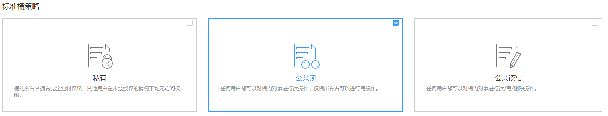

# 配置静态网站托管<a name="zh-cn_topic_0045829093"></a>

用户可将自己的桶配置成静态网站托管模式，并通过桶域名访问该静态网站。

## 前提条件<a name="section11221613153921"></a>

静态网站所需的网页文件已上传到指定桶中。

如果静态网站文件为“归档存储”类别，则需要先恢复，具体操作步骤请参见[恢复归档存储文件](恢复归档存储文件.md)。

> **注意：**   
>如需将托管的静态网站对所有人开放，必须配置匿名用户可访问桶内的静态网站文件。静态网站托管配置会在两分钟内生效。  

## 操作步骤<a name="section11587693153957"></a>

1.  在OBS管理控制台桶列表中，单击待操作的桶，进入“概览”页面。
2.  **可选**：若静态网站需对所有人开放，配置如下策略，使桶内静态网站文件能被公开访问。

    1.  单击“对象”。
    2.  单击静态网站文件对象。
    3.  在“对象ACL\>公共访问权限\>匿名用户”中，单击“编辑”为匿名用户设置对象的读取权限，如[图1](#fig58496641194012)所示。

        **图 1**  为匿名用户设置对象的读取权限<a name="fig58496641194012"></a>  
        

    4.  单击“保存”保存权限设置。

    若桶中只有静态网站文件，则配置桶的“公共读”权限，使桶内所有文件能被公开访问。

    1.  单击“权限\>桶策略”。
    2.  单击“公共读”卡片使桶内的所有对象能被公开访问，如[图2](#fig15186794193556)所示。

        **图 2**  配置公共读权限<a name="fig15186794193556"></a>  
        


3.  在“基础配置”下，“静态网站托管”卡片显示其当前状态。鼠标滑过“静态网站托管”卡片，状态栏显示“配置”，单击“配置”，系统跳转至“静态网站托管”界面。

    或您可以直接在左侧导航栏单击“基础配置\>静态网站托管”，进入“静态网站托管”界面。

4.  单击“开启静态网站托管”，系统弹出“静态网站托管”对话框。
5.  “状态”设置为使能状态。
6.  “托管模式”选择“配置到当前桶”，如[图3](#fig1131112528711)所示。

    **图 3**  配置静态网站托管<a name="fig1131112528711"></a>  
    

7.  在“默认首页”、“默认404错误页面”中设置默认缺省页面和404（Not Found）页面。
    -   默认首页：即访问静态网站时的默认首页。当使用OBS管理控制台配置静态网站托管时，仅支持“html”格式的网页文件；当使用API的方式配置时，OBS不进行限制，用户必须指定对象的“Content-Type”。

        OBS仅支持配置桶根目录下的文件（如“index.html”）作为默认首页，暂不支持按目录层级的方式（如“/page/index.html”）配置默认首页。

    -   默认404错误页面：即访问静态网站遇到错误时，OBS返回给用户的错误页面。当使用OBS管理控制台配置静态网站托管时，仅支持桶根目录下html、jpg、png、bmp、webp格式的文件；当使用API的方式配置时，OBS不进行限制，用户必须指定对象的“Content-Type”。


8.  **可选**：在“重定向规则”中配置重定向规则。满足重定向规则的请求将被重定向到指定主机或页面。

    “重定向规则”采用JSON或XML格式编写，可以包含多条重定向规则，每条重定向规则包含一个Condition和一个Redirect，如下所示：

    以上述模板为例，描述了2条重定向规则：

    ```
    [
    {
    "Condition": {
    "KeyPrefixEquals": "folder1/"
    },
    "Redirect": {
    "HostName": "www.example.com"
    }
    },
    {
    "Condition": {
    "KeyPrefixEquals": "folder2/"
    },
    "Redirect": {
    "ReplaceKeyPrefixWith": "folder3/"
    }
    }
    ]
    ```

    -   对前缀为“folder1/”的请求，自动重定向至主机“www.example.com”上。
    -   对前缀为“folder2/”的请求，自动重定向至前缀为“folder3/”的对象上。

    **表 1**  参数说明

    <a name="table110112174192"></a>
    <table><thead align="left"><tr id="row2010117178192"><th class="cellrowborder" valign="top" width="26%" id="mcps1.2.3.1.1"><p id="p9101181719195"><a name="p9101181719195"></a><a name="p9101181719195"></a>参数</p>
    </th>
    <th class="cellrowborder" valign="top" width="74%" id="mcps1.2.3.1.2"><p id="p14101161771919"><a name="p14101161771919"></a><a name="p14101161771919"></a>键值</p>
    </th>
    </tr>
    </thead>
    <tbody><tr id="row1010191711910"><td class="cellrowborder" valign="top" width="26%" headers="mcps1.2.3.1.1 "><p id="p410171715197"><a name="p410171715197"></a><a name="p410171715197"></a>Condition</p>
    </td>
    <td class="cellrowborder" valign="top" width="74%" headers="mcps1.2.3.1.2 "><p id="p7101201751918"><a name="p7101201751918"></a><a name="p7101201751918"></a>KeyPrefixEquals，HttpErrorCodeReturnedEquals</p>
    </td>
    </tr>
    <tr id="row111016176196"><td class="cellrowborder" valign="top" width="26%" headers="mcps1.2.3.1.1 "><p id="p1710112171199"><a name="p1710112171199"></a><a name="p1710112171199"></a>Redirect</p>
    </td>
    <td class="cellrowborder" valign="top" width="74%" headers="mcps1.2.3.1.2 "><p id="p4101181717199"><a name="p4101181717199"></a><a name="p4101181717199"></a>Protocol，HostName，ReplaceKeyPrefixWith，ReplaceKeyWith，HttpRedirectCode</p>
    </td>
    </tr>
    </tbody>
    </table>

9.  单击“确定”。

    在OBS上托管静态网站配置生效后，您可以通过以下域名访问该静态网站。如果按照如下方法成功访问网站，表明静态网站托管配置成功。

    _https://桶名称.静态网站托管域名_

    _http://桶名称.静态网站托管域名_

    > **说明：**   
    >由于浏览器缓存等原因，您可能需要清除浏览器缓存后才能查看到预期效果。  


