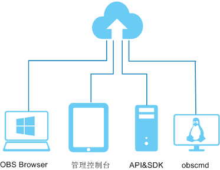

# 使用方式

OBS为用户提供OBS管理控制台、OBS客户端、REST API等多样化的使用方式。

**图 1**  使用方式  

**表 1**  OBS使用方式

<table><thead align="left"><tr id="row1134612441660"><th class="cellrowborder" valign="top" width="21%" id="mcps1.2.3.1.1">
使用方法

</th>
<th class="cellrowborder" valign="top" width="79%" id="mcps1.2.3.1.2">
描述

</th>
</tr>
</thead>
<tbody><tr id="row1234615441267"><td class="cellrowborder" valign="top" width="21%" headers="mcps1.2.3.1.1 ">
管理控制台

</td>
<td class="cellrowborder" valign="top" width="79%" headers="mcps1.2.3.1.2 ">
管理控制台是网页形式的。通过管理控制台，您可以使用直观的界面进行相应的操作。

</td>
</tr>
<tr id="row203464447611"><td class="cellrowborder" valign="top" width="21%" headers="mcps1.2.3.1.1 ">
OBS Browser

</td>
<td class="cellrowborder" valign="top" width="79%" headers="mcps1.2.3.1.2 ">
OBS Browser是一款运行在Windows和MAC系统上的对象存储服务客户端，可以非常方便的让您在个人电脑上进行对象存储的操作。

</td>
</tr>
<tr id="row1934718446613"><td class="cellrowborder" valign="top" width="21%" headers="mcps1.2.3.1.1 ">
obscmd

</td>
<td class="cellrowborder" valign="top" width="79%" headers="mcps1.2.3.1.2 ">
obscmd是一款运行在Linux操作系统上的对象存储服务客户端，实现了本地系统文件上传到OBS，或从OBS下载文件到本地， 主要特点是可以多并发处理上传下载的文件，实现快速传输数据的能力。

</td>
</tr>
<tr id="row93471744264"><td class="cellrowborder" valign="top" width="21%" headers="mcps1.2.3.1.1 ">
SDK

</td>
<td class="cellrowborder" valign="top" width="79%" headers="mcps1.2.3.1.2 ">
OBS SDK是对OBS服务提供的REST API进行的封装，以简化用户的开发工作。用户直接调用OBS SDK提供的接口函数即可实现使用OBS服务业务能力的目的。

</td>
</tr>
<tr id="row5347174415618"><td class="cellrowborder" valign="top" width="21%" headers="mcps1.2.3.1.1 ">
API

</td>
<td class="cellrowborder" valign="top" width="79%" headers="mcps1.2.3.1.2 ">
OBS提供REST形式的访问接口，使用户能够非常容易地从Web应用中访问对象存储服务。用户可以通过本文档提供的简单的REST接口，在任何时间、任何地点、任何互联网设备上进行上传和下载数据。

</td>
</tr>
</tbody>
</table>

