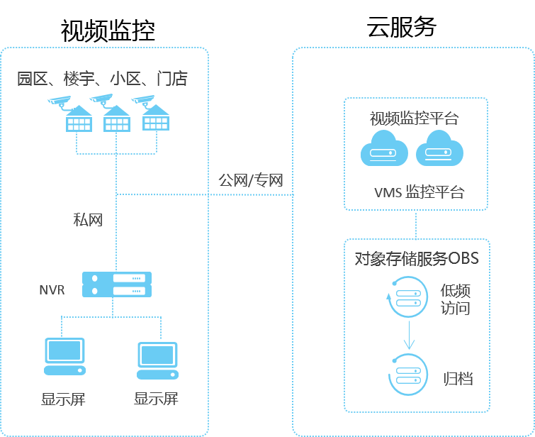
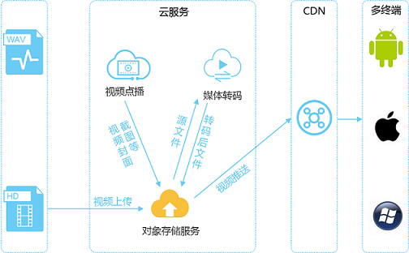
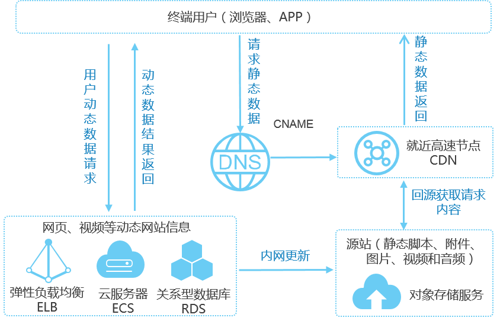

# 应用场景

OBS可应用于视频监控、视频点播、备份归档、HPC、移动互联网、企业云盘（网盘）等场景。

## 视频监控

OBS为视频监控解决方案提供大容量存储空间，同时提供标准存储、低频访问存储和归档存储分类存储数据。

**图 1**  视频监控  

## 视频点播

OBS配合CDN服务，可实现在线视频快速播放，大存储空间，单流大带宽，同时支持高并发访问。

**图 2**  视频点播  

## 备份归档

OBS提供低成本、高可靠访问存储，根据备份和归档需求不同，可以选择不同类型的存储使用。

**图 3**  备份归档  

## HPC

OBS配合弹性云服务器（ECS）、弹性伸缩（AS）、云硬盘（EVS）、镜像服务（IMS）、统一身份认证服务（IAM）和云监控服务（CES），为HPC提供大容量、大单流带宽、安全可靠的解决方案。

**图 4**  HPC  

## 移动互联网

OBS配合弹性云服务器（ECS）、弹性负载均衡（ELB）、关系型数据库（RDS）、CDN和云解析服务（DNS），为移动互联网提供资源弹性伸缩、灵活配置，大容量、高安全和高并发的解决方案。

**图 5**  移动互联网  

## 企业云盘（网盘）

OBS配合弹性云服务器（ECS）、弹性负载均衡（ELB）、关系型数据库（RDS）和云硬盘备份（VBS）服务为企业云盘提供高并发、高可靠、低时延、低成本的存储系统，存储容量可随用户数据量的提高而自动扩容。

**图 6**  企业云盘（网盘）  

