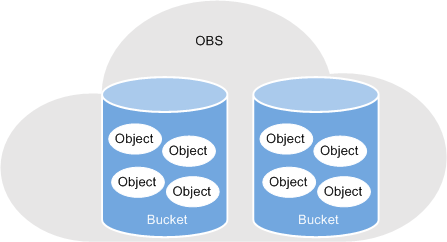

# 桶（Bucket）

桶（Bucket）是OBS中存储对象的容器。对象存储提供了基于桶和对象的扁平化存储方式，桶中的所有对象都处于同一逻辑层级，去除了文件系统中的多层级树形目录结构。

对象存储服务设置有三类存储类别，分别为：标准存储、低频访问存储、归档存储，从而满足客户业务对存储性能、成本的不同诉求。创建桶时可以指定桶的存储类别，桶的存储类别可以修改。

在OBS中，桶名必须是全局唯一的且不能修改，即用户创建的桶不能与自己已创建的其他桶名称相同，也不能与其他用户创建的桶名称相同。每个桶在创建时都会生成默认的桶ACL（Access Control List），桶ACL列表的每项包含了对被授权用户授予什么样的权限，如读取权限、写入权限等。用户只有对桶有相应的权限，才可以对桶进行操作，如创建、删除、显示、设置桶ACL等。

一个账号可创建100个桶。每个桶中存放的对象的数量和大小总和没有限制，用户不需要考虑数据的可扩展性。

由于OBS是基于REST风格HTTP和HTTPS协议的服务，您可以通过URL（Uniform Resource Locator）来定位资源。

OBS中桶和对象的关系如[图1](#fig5658599310445)所示：

**图 1**  桶和对象  

