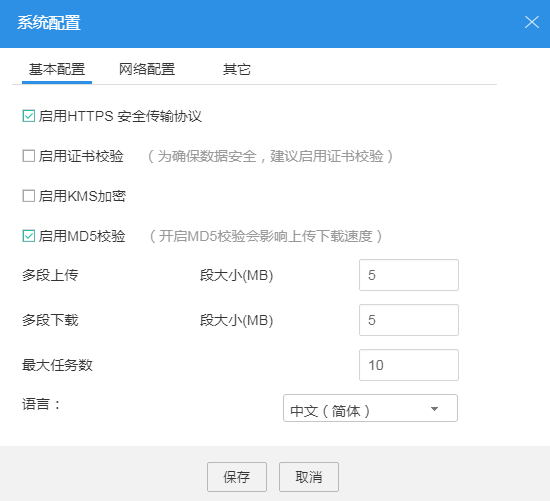
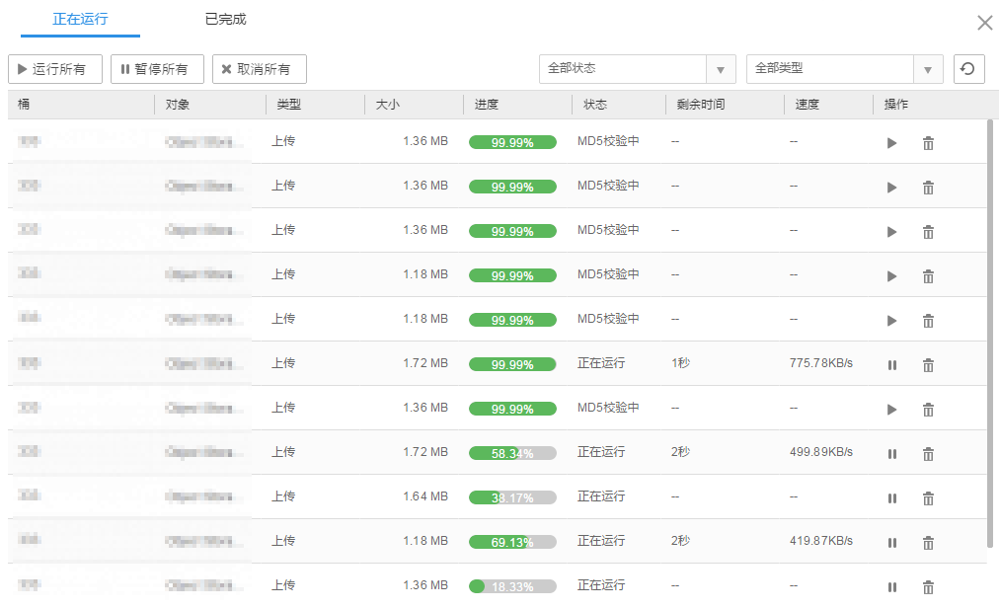
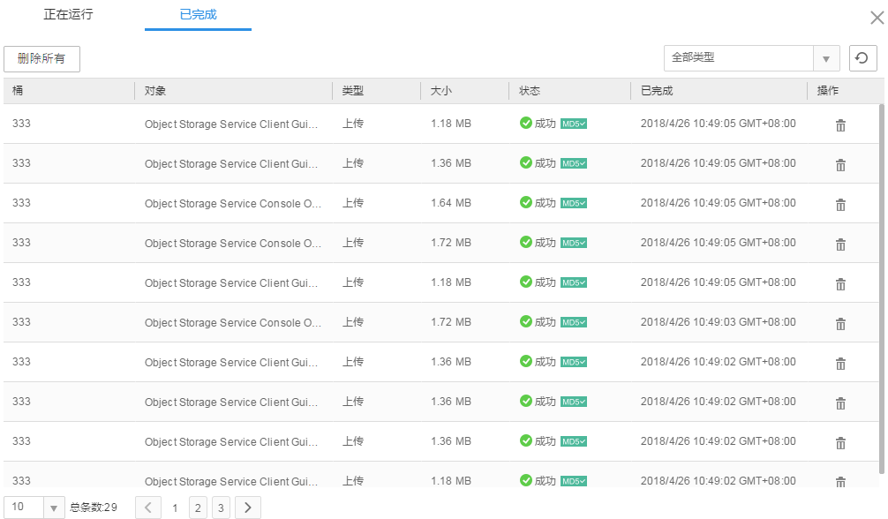

# MD5检验

## 背景信息

文件在上传和下载的过程中，受网络影响可能出现损坏。通过MD5校验，可以验证上传或下载文档的正确性。

OBS Browser开启MD5校验会影响上传下载速度。本章节以上传文件为例介绍MD5校验功能。

> **说明：**   
>桶中文件具有MD5信息，下载文件时才会做MD5校验。  

## 操作步骤

1.  登录OBS Browser。
2.  单击页面右上角的图标并选择“系统配置”。
3.  在“系统配置\>基本配置”窗口，勾选“启用MD5校验”，如[图1](#fig10854191014450)所示。

    **图 1**  配置MD5校验  
    

4.  单击“保存”。
5.  单击想要上传文件或文件夹的桶。
6.  单击“上传”，并选择“上传文件”。
7.  单击“选择文件”，在弹出的对话框中，选中需要上传的文件，单击“打开”。
8.  单击“确定”。
9.  在页面右上角单击，在“正在运行”任务管理列表中可以查看到文件上传状态和MD5校验状态，如[图2](#fig14907112515577)所示。

    **图 2**  MD5校验状态  
    

10. 文件上传完成，可以在“已完成”任务管理列表中查看到MD5校验结果，如[图3](#fig15378815719)所示。

    **图 3**  MD5校验结果  
    

