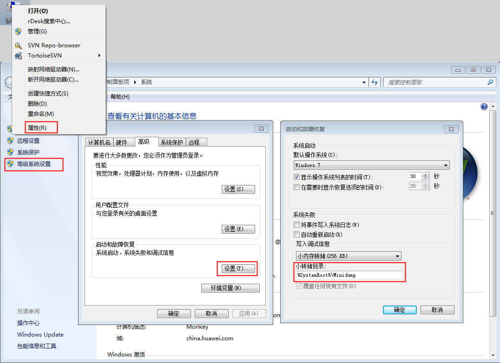

# 使用客户端上传文件时，出现蓝屏或黑屏现象

## 问题

为什么使用OBS Browser上传文件时，出现蓝屏或黑屏现象？

## 回答

使用OBS Browser上传大量文件或少量大文件时，会占用较大的内存空间。请检查您PC机的内存剩余空间是否大于等于512MB，若不足，请关闭其他应用程序释放内存，或者增加PC机的内存或虚拟内存后重试。

若扩大内存后，仍不能归避此问题，请根据如下步骤收集dump文件，并联系客服定位并处理问题。

1.  右键单击“计算机”，如[图1](#f47717ffaf52748978a29fe06579e969f)所示，单击“属性 \> 高级系统设置 \> 设置”查看小转储目录路径。

    此处截图以Windows 7 Pro SP1 64-bit操作系统为例。

    **图 1**  查看小转储目录路径  
    

2.  进入上图所示的小转储目录下，将所有后缀名为**.dump**的文件拷贝并打包发送给联系客服定位并处理问题。

