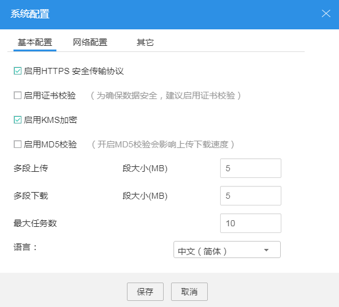
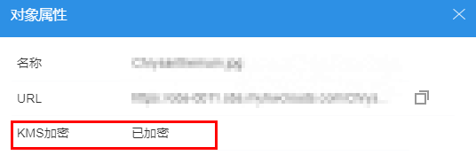

# 使用服务端加密方式上传文件

用户可根据需要对对象进行服务端加密，使对象更安全的存储在OBS中。

## 前提条件

已通过IAM服务添加OBS所在区域的**KMS Administrator**权限。权限添加方法请参见《统一身份认证服务用户指南》的“如何管理用户组并授权？”章节。

## 操作步骤

1.  登录OBS Browser。
2.  在页面右上角单击。
3.  单击“系统配置 \> 基本配置”，如[图1](#fdd58a926a65c4dc39d5a7be42a9bb60c)所示。

    **图 1**  配置KMS加密  
    

4.  勾选“启用HTTPS安全传输协议”以及“启用KMS加密”。

    勾选“启用HTTPS安全传输协议”和“启用KMS加密”后，上传到OBS中的所有对象都会进行KMS加密。对象上传成功后，单击对象列表右侧的图标进入“属性”界面，可查看对象的加密状态，如所示。“已加密”表示该对象已进行服务的加密，“未加密”表示该对象未进行服务的加密。对象的加密状态不可修改。

    > **说明：**   
    >由于启用KMS加密上传对象，必须启用HTTPS安全传输协议，所以，若取消勾选“启用HTTPS安全传输协议”，则“启用KMS加密”复选框也会取消选择状态。  

    **图 2**  加密状态  
    

    > **说明：**   
    >-   由于服务端加密功能不支持HTTP协议,所以想要使用服务端加密功能，需开启HTTPS协议。  
    >-   使用中的密钥不可以删除，如果删除将导致加密对象不能下载。  

