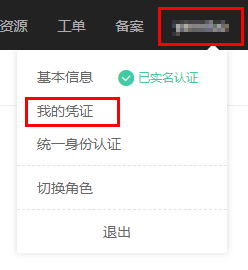

# 创建访问密钥（AK和SK）

本节介绍如何通过OBS管理控制台创建访问密钥（AK和SK），访问密钥（AK和SK）用于对请求加密签名，确保请求的机密性、完整性和请求双方身份的正确性。

## 背景信息

AK和SK支持IAM的认证机制，以下是对AK和SK的解释说明：

-   AK：Access Key ID，接入键标识，用户在OBS系统中的接入键标识，一个接入键标识唯一对应一个用户，一个用户可以同时拥有多个接入键标识。OBS系统通过接入键标识识别访问系统的用户。
-   SK：Secret Access Key，安全接入键，用户在OBS系统中的安全接入键，是用户访问OBS系统的密钥，用户根据安全接入键和请求头域生成鉴权信息。安全接入键和接入键标识一一对应。

## 约束和限制

每个用户最多可以创建两个有效的访问密钥。

## 前提条件

已注册并开通云服务账号。

## 操作步骤

1.  登录OBS管理控制台。
2.  单击页面右上角的用户名，并选择“我的凭证”，如[图1](#fig26678797173645)所示。

    **图 1**  选择我的凭证  
    

3.  进入“我的凭证”页面，单击“管理访问密钥”页签下方的“新增访问密钥”，如[图2](#fig674123982213)所示。

    **图 2**  新增访问密钥  
    

    > **说明：**   
    >每个用户最多可创建两个有效的访问密钥。  

4.  在弹出的“新增访问密钥”对话框中，输入登录密码和对应验证码。

    > **说明：**   
    >-   用户如果未绑定邮箱和手机，则只需输入登录密码。  
    >-   用户如果同时绑定了邮箱和手机，可以选择其中一种方式进行验证。  

5.  单击“确定”。
6.  根据浏览器提示，保存密钥。密钥会直接保存到浏览器默认的下载文件夹中。

    > **说明：**   
    >-   为防止访问密钥泄露，建议您将其保存到安全的位置。如果用户在此提示框中单击“取消”，则不会下载密钥，后续也将无法重新下载。如果需要使用访问密钥，可以重新创建新的访问密钥。  
    >-   访问密钥（AK和SK）需定期更新。  

7.  打开下载下来的“credentials.csv”文件既可获取到访问密钥（AK和SK）。

