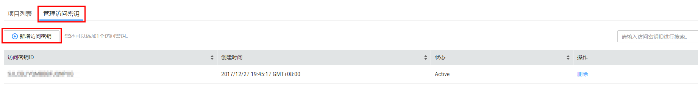
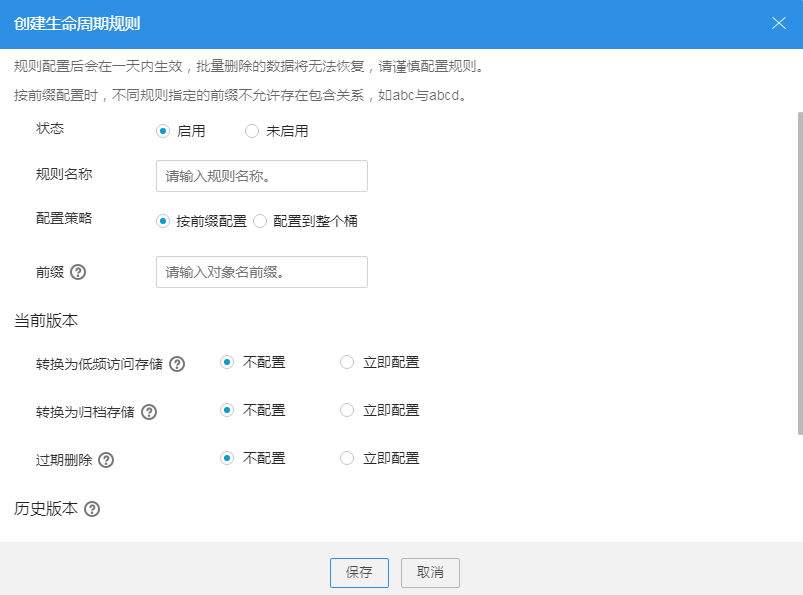

# 备份或归档数据

## 背景信息

OBS是按存储容量和时间计费的，某公司有大量视频或音频数据需要备份或归档在OBS中，在一段时间内，可能这些视频或音频文件的访问频率较高，但在一定时间过后，可能就不会再访问这些文件了。用户可选择在一段时间后删除这些文件，以此来达到节约成本，更高效利用OBS的目的。

用户可通过OBS管理控制台和OBS Browser两种工具存储数据。在使用OBS做备份或归档的情况下，用户一般会存储大量数据，此时，建议选择使用OBS Browser批量上传待备份或归档的数据。通过OBS Browser的批量上传功能上传数据，可大大缩短数据上传时间。

## 配置步骤

1.  登录OBS管理控制台。
2.  创建登录OBS Browser需要用到的访问密钥，即AK和SK。
    1.  登录OBS管理控制台。
    2.  单击OBS对象存储管理控制台页面右上角的用户名，并选择“我的凭证”。
    3.  在“我的凭证”页面，单击“管理访问秘钥\>新增访问秘钥”，如[图1](#fig1722545183515)所示。

        每个用户最多可创建两个有效的访问密钥。

        **图 1**  新增访问密钥  
        

    4.  在弹出的“新增访问密钥”对话框中，输入登录密码和对应验证码。

        > **说明：**   
        >-   用户如果未绑定邮箱和手机，则只需输入登录密码。  
        >-   用户如果同时绑定了邮箱和手机，可以选择其中一种方式进行验证。  

    5.  单击“确定”。
    6.  根据浏览器提示，保存密钥。密钥会直接保存到浏览器默认的下载文件夹中。

        > **说明：**   
        >为防止访问密钥泄露，建议您将其保存到安全的位置。如果用户在此提示框中单击“取消”，则不会下载密钥，后续也将无法重新下载。如果需要使用访问密钥，可以重新创建新的访问密钥。  

    7.  打开下载下来的“credentials.csv”文件既可获取到访问密钥（AK和SK）。

3.  使用[2](#l68ad1e1e9a5b46eeaf868e24bab04475)中创建的访问密钥登录OBS Browser，如[图2](#fd995745dbd3541f1b3284aeb717604eb)所示。

    **图 2**  添加新账号-OBS存储  
    

4.  根据不同的应用场景，创建不同存储类别的桶。
    -   备份场景：单击“添加桶”，在弹出框的“存储类别”后选择“低频访问存储”，输入桶名和选择区域后单击“确定”创建一个低频访问存储桶，用于存放待备份的数据。
    -   归档场景：单击“添加桶”，在弹出框“存储类别”后选择“归档存储”，输入桶名和选择区域后单击“确定”创建一个归档存储桶，用于存放待归档的数据。

5.  将需要备份或归档的数据上传到新创建的桶中。
6.  单击页面左上角的图标返回桶列表。
7.  右键单击备份或归档数据存储的目标桶，并选择“生命周期管理”，进入生命周期设置界面。
8.  在“生命周期管理”对话框中单击“创建”，系统弹出如[图3](#f54e834339e4b4c179c802fc391687474)所示对话框。

    **图 3**  创建生命周期规则  
    

9.  配置生命周期管理规则。

    基本信息：

    -   “状态”：选中“启用”，启用本条生命周期规则。
    -   “规则名称”：用于识别不同的生命周期配置，其长度需不超过255字符。
    -   “策略”：可以按前缀配置，也可以配置到整个桶。
        -   按前缀配置：满足该前缀的对象将受生命周期规则管理，输入的对象前缀不能包括\\\\:\*?\\"<\>|特殊字符，不能以/开头或结尾，不能两个/相邻。
        -   配置到整个桶：桶内所有对象都将受生命周期规则管理。

    > **说明：**   
    >-   当按前缀配置时，如果指定的前缀名与某条已配置的生命周期规则指定的前缀名存在包含关系，OBS会将两条规则视为同一条，而禁止您配置本条规则。例如，系统中已存在指定前缀名为“abc”的规则，则不允许再配置指定前缀以“abc”字段开头的规则。  
    >-   如果已存在按前缀配置的生命周期规则，则不允许再新增配置到整个桶的规则。  
    >-   如果已存在配置到整个桶的生命周期规则，则不允许再新增按前缀配置的规则，此时界面的“添加规则”按钮会变成灰色，表示不可操作。  

    当前版本或历史版本：

    -   转换为低频访问存储：指定在对象最后一次更新后多少天，受规则影响的对象将转换为低频访问存储。至少设置为30天。
    -   转换为归档存储：指定在对象最后一次更新后多少天，受规则影响的对象将转换为归档存储。若同时设置转换为低频访问存储和转换为归档存储，则转换为归档存储的时间要比转换为低频访问存储的时间至少长30天。若单独设置转换为归档存储，则没有时间限制。
    -   过期删除：指定在对象最后一次更新后多少天，受规则影响的对象将过期并自动被OBS删除。过期时间必须大于前两个转换时间的最大值。

        > **说明：**   
        >-   “当前版本”与“历史版本”是针对“多版本控制”而言的。若开启了“多版本控制”功能，同名的对象上传到同一路径下时，则会产生不同的版本号。最新版本的对象称之为“当前版本”，历史时间上传的对象称之为“历史版本”。  
        >-   可以同时配置这两个版本，也可以只配置一个版本，也可以都不配置。  

    例如，您于2015年1月7日在OBS中存储了以下几个文件：

    -   log/test1.log
    -   log/test2.log
    -   doc/example.doc
    -   doc/good.txt

    您于2015年1月10日在OBS中存储了以下几个文件：

    -   log/clientlog.log
    -   log/serverlog.log
    -   doc/work.doc
    -   doc/travel.txt

        在2015年1月10日设置前缀为“log”的对象，过期删除的时间设置为一天，OBS将会在2015年1月12日自动删除“log/clientlog.log”、“log/serverlog.log”、“log/test1.log”和“log/test2.log”这四个对象。

        在今天设置前缀为“log”的对象，转换为低频访问存储的时间设置为30天，转换为归档存储的时间设置为60天，过期删除的时间设置为100天，OBS将会第31天将“log/clientlog.log”、“log/serverlog.log”、“log/test1.log”和“log/test2.log”这四个对象转换为低频访问存储，第61天后转换为归档存储，第101天后自动删除这些对象。

    > **说明：**   
    >对象存储类别的转换以及过期后被删除的时间可能会延迟，一般不超过48小时。  

10. 单击“保存”
11. 在“生命周期规则”对话框中单击“保存”，保存当前的生命周期规则。
12. 在弹出的消息窗口中，单击“确定”关闭创建结果消息窗口。

