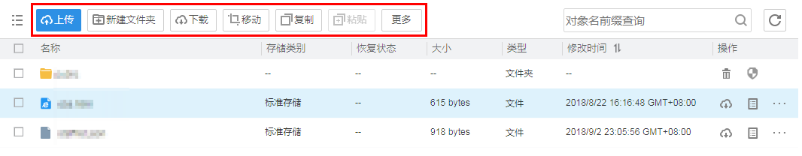
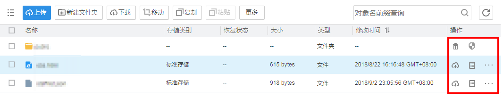
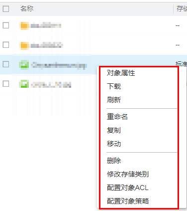

# 对象管理方法介绍

OBS Browser支持以下三种方式管理对象。

1.  通过对象列表上方的操作按钮管理对象。

    单击待操作对象所在行，选择对象列表上方的操作按钮管理对象，如[图1](#fig4140529718916)所示。

    **图 1**  对象管理第一种方法  
    

2.  通过对象所在行右侧的操作按钮管理对象。

    单击待操作对象所在行右侧的操作按钮管理对象，如[图2](#fig24767716181032)所示。

    **图 2**  对象管理第二种方法  
    

3.  通过右键选项管理对象。

    右键单击待操作对象所在行，通过选择弹出框里的操作管理对象，如[图3](#fig56131650141216)所示。

    **图 3**  对象管理第三种方法  
    

