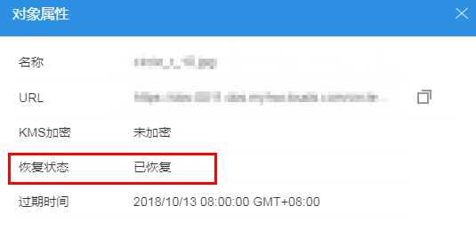

# 恢复归档存储文件

针对存储类别为归档存储的对象，用户需要先恢复才能下载。

## 背景信息

归档存储是一种很少访问（平均一年访问一次）、但安全、持久且成本极低的存储服务，适用于数据归档和长期备份。客户能够以极低的价格安全地存储数据，帮助客户显著降低了成本。为了保持成本低廉，数据恢复时间可能长达数分钟到数小时不等。

归档存储的对象正在恢复的过程中，不允许暂停或删除恢复任务。

对象状态为恢复中的对象不能再次恢复。

数据恢复时间和收费详情请参见[产品价格详情](https://support.huaweicloud.com/pro_price/index.html)。

## 操作步骤

1.  登录OBS Browser。
2.  单击待恢复文件所在的桶，进入对象列表页面。
3.  单击待恢复文件后的“恢复”图标或者选中待恢复的对象，并单击对象列表上方的“恢复”。

    恢复对象需要设置对象的有效期和恢复速率，参数解释如[表1](#t11e13a9301aa4729b85b9e6a3f461360)所示：

    **表 1**  恢复对象

    
    <table><thead align="left"><tr id="zh-cn_topic_0129289085_row20202933164622"><th class="cellrowborder" valign="top" width="23.68%" id="mcps1.2.3.1.1">
参数

    </th>
    <th class="cellrowborder" valign="top" width="76.32%" id="mcps1.2.3.1.2">
说明

    </th>
    </tr>
    </thead>
    <tbody><tr id="zh-cn_topic_0129289085_row63287564164622"><td class="cellrowborder" valign="top" width="23.68%" headers="mcps1.2.3.1.1 ">
有效期

    </td>
    <td class="cellrowborder" valign="top" width="76.32%" headers="mcps1.2.3.1.2 ">
对象恢复后，保持为“已恢复”状态的时长，从对象恢复完成开始计时。有效期时长可设置1-30天的整数。系统默认有效期为30天。

    
例如：恢复对象时，有效期设置为20天，则从对象恢复成功后开始算起，20天后，该对象则会从“已恢复”状态变成“未恢复”状态。

    </td>
    </tr>
    <tr id="zh-cn_topic_0129289085_row53182611164622"><td class="cellrowborder" valign="top" width="23.68%" headers="mcps1.2.3.1.1 ">
速率

    </td>
    <td class="cellrowborder" valign="top" width="76.32%" headers="mcps1.2.3.1.2 ">
对象的恢复速度。

    <ul id="zh-cn_topic_0129289085_ul20730162164622"><li>加急：可在1-5分钟内恢复归档存储数据。</li><li>标准：可在3-5小时内恢复归档存储数据。</li></ul>
    </td>
    </tr>
    </tbody>
    </table>

4.  单击“确定”。

    文件恢复状态可单击对象右侧的图标，在“对象属性”页面查看，如[图1](#fe014653c9d364bf3999772d96d998638)所示。

    **图 1**  恢复状态  
    

    文件恢复成功后才能对该文件进行下载操作。可单击页面右上角的“刷新”按钮手动刷新恢复任务查看恢复进度，系统也会每5分钟自动刷新恢复任务。

    > **说明：**   
    >系统每天会在UTC 00:00点检查一次文件恢复情况，过期时间是根据最近一次系统检查时间开始计算的。  

## 相关操作

在对象有效期内，用户可以重复做对象恢复操作。对象的有效期会根据最新一次的恢复完成时间开始算起，以此可以达到延长对象有效期的目的。

> **说明：**   
>重复恢复对象时，其过期时间应该在上一次恢复对象的过期时间之后。  

