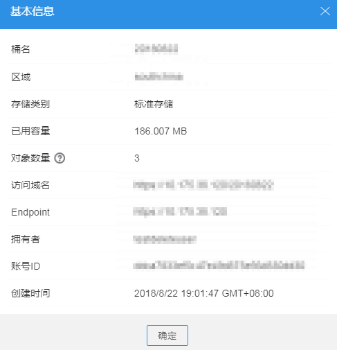

# 查看桶的基本信息

您可以通过OBS Browser查看桶的基本信息，如拥有者、位置、容量、对象数等。

## 操作步骤

1.  登录OBS Browser。
2.  选中待查看的桶，单击“基本信息”。
3.  在弹出的“基本信息”界面中查看桶的基本信息，如[图1](#fig35840242155659)所示。

    **图 1**  基本信息  
    

    **表 1**  参数说明

    
    <table><thead align="left"><tr id="r3491e5e338144b579a4fca838bc0237d"><th class="cellrowborder" valign="top" width="27%" id="mcps1.2.3.1.1">
参数

    </th>
    <th class="cellrowborder" valign="top" width="73%" id="mcps1.2.3.1.2">
说明

    </th>
    </tr>
    </thead>
    <tbody><tr id="row164215717380"><td class="cellrowborder" valign="top" width="27%" headers="mcps1.2.3.1.1 ">
桶名

    </td>
    <td class="cellrowborder" valign="top" width="73%" headers="mcps1.2.3.1.2 ">
桶的名称。

    </td>
    </tr>
    <tr id="ra2be5def84e74e0bb76977526c9451d3"><td class="cellrowborder" valign="top" width="27%" headers="mcps1.2.3.1.1 ">
区域

    </td>
    <td class="cellrowborder" valign="top" width="73%" headers="mcps1.2.3.1.2 ">
桶所在的区域。

    </td>
    </tr>
    <tr id="rb7e5fba4613d4c7f898374ffb25c728e"><td class="cellrowborder" valign="top" width="27%" headers="mcps1.2.3.1.1 ">
存储类别

    </td>
    <td class="cellrowborder" valign="top" width="73%" headers="mcps1.2.3.1.2 ">
桶的存储类别，有标准存储、低频访问存储、归档存储三种类别。

    </td>
    </tr>
    <tr id="r261a91b4f5e646b981a4b7f7a36495fb"><td class="cellrowborder" valign="top" width="27%" headers="mcps1.2.3.1.1 ">
已用容量

    </td>
    <td class="cellrowborder" valign="top" width="73%" headers="mcps1.2.3.1.2 ">
桶中存储的对象占用的存储空间。

    </td>
    </tr>
    <tr id="r85dcfe96a3bc490c842642438490d9e7"><td class="cellrowborder" valign="top" width="27%" headers="mcps1.2.3.1.1 ">
对象数量

    </td>
    <td class="cellrowborder" valign="top" width="73%" headers="mcps1.2.3.1.2 ">
桶中文件夹、当前版本文件和历史版本文件总和。

    </td>
    </tr>
    <tr id="row026413344712"><td class="cellrowborder" valign="top" width="27%" headers="mcps1.2.3.1.1 ">
访问域名

    </td>
    <td class="cellrowborder" valign="top" width="73%" headers="mcps1.2.3.1.2 ">
桶的访问域名，格式为：<i>桶名</i>.<i>域名</i>

    </td>
    </tr>
    <tr id="row6678195187"><td class="cellrowborder" valign="top" width="27%" headers="mcps1.2.3.1.1 ">
Endpoint

    </td>
    <td class="cellrowborder" valign="top" width="73%" headers="mcps1.2.3.1.2 ">
桶所在区域的域名。OBS为每个区域提供Endpoint，用于处理各自区域的访问请求。

    </td>
    </tr>
    <tr id="row16321236163718"><td class="cellrowborder" valign="top" width="27%" headers="mcps1.2.3.1.1 ">
拥有者

    </td>
    <td class="cellrowborder" valign="top" width="73%" headers="mcps1.2.3.1.2 ">
桶的拥有者是指桶创建者的账号。

    </td>
    </tr>
    <tr id="r3da122b4f2c9404da7fbb03a0949d5a0"><td class="cellrowborder" valign="top" width="27%" headers="mcps1.2.3.1.1 ">
账号ID

    </td>
    <td class="cellrowborder" valign="top" width="73%" headers="mcps1.2.3.1.2 ">
桶的拥有者全局唯一标识，与“我的凭证”页面的“账号ID”相同。

    </td>
    </tr>
    <tr id="r66ae4a56bee74c9697633ab781ed602d"><td class="cellrowborder" valign="top" width="27%" headers="mcps1.2.3.1.1 ">
创建时间

    </td>
    <td class="cellrowborder" valign="top" width="73%" headers="mcps1.2.3.1.2 ">
桶的创建时间。

    </td>
    </tr>
    </tbody>
    </table>

    > **说明：**   
    >“已用容量”和“对象数量”非实时数据，系统更新存在至少15分钟的延迟。  

