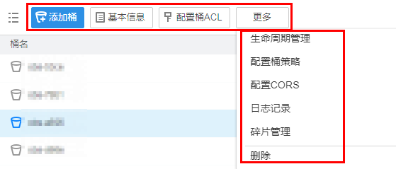
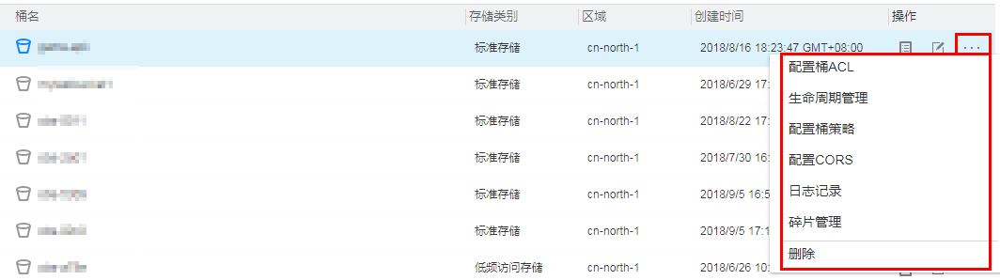

# 桶管理方法介绍

OBS Browser支持以下三种方式管理桶。

1.  通过OBS Browser桶列表上方的操作按钮管理桶。

    单击待操作桶所在行，选择桶列表上方的操作按钮管理桶，如[图1](#fcd32b0f2cd294fdaaa01e93655c90137)所示。

    **图 1**  桶管理第一种方法  
    

2.  通过桶所在行右侧的操作按钮管理桶。

    单击待操作桶所在行右侧的操作按钮管理桶，如[图2](#fig46223652173138)所示。

    **图 2**  桶管理第二种方法  
    

3.  通过右键选项管理桶。

    右键单击待操作桶所在行，通过选择弹出框里的操作管理桶，如[图3](#fig40567659173352)所示。

    **图 3**  桶管理第三种方法  
    

