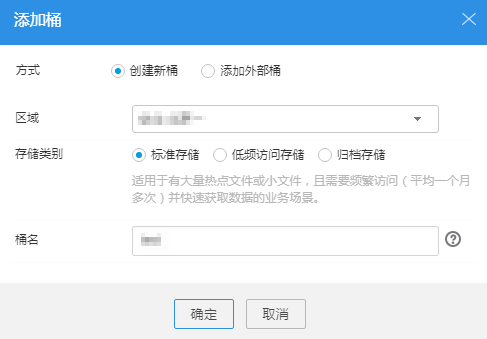

# 添加桶

桶是OBS中存储对象的容器。您需要先创建一个桶，然后才能在OBS中存储数据。

> **说明：**   
>一个账号可创建100个桶。  

## 操作步骤

1.  登录OBS Browser。
2.  在页面左上方单击“添加桶”，系统弹出如[图1](#obs_03_0022_fig43772663175835)所示对话框。

    **图 1**  添加桶  
    

3.  设置桶的相关参数，参数描述如[表1](#tcbb89d695149467789cfdd635af1df0c)所示。

    **表 1**  创建桶

    
    <table><thead align="left"><tr id="r68a17455096b4296954bbe548e043709"><th class="cellrowborder" valign="top" width="24.43%" id="mcps1.2.3.1.1">
参数

    </th>
    <th class="cellrowborder" valign="top" width="75.57000000000001%" id="mcps1.2.3.1.2">
说明

    </th>
    </tr>
    </thead>
    <tbody><tr id="row11330107171416"><td class="cellrowborder" valign="top" width="24.43%" headers="mcps1.2.3.1.1 ">
方式

    </td>
    <td class="cellrowborder" valign="top" width="75.57000000000001%" headers="mcps1.2.3.1.2 ">
选择“创建新桶”。

    </td>
    </tr>
    <tr id="r2249a188eb05438b9917d04f844cad9c"><td class="cellrowborder" valign="top" width="24.43%" headers="mcps1.2.3.1.1 ">
区域

    </td>
    <td class="cellrowborder" valign="top" width="75.57000000000001%" headers="mcps1.2.3.1.2 ">
选择新建桶所在的区域。

    </td>
    </tr>
    <tr id="rbe52c4e262b746eeb342333853dd9b8b"><td class="cellrowborder" valign="top" width="24.43%" headers="mcps1.2.3.1.1 ">
存储类别

    </td>
    <td class="cellrowborder" valign="top" width="75.57000000000001%" headers="mcps1.2.3.1.2 ">
桶的存储类别有三种，分别为：标准存储、低频访问存储、归档存储。

    <ul id="uef63531703f3494dad84f6a2666529f1"><li>标准存储：拥有低访问时延和较高的吞吐量。</li><li>低频访问存储：适用于不频繁访问（平均一年少于12次）但在需要时也要求快速访问数据的业务场景。</li><li>温存储：适用于不频繁访问（平均一年少于12次）但在需要时也要求快速访问数据的业务场景。</li><li>归档存储：适用于很少访问（平均一年访问一次）数据的业务场景。</li></ul>
    </td>
    </tr>
    <tr id="rbb06d7afa582475da604f2ba63295b8f"><td class="cellrowborder" valign="top" width="24.43%" headers="mcps1.2.3.1.1 ">
桶名称

    </td>
    <td class="cellrowborder" valign="top" width="75.57000000000001%" headers="mcps1.2.3.1.2 ">
OBS中桶按照DNS规范进行命名，DNS规范为全球通用规则，其具体命名规则如下：

    <ul id="ul28645947"><li>需全局唯一，不能与已有的任何桶名称重复。</li><li>长度范围为3到63个字符，支持小写字母、数字、中划线（-）、英文句号（.）。</li><li>禁止两个英文句号（.）或英文句号（.）和中划线（-）相邻，禁止以英文句号（.）和中划线（-）开头或结尾。</li><li>禁止使用IP地址。</li><li>如果名称中包含英文句号（.），访问桶或对象时可能会进行安全证书校验。</li></ul>
    </td>
    </tr>
    </tbody>
    </table>

    > **说明：**   
    >-   由于通过URL访问桶时，桶名会作为URL的一部分，根据DNS标准，URL不支持大写字母，无法区分带大写字母的桶。因此，“桶名称”仅支持小写字母、数字、“-”、“.”作为桶的命名规则。例如：若想通过URL访问名为“MyBucket”的桶，该URL将解析成名为“mybucket”的桶，导致访问出错。  
    >-   DNS命名规范方便全局统一，方便在访问桶时对桶进行解析，可以使客户受益于新功能和优化性能，并支持对桶进行静态网站托管。  
    >-   桶创建成功后，不能修改名称，创建时，请设置合适的桶名。  

4.  单击“确定”。
5.  在弹出的消息窗口中，单击“确定”关闭创建结果消息窗口。

## 配置区域信息

OBS Browser支持“区域”信息可配置，具体配置方法如下：

1.  进入OBS Browser解压路径下的“OBS Browser”文件夹，打开“region”文件。
2.  修改“region”文件中的“options”参数值。

    将需要新增的区域信息根据如下格式填写到“options”参数后。

    _\{"key":"__区域别名","value":"__区域"\}_

    新增信息需遵守JSON格式。其字段含义如下：

    -   “key”表示区域别名，用户自定义。其值会展示在“创建桶”窗口中的区域框的下拉列表中。为了方便在界面查阅，建议输入值不超过25个字符。
    -   “value”表示“区域”，根据OBS支持的“区域”填写。

        每新增一个“区域”，“options”的值便增加一组**\{"key":"_区域别名_","value":"_区域_"\}**值，每组区域信息之间用英文逗号隔开即可。如下示例为新增“region01”和“region02”两个“区域”的配置。“region”文件中其余参数值保持不变。

        _"options":\[\{"key":"test\_region01","value":"region01"\},\{"key":"test\_region02","value":"region02"\}\]_

3.  “region”文件修改成功后，重启OBS Browser，使配置生效。

## 相关操作

您可以在创建桶时指定桶的存储类别，也可以在创建后修改桶的存储类别。修改步骤如下：

1.  登录OBS客户端。
2.  在桶列表中选择待操作的桶，并单击右侧的，系统弹出“修改存储类别”对象框。
3.  选择目标存储类别，并单击“确定”。修改桶的存储类别并不会影响存储在桶内的对象的存储类别。
4.  在弹出的消息窗口中，单击“确定”关闭创建结果消息窗口。

