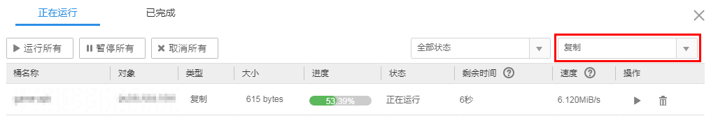

# 管理复制任务

用户可通过OBS Browser软件管理复制任务。

## 前提条件

您执行过复制任务。

## 操作步骤

1.  登录OBS Browser。
2.  在页面右上角单击。
3.  在右上角的选择框中选择“复制”，如[图1](#faa7ed20f26954ad5ac5865623dc5f8b0)所示。

    **图 1**  复制任务列表  
    

    可能存在多种原因导致任务复制失败，单击“全部状态 \> 失败”，查看复制失败的任务，可选中复制失败的任务，单击对其进行重新复制操作。也可将鼠标移动到失败任务后的图标上查看失败原因。

4.  **可选**：选择正在运行的任务，单击，暂停任务。也可单击“暂停所有”，暂停所有任务。

    已暂停的任务，可单击，继续运行任务。也可单击“运行所有”，运行所有任务。

5.  **可选**：选择正在运行的任务，单击，删除任务。也可单击“取消所有”删除任务列表中所有正在上传、下载、删除、移动、复制的任务。
6.  **可选**：单击页面上方“已完成”，可查看已完成的任务。单击已完成任务后的按钮删除已完成的任务。也可单击页面上方的“全部删除”删除全部已完成的任务。

