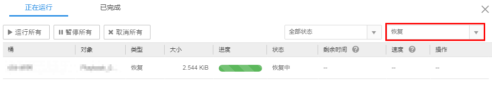

# 管理恢复任务

用户可通过OBS Browser管理恢复任务。

## 前提条件

您执行过恢复任务。

## 操作步骤

1.  登录OBS Browser。
2.  在页面右上角单击。
3.  在右上角的选择框中选择“恢复”，如[图1](#fig14114384193210)所示。

    **图 1**  恢复任务列表  
    

    可能存在多种原因导致任务恢复失败，可将鼠标移动到失败任务后的图标上查看失败原因。

    无法查看恢复任务的速度和剩余时间，文件恢复状态可单击对象右侧的**更多\>对象属性**，在“对象属性”页面查看，如[图2](#fig19823508193541)所示。

    **图 2**  恢复状态  
    

    文件恢复成功后才能对该文件进行下载操作。可单击页面右上角的“刷新”按钮手动刷新恢复任务查看恢复进度，系统也会每5分钟自动刷新恢复任务。

    > **说明：**   
    >-   “运行所有”和“暂停所有”按钮操作对恢复任务不生效。  
    >-   “取消所有”按钮操作，对正在恢复的任务不生效，恢复失败的任务会删除。  

4.  **可选**：单击页面上方“已完成”，可查看已完成的任务。单击已完成任务后的按钮删除已完成的任务。也可单击页面上方的“全部删除”删除全部已完成的恢复任务。

