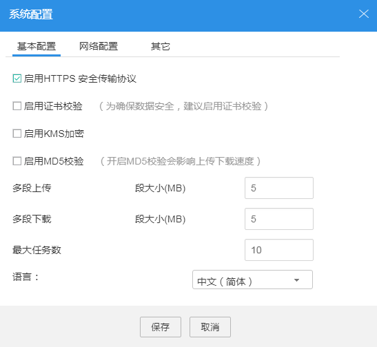
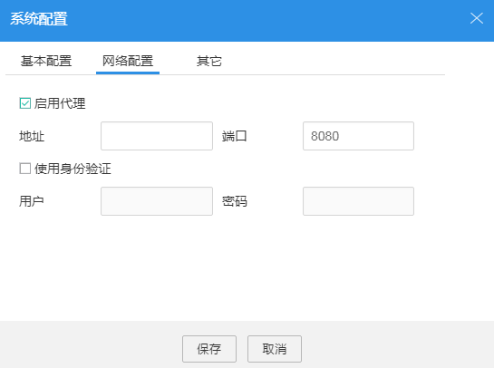
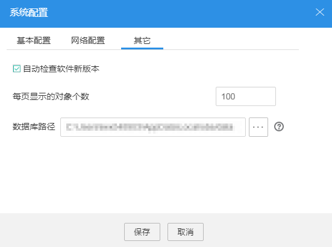

# 系统配置

本节介绍如何修改OBS Browser的各项配置。

## 操作步骤

1.  登录OBS Browser。
2.  在OBS Browser右上角，单击，并选择“系统配置”，如[图1](#fig42068739173655)所示。

    **图 1**  系统配置  
    

3.  在弹出的“系统配置”对话框中，更改需要修改的基本配置参数。

    各参数含义如[表1](#t5b000a761ce742d3a008e78296aa7e23)所示。

    **表 1**  OBS Browser配置

    
    <table><thead align="left"><tr id="rfc94c5f5c90a40ad972e6d88fa20f45b"><th class="cellrowborder" valign="top" width="28.000000000000004%" id="mcps1.2.3.1.1">
参数

    </th>
    <th class="cellrowborder" valign="top" width="72%" id="mcps1.2.3.1.2">
说明

    </th>
    </tr>
    </thead>
    <tbody><tr id="rdb7f5ea2a4d74adf91a7682afdb7f55a"><td class="cellrowborder" valign="top" width="28.000000000000004%" headers="mcps1.2.3.1.1 ">
启用HTTPS安全传输协议

    </td>
    <td class="cellrowborder" valign="top" width="72%" headers="mcps1.2.3.1.2 ">
勾选后所有通信信息都将被加密，通过HTTPS协议传输到OBS中。

    </td>
    </tr>
    <tr id="row4738349017324"><td class="cellrowborder" valign="top" width="28.000000000000004%" headers="mcps1.2.3.1.1 ">
启用证书检验

    </td>
    <td class="cellrowborder" valign="top" width="72%" headers="mcps1.2.3.1.2 ">
勾选后，客户端会校验服务端的证书。

    </td>
    </tr>
    <tr id="row19413122016318"><td class="cellrowborder" valign="top" width="28.000000000000004%" headers="mcps1.2.3.1.1 ">
启用KMS加密

    </td>
    <td class="cellrowborder" valign="top" width="72%" headers="mcps1.2.3.1.2 ">
勾选“启用HTTPS安全传输协议”和“启用KMS加密”后，上传到OBS中的所有对象都会进行KMS加密。

    </td>
    </tr>
    <tr id="row643524614297"><td class="cellrowborder" valign="top" width="28.000000000000004%" headers="mcps1.2.3.1.1 ">
启用MD5校验

    </td>
    <td class="cellrowborder" valign="top" width="72%" headers="mcps1.2.3.1.2 ">
勾选后，客户端上传、下载文件会进行MD5校验。

    </td>
    </tr>
    <tr id="r9d15bd3a61304c50b4a10db1b16925a0"><td class="cellrowborder" valign="top" width="28.000000000000004%" headers="mcps1.2.3.1.1 ">
多段上传，段大小(MB)

    </td>
    <td class="cellrowborder" valign="top" width="72%" headers="mcps1.2.3.1.2 ">
系统默认使用多段上传功能，大于设置的段大小（默认为5MB）的对象在OBS后台将分为多个数据段进行上传，每个数据段的大小通过此界面进行配置。“段大小(MB)”的设置区间在5MB到5GB之间。

    
 说明： 

系统默认使用多段上传功能，“段大小(MB)”推荐设置指导如下：

    
为最大限度提升客户端性能，设置分段上传的“段大小(MB)”时可根据实际的上传速度而定，“段大小(MB)”值高于最大上传速度值最佳。例如：当前网络的最大上传速度为10MBps，则“段大小(MB)”值需为大于10MB的一个整数值，一般设置为最大上传速度值的两到三倍。

    

    </td>
    </tr>
    <tr id="row3807301024"><td class="cellrowborder" valign="top" width="28.000000000000004%" headers="mcps1.2.3.1.1 ">
多段下载，段大小(MB)

    </td>
    <td class="cellrowborder" valign="top" width="72%" headers="mcps1.2.3.1.2 ">
系统默认使用多段下载功能，大于设置的段大小（默认为5MB）的对象在OBS后台将分为多个数据段进行上传，每个数据段的大小通过此界面进行配置。“段大小(MB)”的设置区间在5MB到5GB之间。

    </td>
    </tr>
    <tr id="row8122057132112"><td class="cellrowborder" valign="top" width="28.000000000000004%" headers="mcps1.2.3.1.1 ">
最大任务数

    </td>
    <td class="cellrowborder" valign="top" width="72%" headers="mcps1.2.3.1.2 ">
设置最大上传和下载任务个数，请输入2到20的整数。

    </td>
    </tr>
    <tr id="r5c282d679f104865892038ab05394b01"><td class="cellrowborder" valign="top" width="28.000000000000004%" headers="mcps1.2.3.1.1 ">
语言

    </td>
    <td class="cellrowborder" valign="top" width="72%" headers="mcps1.2.3.1.2 ">
根据需求设置语言类型。语言切换后，重启软件生效。

    </td>
    </tr>
    </tbody>
    </table>

4.  **可选**：单击“网络配置”，根据需求设置代理服务器信息，如[图2](#fig543149173827)所示。

    **图 2**  网络配置  
    

    **表 2**  参数说明

    
    <table><thead align="left"><tr id="r0490806c5cb5479da3ea9bc271e9302b"><th class="cellrowborder" valign="top" width="26%" id="mcps1.2.3.1.1">
参数

    </th>
    <th class="cellrowborder" valign="top" width="74%" id="mcps1.2.3.1.2">
说明

    </th>
    </tr>
    </thead>
    <tbody><tr id="r5d619d0924594f0ea5a7e192c9512dce"><td class="cellrowborder" valign="top" width="26%" headers="mcps1.2.3.1.1 ">
启用代理

    </td>
    <td class="cellrowborder" valign="top" width="74%" headers="mcps1.2.3.1.2 ">
勾选后，会展示“使用身份验证”的可选项。设置以下参数就可以通过代理服务器访问OBS。

    <ul id="u12af2c34ad70412eb298ce10202467ec"><li>地址：代理服务器地址。</li><li>端口：代理服务器端口（默认为“8080”）。</li></ul>
    </td>
    </tr>
    </tbody>
    </table>

5.  **可选**：单击“其它”，根据需要设置其他配置信息，如[图3](#fig2876079495946)所示。

    **图 3**  其他配置  
    

    **表 3**  OBS Browser其它参数配置

    
    <table><thead align="left"><tr id="rb8a4d9d54d524899bcc64f29d2f08ff2"><th class="cellrowborder" valign="top" width="32.17%" id="mcps1.2.3.1.1">
参数

    </th>
    <th class="cellrowborder" valign="top" width="67.83%" id="mcps1.2.3.1.2">
说明

    </th>
    </tr>
    </thead>
    <tbody><tr id="re13f6930f0be4e25bd9c8468b8047b12"><td class="cellrowborder" valign="top" width="32.17%" headers="mcps1.2.3.1.1 ">
自动检测软件新版本

    </td>
    <td class="cellrowborder" valign="top" width="67.83%" headers="mcps1.2.3.1.2 ">
勾选后，每次登录OBS Browser时，都会自动检查软件当前版本是否为最新版本。

    </td>
    </tr>
    <tr id="re936197711a94bde9f51b425081d8979"><td class="cellrowborder" valign="top" width="32.17%" headers="mcps1.2.3.1.1 ">
每页显示的对象个数

    </td>
    <td class="cellrowborder" valign="top" width="67.83%" headers="mcps1.2.3.1.2 ">
设置每页显示的对象个数。系统默认设置为100个。设置范围为50到300个。设置成功后可单击页面右上角的按钮使配置生效。

    </td>
    </tr>
    <tr id="row1910615592564"><td class="cellrowborder" valign="top" width="32.17%" headers="mcps1.2.3.1.1 ">
数据库路径

    </td>
    <td class="cellrowborder" valign="top" width="67.83%" headers="mcps1.2.3.1.2 ">
OBS Browser数据保存的路径。可以通过单击后面的，修改路径。

    </td>
    </tr>
    </tbody>
    </table>

6.  单击“保存”，保存系统配置。

