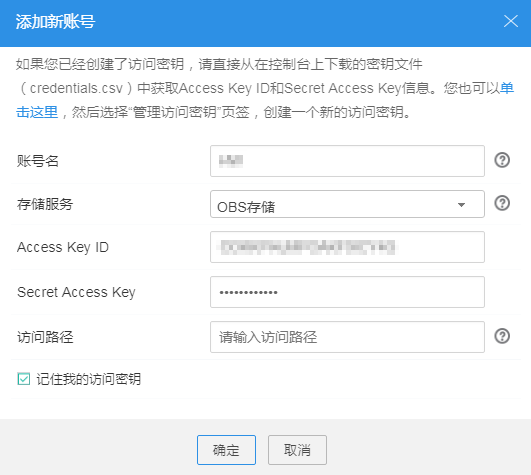
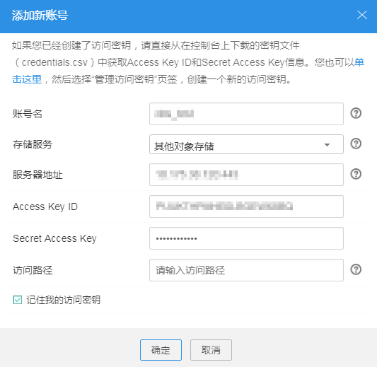

# 账号管理

OBS Browser支持多个账号的管理。

## 添加账号

OBS Browser最多支持添加10个账号信息。

1.  登录OBS Browser。
2.  在OBS Browser右上角，单击账号名，并选择“账号管理”。
3.  在弹出的“账号管理”对话框中，单击“添加新账号”。
4.  在“添加新账号”对话框中根据实际需要填写账号信息。

    需填写的账号信息包括如下几项：

    -   账号名：您在OBS Browser上使用的账号名，仅用于在OBS Browser上区别不同的账号，无需与云服务上注册的OBS帐号一致。账号名长度不超过50个字符。
    -   存储类型：OBS Browser支持连接到“OBS存储”或“其他对象存储”上。
        -   当连接对象存储服务时，选择“OBS存储”，，如[图1](#f7b99ff29dc1543b4b16e69c9db5bd5af)所示。

            **图 1**  添加新账号-OBS存储  
            

        -   当连接其他对象存储服务时，选择“其他对象存储”，，如[图2](#f8c588f27619148c78257359a12e609a7)所示

            您还需同时指定该存储的“服务器地址”，支持填写IP地址或域名，格式为：**_服务__器__IP__地址或域名_:_服务器端口号_**（HTTPS协议端口号为“443”，HTTP协议端口号为“80”）。系统默认服务器为HTTPS服务器，如需使用HTTP服务器，请单击页面右上角的图标并单击“系统配置”，在弹出的“系统配置”窗口，取消对“启用HTTPS安全传输协议”的勾选。

            **图 2**  添加新账号-“其他对象存储”  
            

    -   Access Key ID/Secret Access Key：您在存储服务（如OBS）上注册帐号后，在“我的凭证”创建的AK/SK。获取AK/SK方法详情请参见[创建访问密钥（AK和SK）](创建访问密钥（AK和SK）.md)。
    -   访问路径

        您可以输入桶名称或对象路径，登录成功后，将访问特定的桶或对象。

    -   系统默认会勾选“记住我的访问密钥”，若用户不勾选，则在每次登录OBS Browser时，需要重新填写“Secret Access Key”值。

5.  单击“确定”。

    账号信息保存成功后，添加的新账号会在页面右上角账号名下拉列表中显示。单击选中的账号即可切换当前登录账号。

## 编辑账号

1.  登录OBS Browser。
2.  在OBS Browser右上角，单击账号名，并选择“账号管理”。
3.  单击需要修改的账号后的“编辑”。
4.  根据需要修改账号信息。
5.  单击“确定”，保存修改的账号信息。

## 删除账号

1.  登录OBS Browser。
2.  在OBS Browser右上角，单击账号名，并选择“账号管理”。
3.  单击需要删除的账号后的“删除”。
4.  单击“确定”，完成帐号删除。

