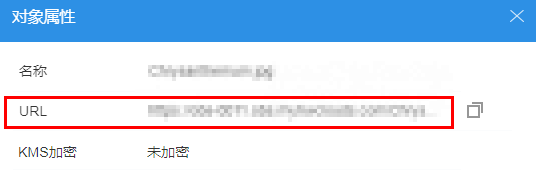

# 通过对象URL访问对象

对象URL（对象共享）功能，可实现匿名用户通过对象共享链接地址，直接访问对象数据。

## 前提条件

已通过OBS管理控制台设置匿名用户读取该指定对象的权限。

## 操作步骤

1.  登录OBS Browser。
2.  选中待配置的对象，单击需要共享的对象右侧的“对象属性”图标，如[图1](#fe095887a5e664d6aa0dd30456edda8b1)所示。在URL行查看该对象链接地址。

    登录OBS Browser时，选择“OBS存储”，则生成的对象链接地址格式为：https://_桶名.__域名_/_文件夹目录层级_/_对象名_。如果该对象存在于桶的根目录下，其链接地址不会有文件夹目录层级。

    **图 1**  对象属性  
    

    -   登录OBS Browser时，选择“其他对象存储”，则生成的对象链接地址格式为：https://_存储服务器IP__地址或域名_/_桶名_/_文件夹目录层级_/_对象名_。如果该对象存在于桶的根目录下，其链接地址不会有文件夹目录层级。
    -   登录OBS Browser时，选择“OBS存储”，则生成的对象链接地址格式为：https://_桶名.__域名_/_文件夹目录层级_/_对象名_。如果该对象存在于桶的根目录下，其链接地址不会有文件夹目录层级。

    > **说明：**   
    >对于存储类别为归档存储的桶中的对象，如果要让匿名用户通过URL访问，则需要先确认对象的状态是否为“已恢复”。  
    >据对象类型的不同，通过浏览器访问该对象的方式不同。例如：.txt、.html等文件可直接通过浏览器打开浏览，而.exe、.dat等文件则会在浏览器打开时，自动下载到本地。  

3.  单击，复制该对象链接地址。
4.  在弹出的消息窗口中，单击“确定”关闭创建结果消息窗口。
5.  将对象链接地址复制到浏览器中打开，即可访问该对象。

