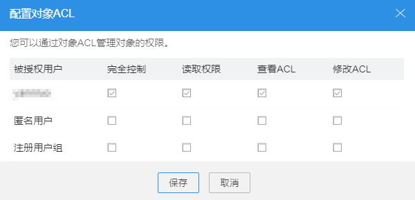

# 配置对象ACL

## 操作步骤

1.  登录OBS Browser。
2.  单击待配置的桶，进入桶界面。
3.  在待操作对象右侧，单击，选择“配置对象ACL”。
4.  根据需求设置目标桶的ACL权限，单击“保存”，如[图1](#ff824ee795c054719ae026365b7671c8f)所示。

    **图 1**  配置对象ACL  
    

5.  在弹出的消息窗口中，单击“确定”关闭创建结果消息窗口。

