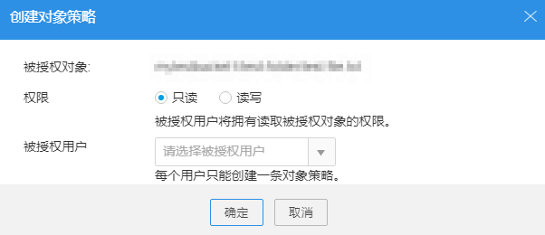

# 配置对象策略

## 操作步骤

1.  登录OBS Browser。
2.  单击待配置的桶，进入桶界面。
3.  选择待操作的对象，在对象列表上方，单击“配置对象策略”。
4.  若您是第一次配置，在系统弹出的“配置对象策略”对话框中，输入“账号ID”，并单击“确定”。若您不是第一次配置，则不会有改信息弹出，系统直接弹出“配置对象策略”窗口信息。

    “账号ID”可通过管理控制台的“我的凭证”页面查看。

5.  单击“创建对象策略”。
6.  在“创建对象策略”对话框中，设置权限，选择被授权的IAM用户。

    **图 1**  创建对象策略  
    

7.  单击“确定”。
8.  在“配置对象策略”对话框中，单击“保存”。
9.  在弹出的消息窗口中，单击“确定”关闭创建结果消息窗口。

