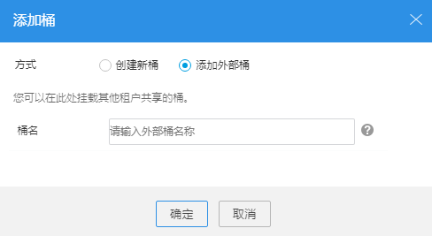

# 配置挂载外部桶

OBS Browser支持挂载外部桶功能。

## 前提条件

本账号已获取了挂载桶的相应的读写权限。桶的读写权限通过桶ACL配置。

对于特定用户的桶ACL权限，通过OBS管理控制台设置；注册用户的桶ACL权限则可通过OBS管理控制台和OBS Browser设置。当授权给注册账号权限时，所有在OBS上注册的账号都将获得该权限。

例如：账号A要挂载账号B的“testbucket”桶，账号B需授权给账号A“testbucket”桶的读取权限。账号A还需要上传对象到挂载桶中时，账号B还需授权给账号A“testbucket”桶的写入权限，上传到挂载桶中的对象的拥有者是账号A，同时授权账号B该对象的读写权限。

## 操作步骤

1.  登录OBS Browser。
2.  单击页面左上方“添加桶”。
3.  在弹出的对话框中，选择“方式”后的“添加外部桶”，并在“桶名”输入框中，输入需要挂载的外部桶名称，并单击“确定”，如[图1](#f6670af00503c4409a0d68693132a5926)所示。

    **图 1**  添加外部桶  
    

    当挂载外部桶成功后，用户可以在桶列表中查看到挂载的外部桶，并且对该桶有相应的ACL访问权限。

4.  在弹出的消息窗口中，单击“确定”关闭创建结果消息窗口。

