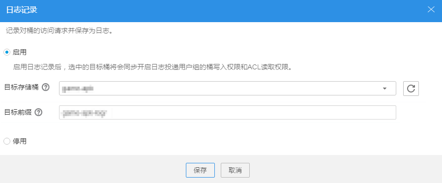

# 配置日志记录

当一个桶启用了日志记录功能后，OBS自动将该桶的日志按照固定的命名规则，生成一个对象写入用户指定的桶。

## 前提条件

日志投递用户组对目的桶具有“写入权限”和“查看ACL权限”。权限设置方法请参见[配置桶ACL权限](配置桶ACL权限.md)。

## 操作步骤

1.  登录OBS Browser。
2.  选中待配置的桶，单击“更多 \> 日志记录”。
3.  勾选“启用”，选择“目标桶”，并填写“目标前缀”后，单击“保存”，如[图1](#fig5791779717938)所示。

    **图 1**  日志记录  
    

    -   “目标存储桶”指日志文件存储的桶。
    -   “目标前缀”指日志名的前缀。

    启用日志记录功能后，生成的日志文件根据如下规则命名：

    _<TargetPrefix\>_YYYY-mm-DD-HH-MM-SS-_<UniqueString\>_

    其中，_<TargetPrefix\>_为用户指定的目标前缀。**YYYY-mm-DD-HH-MM-SS**为日志生成的日期与时间，各字段依次表示年、月、日、时、分、秒。_<UniqueString\>_为OBS自动生成的字符串。

    在OBS客户端中，如果配置的目标前缀_<TargetPrefix\>_以斜杠**/**结尾，则该桶生成的日志文件在目标桶中将统一存放在以_<TargetPrefix\>_命名的文件夹中，方便您进行管理。

    例如：

    -   如果配置目标桶为**bucket**，目标前缀为**bucket-log/**，则所有日志都将保存在目标桶**bucket**内的文件夹**bucket-log/**中。日志命名举例：**2015-06-29-12-22-07-N7MXLAF1BDG7MPDV**。
    -   如果配置目标桶为**bucket**，目标前缀为**bucket-log**，则所有日志都将直接保存在目标桶**bucket**中。日志命名举例：**bucket-log2015-06-29-12-22-07-N7MXLAF1BDG7MPDV**。

    日志记录设置成功后，大约15分钟后可在日志存储目标桶中查看到桶的操作日志。

4.  在弹出的消息窗口中，单击“确定”关闭创建结果消息窗口。

