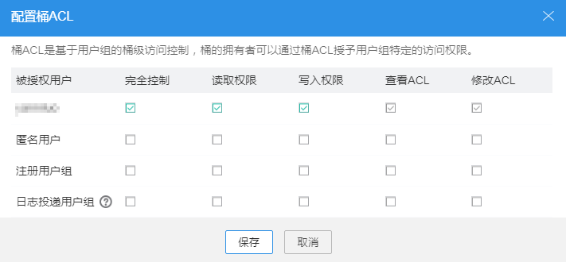

# 配置桶ACL权限

OBS固定有对拥有者、匿名用户、注册用户组以及日志投递用户组设置ACL权限的功能。

## 操作步骤

1.  登录OBS Browser。
2.  选中待配置的桶，单击“配置桶ACL”。
3.  根据需求设置目标桶的ACL权限，单击“保存”，如[图1](#ff824ee795c054719ae026365b7671c8f)所示。

    **图 1**  配置桶ACL  
    

4.  在弹出的消息窗口中，单击“确定”关闭创建结果消息窗口。

