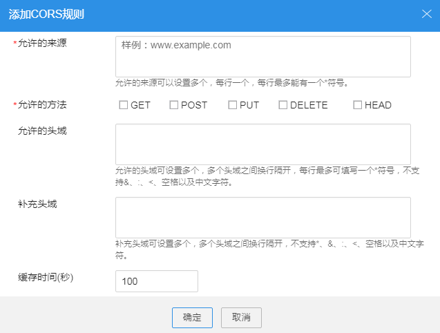

# 配置跨域资源共享

OBS Browser提供HTML5协议中的跨域资源共享CORS设置，帮助用户实现跨域访问。

## 操作步骤

1.  登录OBS Browser。
2.  选中待配置的桶，单击“更多 \> 配置CORS”。
3.  单击“添加”。

    > **说明：**   
    >OBS最多可设置100条CORS规则。  

4.  在弹出的“添加CORS规则”对话框中，填写跨域资源共享的规则。

    **图 1**  添加CORS规则  
    

    CORS规则各参数解释如[表1](#t810c07199d9d4fb4949e45cc402582a0)所示。

    **表 1**  CORS规则

    
    <table><thead align="left"><tr id="r282c3ed8eee94e42b62d5849670244ca"><th class="cellrowborder" valign="top" width="32%" id="mcps1.2.3.1.1">
参数

    </th>
    <th class="cellrowborder" valign="top" width="68%" id="mcps1.2.3.1.2">
解释

    </th>
    </tr>
    </thead>
    <tbody><tr id="r2ff60e1cc4c04df0bd1b01f6f2bb5196"><td class="cellrowborder" valign="top" width="32%" headers="mcps1.2.3.1.1 ">
允许的来源

    </td>
    <td class="cellrowborder" valign="top" width="68%" headers="mcps1.2.3.1.2 ">
必选参数，指定允许的跨域请求的来源，即允许来自该域名下的请求访问该桶。

    
允许多条匹配规则，以回车换行为间隔。每个匹配规则允许使用最多一个“*”通配符。例如：

    <pre class="screen" id="scbcd7fb5598746eb8312b7ae6cacc05f">http://rds.example.com
    https://*.vbs.example.com</pre>
    </td>
    </tr>
    <tr id="rab81f76db9364bf8ab978a987ee0e07b"><td class="cellrowborder" valign="top" width="32%" headers="mcps1.2.3.1.1 ">
允许的方法

    </td>
    <td class="cellrowborder" valign="top" width="68%" headers="mcps1.2.3.1.2 ">
必选参数，指定允许的跨域请求方法，即桶和对象的几种操作类型。包括：GET、POST、PUT、DELETE、HEAD。

    </td>
    </tr>
    <tr id="r467a5c6a833f4015bb22f4087de6b74c"><td class="cellrowborder" valign="top" width="32%" headers="mcps1.2.3.1.1 ">
允许的头域

    </td>
    <td class="cellrowborder" valign="top" width="68%" headers="mcps1.2.3.1.2 ">
可选参数，指定允许的跨域请求的头域。只有匹配上允许的头域中的配置，才被视为是合法的CORS请求。

    
允许的头域可设置多个，多个头域之间换行隔开，每行最多可填写一个*符号，不支持&amp;、:、&lt;、空格以及中文字符。

    </td>
    </tr>
    <tr id="r64d7889221344540a64115505d5e1e72"><td class="cellrowborder" valign="top" width="32%" headers="mcps1.2.3.1.1 ">
补充头域

    </td>
    <td class="cellrowborder" valign="top" width="68%" headers="mcps1.2.3.1.2 ">
可选参数，指CORS响应中带的补充头域，给客户端提供额外的信息。

    
补充头域可设置多个，多个头域之间换行隔开，不支持*、&amp;、:、&lt;、空格以及中文字符。

    </td>
    </tr>
    <tr id="r878b4e4c1aa9415ebabb6923463b8153"><td class="cellrowborder" valign="top" width="32%" headers="mcps1.2.3.1.1 ">
缓存时间

    </td>
    <td class="cellrowborder" valign="top" width="68%" headers="mcps1.2.3.1.2 ">
必选参数，请求来源的客户端可以缓存的CORS响应时间，以秒为单位，默认为100秒。

    </td>
    </tr>
    </tbody>
    </table>

5.  单击“确定”。
6.  单击“确定”，保存该规则。

    CORS配置成功后，便仅允许跨域请求来源的地址通过允许的方法访问OBS的桶。例如：为桶“testbucket”允许的来源配置为“`www.examlple.com`”，允许的方法配置为“GET”，允许的头域和补充的头域置空，缓存时间设置为“100”，则OBS仅允许来源为“`www.examlple.com`”的“GET”请求访问桶“testbucket”，且不限制该请求的头域，请求来源的客户端可缓存的该CORS请求的响应时间为100秒。

7.  在弹出的消息窗口中，单击“确定”关闭创建结果消息窗口。

