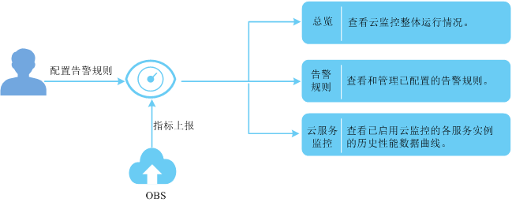

# Cloud Eye控制台监控指标

云监控（Cloud Eye）管理控制台支持监控桶的上传流量、下载流量、GET类请求次数、PUT类请求次数、GET类请求首字节平均时延、4xx异常次数和5xx异常次数。

**图 1**  云监控示意图  

**表 1**  OBS监控指标

<table><thead align="left"><tr id="row208519234123"><th class="cellrowborder" valign="top" width="33.33333333333333%" id="mcps1.2.4.1.1">
指标名称

</th>
<th class="cellrowborder" valign="top" width="33.33333333333333%" id="mcps1.2.4.1.2">
含义

</th>
<th class="cellrowborder" valign="top" width="33.33333333333333%" id="mcps1.2.4.1.3">
取值范围

</th>
</tr>
</thead>
<tbody><tr id="row785132321213"><td class="cellrowborder" valign="top" width="33.33333333333333%" headers="mcps1.2.4.1.1 ">
下载流量

</td>
<td class="cellrowborder" valign="top" width="33.33333333333333%" headers="mcps1.2.4.1.2 ">
该指标用于统计所有桶的所有下载请求响应的字节数，包括http body体。以字节为单位。

</td>
<td class="cellrowborder" valign="top" width="33.33333333333333%" headers="mcps1.2.4.1.3 ">
≥ 0 Byte

</td>
</tr>
<tr id="row5101162341218"><td class="cellrowborder" valign="top" width="33.33333333333333%" headers="mcps1.2.4.1.1 ">
上传流量

</td>
<td class="cellrowborder" valign="top" width="33.33333333333333%" headers="mcps1.2.4.1.2 ">
该指标用于统计所有桶的所有上传请求消息体的字节数，包括http body体。以字节为单位。

</td>
<td class="cellrowborder" valign="top" width="33.33333333333333%" headers="mcps1.2.4.1.3 ">
≥ 0 Byte

</td>
</tr>
<tr id="row14101023201219"><td class="cellrowborder" valign="top" width="33.33333333333333%" headers="mcps1.2.4.1.1 ">
GET类请求次数

</td>
<td class="cellrowborder" valign="top" width="33.33333333333333%" headers="mcps1.2.4.1.2 ">
该指标用于统计所有桶及桶中对象的GET/HEAD/OPTIONS请求次数。以次为单位。

</td>
<td class="cellrowborder" valign="top" width="33.33333333333333%" headers="mcps1.2.4.1.3 ">
≥ 0 Counts

</td>
</tr>
<tr id="row410122331215"><td class="cellrowborder" valign="top" width="33.33333333333333%" headers="mcps1.2.4.1.1 ">
PUT类请求次数

</td>
<td class="cellrowborder" valign="top" width="33.33333333333333%" headers="mcps1.2.4.1.2 ">
该指标用于统计所有桶及桶中对象的PUT/POST/DELETE请求次数。以次为单位。

</td>
<td class="cellrowborder" valign="top" width="33.33333333333333%" headers="mcps1.2.4.1.3 ">
≥ 0 Counts

</td>
</tr>
<tr id="row61017239122"><td class="cellrowborder" valign="top" width="33.33333333333333%" headers="mcps1.2.4.1.1 ">
GET类请求首字节平均时延

</td>
<td class="cellrowborder" valign="top" width="33.33333333333333%" headers="mcps1.2.4.1.2 ">
该指标用于统计GET/HEAD/OPTIONS操作，在一个统计周期内从系统收到完整请求到开始返回响应的耗时平均值。

</td>
<td class="cellrowborder" valign="top" width="33.33333333333333%" headers="mcps1.2.4.1.3 ">
≥ 0 ms

</td>
</tr>
<tr id="row374382021417"><td class="cellrowborder" valign="top" width="33.33333333333333%" headers="mcps1.2.4.1.1 ">
4xx异常次数

</td>
<td class="cellrowborder" valign="top" width="33.33333333333333%" headers="mcps1.2.4.1.2 ">
该指标用于统计服务端响应错误状态码为4xx的请求数。以次为单位。

</td>
<td class="cellrowborder" valign="top" width="33.33333333333333%" headers="mcps1.2.4.1.3 ">
≥ 0 Counts

</td>
</tr>
<tr id="row310115233127"><td class="cellrowborder" valign="top" width="33.33333333333333%" headers="mcps1.2.4.1.1 ">
5xx异常次数

</td>
<td class="cellrowborder" valign="top" width="33.33333333333333%" headers="mcps1.2.4.1.2 ">
该指标用于统计服务端响应错误状态码为5xx的请求数。以次为单位。

</td>
<td class="cellrowborder" valign="top" width="33.33333333333333%" headers="mcps1.2.4.1.3 ">
≥ 0 Counts

</td>
</tr>
</tbody>
</table>

## 操作步骤

1.  登录华为云管理控制台。
2.  选择“服务列表\>管理与部署\>云监控服务”，登录云监控管理控制台。
3.  在左侧导航栏单击“告警\>告警规则”。
4.  单击“创建告警规则”，弹出“创建告警规则”。
5.  设置“资源类型”为“对象存储服务”，“维度”为“桶名”，并单击“选择”，选择“监控对象”。

    **表 2**  参数说明

    
    <table><thead align="left"><tr id="row85589515345"><th class="cellrowborder" valign="top" width="20.42204220422042%" id="mcps1.2.4.1.1">
参数

    </th>
    <th class="cellrowborder" valign="top" width="46.24462446244625%" id="mcps1.2.4.1.2">
参数说明

    </th>
    <th class="cellrowborder" valign="top" width="33.33333333333333%" id="mcps1.2.4.1.3">
取值样例

    </th>
    </tr>
    </thead>
    <tbody><tr id="row655865117344"><td class="cellrowborder" valign="top" width="20.42204220422042%" headers="mcps1.2.4.1.1 ">
资源类型

    </td>
    <td class="cellrowborder" valign="top" width="46.24462446244625%" headers="mcps1.2.4.1.2 ">
配置告警规则监控的云服务资源类型。

    </td>
    <td class="cellrowborder" valign="top" width="33.33333333333333%" headers="mcps1.2.4.1.3 ">
对象存储服务

    </td>
    </tr>
    <tr id="row105586516347"><td class="cellrowborder" valign="top" width="20.42204220422042%" headers="mcps1.2.4.1.1 ">
维度

    </td>
    <td class="cellrowborder" valign="top" width="46.24462446244625%" headers="mcps1.2.4.1.2 ">
用于指定告警规则对应指标的维度名称

    </td>
    <td class="cellrowborder" valign="top" width="33.33333333333333%" headers="mcps1.2.4.1.3 ">
对象存储桶

    </td>
    </tr>
    <tr id="row75581351173415"><td class="cellrowborder" valign="top" width="20.42204220422042%" headers="mcps1.2.4.1.1 ">
监控对象

    </td>
    <td class="cellrowborder" valign="top" width="46.24462446244625%" headers="mcps1.2.4.1.2 ">
用来配置该告警规则针对的具体资源，可以是一个或多个。

    </td>
    <td class="cellrowborder" valign="top" width="33.33333333333333%" headers="mcps1.2.4.1.3 ">
桶

    </td>
    </tr>
    </tbody>
    </table>

6.  单击“下一步”。
7.  设置相关监控指标，监控指标参数说明如[表3](#table046794374713)所示。

    **表 3**  参数说明

    
    <table><thead align="left"><tr id="row15467134310471"><th class="cellrowborder" colspan="2" valign="top" id="mcps1.2.5.1.1">
参数

    </th>
    <th class="cellrowborder" valign="top" id="mcps1.2.5.1.2">
参数说明

    </th>
    <th class="cellrowborder" valign="top" id="mcps1.2.5.1.3">
取值样例

    </th>
    </tr>
    </thead>
    <tbody><tr id="row1946713433478"><td class="cellrowborder" colspan="2" valign="top" headers="mcps1.2.5.1.1 ">
选择类型

    </td>
    <td class="cellrowborder" valign="top" headers="mcps1.2.5.1.2 ">
支持从模板导入和自定义创建。

    </td>
    <td class="cellrowborder" valign="top" headers="mcps1.2.5.1.3 ">
-

    </td>
    </tr>
    <tr id="row6467164320472"><td class="cellrowborder" colspan="2" valign="top" headers="mcps1.2.5.1.1 ">
监控指标

    </td>
    <td class="cellrowborder" valign="top" headers="mcps1.2.5.1.2 ">
例如：

    <ul id="ul1219562185012"><li>下载流量</li><li>上传流量</li><li>GET类请求次数</li><li>PUT类请求次数</li><li>GET类请求首字节平均时延</li><li>4xx异常次数</li><li>5xx异常次数</li></ul>
    </td>
    <td class="cellrowborder" valign="top" headers="mcps1.2.5.1.3 ">
-

    </td>
    </tr>
    <tr id="row204676438477"><td class="cellrowborder" rowspan="3" valign="top" width="16.04%" headers="mcps1.2.5.1.1 ">
告警策略

    </td>
    <td class="cellrowborder" valign="top" width="14.829999999999998%" headers="mcps1.2.5.1.1 ">
阈值

    </td>
    <td class="cellrowborder" valign="top" width="35.5%" headers="mcps1.2.5.1.2 ">
由数据类型（原始值、最大值、最小值、平均值、求和值和方差值）、判断条件（&gt;、≥、&lt;、≤和=）、临界值三部分组成，用来配置告警条件，例如“平均值&gt;80”就是一个告警条件。

    </td>
    <td class="cellrowborder" valign="top" width="33.629999999999995%" headers="mcps1.2.5.1.3 ">
80

    </td>
    </tr>
    <tr id="row8631103319141"><td class="cellrowborder" valign="top" headers="mcps1.2.5.1.1 ">
监控周期

    </td>
    <td class="cellrowborder" valign="top" headers="mcps1.2.5.1.1 ">
告警规则刷新告警状态的周期。

    </td>
    <td class="cellrowborder" valign="top" headers="mcps1.2.5.1.2 ">
5分钟

    </td>
    </tr>
    <tr id="row15467174315475"><td class="cellrowborder" valign="top" headers="mcps1.2.5.1.1 ">
连续出现的次数

    </td>
    <td class="cellrowborder" valign="top" headers="mcps1.2.5.1.1 ">
触发告警时的采样点数目。 例如： 出现次数配置为n，则告警规则的采样点是连续n个监控周期（原始数据使用5分钟的默认监控周期）的采样点，当这些采样点全部满足阈值中配置的告警条件，告警规则的状态才会刷新为告警。

    </td>
    <td class="cellrowborder" valign="top" headers="mcps1.2.5.1.2 ">
3

    </td>
    </tr>
    <tr id="row393417551738"><td class="cellrowborder" colspan="2" valign="top" headers="mcps1.2.5.1.1 ">
告警级别

    </td>
    <td class="cellrowborder" valign="top" headers="mcps1.2.5.1.2 ">
告警的紧急重要程度。

    </td>
    <td class="cellrowborder" valign="top" headers="mcps1.2.5.1.3 ">
重要

    </td>
    </tr>
    <tr id="row16467134320472"><td class="cellrowborder" colspan="2" valign="top" headers="mcps1.2.5.1.1 ">
发送通知

    </td>
    <td class="cellrowborder" valign="top" headers="mcps1.2.5.1.2 ">
配置是否发送邮件、短信通知用户或发送HTTP、HTTPS消息给服务器。

    </td>
    <td class="cellrowborder" valign="top" headers="mcps1.2.5.1.3 ">
-

    </td>
    </tr>
    </tbody>
    </table>

8.  单击“下一步”。
9.  输入“名称”，单击“创建”。告警规则创建完成。

    **表 4**  参数说明

    
    <table><thead align="left"><tr id="row15293151924912"><th class="cellrowborder" valign="top" width="25.252525252525253%" id="mcps1.2.4.1.1">
参数

    </th>
    <th class="cellrowborder" valign="top" width="38.38383838383839%" id="mcps1.2.4.1.2">
参数说明

    </th>
    <th class="cellrowborder" valign="top" width="36.36363636363637%" id="mcps1.2.4.1.3">
取值样例

    </th>
    </tr>
    </thead>
    <tbody><tr id="row163091419194916"><td class="cellrowborder" valign="top" width="25.252525252525253%" headers="mcps1.2.4.1.1 ">
名称

    </td>
    <td class="cellrowborder" valign="top" width="38.38383838383839%" headers="mcps1.2.4.1.2 ">
系统会随机产生一个名称，用户也可以进行修改。

    </td>
    <td class="cellrowborder" valign="top" width="36.36363636363637%" headers="mcps1.2.4.1.3 ">
alarm-b6al

    </td>
    </tr>
    <tr id="row20309151944910"><td class="cellrowborder" valign="top" width="25.252525252525253%" headers="mcps1.2.4.1.1 ">
描述

    </td>
    <td class="cellrowborder" valign="top" width="38.38383838383839%" headers="mcps1.2.4.1.2 ">
告警规则描述（此参数非必填项）。

    </td>
    <td class="cellrowborder" valign="top" width="36.36363636363637%" headers="mcps1.2.4.1.3 ">
-

    </td>
    </tr>
    </tbody>
    </table>

10. 在左侧导航树选择“云服务监控\>对象存储服务”。
11. 选择要查看的桶所在行，单击“查看监控图标”，可以查看近1小时、近3小时和近12小时的监控数据视图。
12. （可选）单击“设置监控指标”，您可以设置在页面中展示的监控指标视图。

