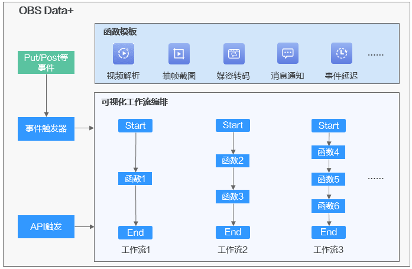
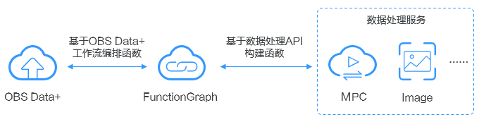

# Data+简介

## 什么是Data+

Data+是OBS提供的一项数据处理服务，可以对OBS内存储的数据，按照用户编排的工作流进行自动化处理（如解析、转码、截图等）。

Data+基于函数工作流FunctionGraph的函数能力，将复杂的业务处理逻辑编排为工作流，通过事件触发器或API驱动，自动化完成多项复杂的数据处理任务。Data+提供图形化界面，方便用户直观便捷的构建数据处理流程，同时提供了预置的数据处理服务模板和自定义函数能力，覆盖数据处理的各种场景。模板的详细介绍，请参见[配置Data+](配置Data+.md)。

-   通过事件触发器触发工作流

    在OBS桶上配置事件触发器，指定工作流触发的条件，如桶内什么数据在执行某类操作后开始处理，当事件触发时异步执行满足条件的复杂任务。通常这类复杂任务处理逻辑相同，可以对一类对象进行操作。比较典型的场景是：用户上传视频对象后，可以根据工作流自动完成视频解析或者转码。

-   通过API触发工作流

    在少数场景下，用户对单个对象或者一类对象进行的复杂操作是有区别的，这就要求用户通过API调用方式来实现单个对象粒度的复杂任务处理，可以指定某个对象立即执行某个特定的工作流。

**图 1**  OBS Data+  

## 服务优势

-   简单易用：通过控制台的图形化界面，轻松按需搭建数据处理流程。
-   功能强大：支持华为云各种数据处理服务的工作流处理能力。
-   容错性好：通过内置错误重试能力，自动重试失败或超时的任务，对不同类型错误做出不同响应。同时提供工作流异常或失败后的恢复接口，从失败的位置继续执行工作流。

## 应用场景

**表 1**  Data+应用场景

<table><thead align="left"><tr id="row986612197431"><th class="cellrowborder" valign="top" width="20%" id="mcps1.2.3.1.1">
应用场景

</th>
<th class="cellrowborder" valign="top" width="80%" id="mcps1.2.3.1.2">
支持的功能

</th>
</tr>
</thead>
<tbody><tr id="row11866151915435"><td class="cellrowborder" valign="top" width="20%" headers="mcps1.2.3.1.1 ">
视频

</td>
<td class="cellrowborder" valign="top" width="80%" headers="mcps1.2.3.1.2 ">
视频解析、媒资转码、抽帧截图、添加水印、转封装、审核等

</td>
</tr>
<tr id="row188661019174316"><td class="cellrowborder" valign="top" width="20%" headers="mcps1.2.3.1.1 ">
图片

</td>
<td class="cellrowborder" valign="top" width="80%" headers="mcps1.2.3.1.2 ">
缩略、添加水印、转封装、文字审核、图像审核、人脸识别等

</td>
</tr>
<tr id="row5866519174317"><td class="cellrowborder" valign="top" width="20%" headers="mcps1.2.3.1.1 ">
文档

</td>
<td class="cellrowborder" valign="top" width="80%" headers="mcps1.2.3.1.2 ">
压缩、预览、统计等

</td>
</tr>
<tr id="row1386681913436"><td class="cellrowborder" valign="top" width="20%" headers="mcps1.2.3.1.1 ">
基因

</td>
<td class="cellrowborder" valign="top" width="80%" headers="mcps1.2.3.1.2 ">
文件个数统计、模糊搜索、压缩、容量监控通知等

</td>
</tr>
<tr id="row686611920434"><td class="cellrowborder" valign="top" width="20%" headers="mcps1.2.3.1.1 ">
医疗

</td>
<td class="cellrowborder" valign="top" width="80%" headers="mcps1.2.3.1.2 ">
数据从存储网关到OBS、AI分析、影像筛查等

</td>
</tr>
<tr id="row11866819204313"><td class="cellrowborder" valign="top" width="20%" headers="mcps1.2.3.1.1 ">
监控

</td>
<td class="cellrowborder" valign="top" width="80%" headers="mcps1.2.3.1.2 ">
视频截帧、图片压缩、图片转存、车牌识别、人脸识别、轨迹跟踪、RTMP直存OBS等

</td>
</tr>
</tbody>
</table>

> **说明：** 
>当前针对视频解析、媒资转码、抽帧截图提供了预置模板，其他场景可通过自定义函数实现。

## 权限说明

使用Data+之前需要进行相关授权，才能保证OBS与其他数据处理服务能够相互配合进行数据处理。目前主要分以下两个方面：

1.  第一次使用Data+时，需要在控制台上根据提示对Data+进行统一授权。

    **授权内容：**

    授权Data+使用您的FunctionGraph服务和Data+工作流中使用到的其他数据处理服务，用以创建函数和通过函数调用其他数据处理服务的API，以便能根据工作流自动处理OBS桶中的数据。

    授权过程用户无感知，只需一键操作，系统将自动为您创建IAM委托。

    -   委托一：委托OBS服务访问FunctionGraph服务
    -   委托二：委托FunctionGraph服务访问OBS服务以及其他数据处理服务

    > **说明：** 
    >-   在授权前，需要保证账号下至少还可以创建2个委托。
    >-   访问其他数据处理服务的权限不会在统一授权时添加，系统会在您创建Data+工作流时，根据工作流函数使用到的服务按需添加。
    >-   如果账号的下的IAM用户需要使用Data+，则需要给IAM用户配置FunctionGraph、数据处理服务（如MPC）、SMN等服务的访问权限。具体配置的权限需要和委托的权限保持一致。委托的权限详情可以在“统一身份认证 \> 委托”中查看名称以“obs\_function\_agency”开头的委托。

2.  使用媒体处理MPC的相关能力时（如视频解析、抽帧截图、媒资转码），需要先在MPC中开启桶授权。授权方法请参见[获取云资源授权](https://support.huaweicloud.com/usermanual-mpc/mpc010003.html)。

    需要为以下桶开启桶授权：

    -   抽帧截图输出桶
    -   媒资转码输出桶
    -   使用了视频解析、抽帧截图或媒资转码的工作流所关联的事件触发器对应的事件源存储桶

    > **说明：** 
    >您也可以直接开启委托授权，一键为所有桶都进行授权。但为了遵循权限最小原则，建议您选择通过桶授权方式仅为有需求的桶授权。

**图 2**  Data+与函数工作流及数据处理服务的关系  

## 约束与限制

-   当前仅支持创建串行的工作流。
-   一个事件触发器仅支持关联一个工作流，一个工作流可同时被多个事件触发器关联。
-   当前暂不支持创建重名工作流，即使工作流被删除后，也不能再创建与之重名的工作流。
-   同一桶内的触发器名称不允许重复。
-   Data+工作流及工作流中使用的FunctionGraph、数据处理服务、消息通知服务、OBS桶等均需要在相同区域的默认项目下。

    > **说明：** 
    >Data+工作流所属区域为创建工作流的桶所属区域。例如工作流A是在桶A中创建的，则桶A的区域即为工作流A的区域。

