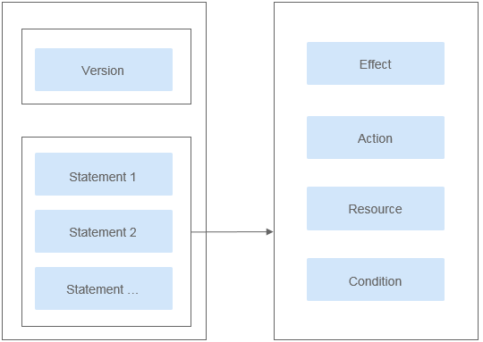
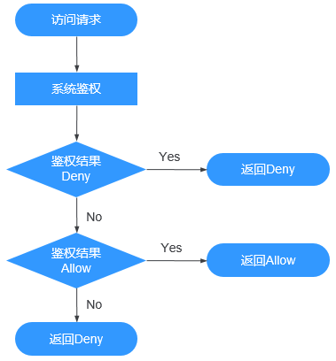

# IAM权限<a name="obs_03_0110"></a>

通过IAM，您可以在云账号中创建IAM用户，并使用策略来控制IAM用户对云资源的访问范围。

IAM权限是作用于云资源的，IAM权限定义了允许和拒绝的访问操作，以此实现云资源权限访问控制。

对于OBS，IAM权限的OBS权限是作用于OBS所有的桶和对象的。如果要授予IAM用户操作OBS资源的权限，则需要向用户所属的用户组授予一个或多个OBS权限集。

IAM权限的OBS权限详情请参见[权限管理](https://support.huaweicloud.com/productdesc-obs/obs_03_0045.html)。

## IAM权限应用场景<a name="section01904185241"></a>

IAM权限主要面向对同账号下IAM用户授权的场景：

-   使用策略控制账号下整个云资源的权限时，使用IAM权限授权。
-   使用策略控制账号下OBS所有的桶和对象的权限时，使用IAM权限授权。
-   使用策略控制账号下OBS指定资源的权限时，使用IAM权限授权。

## 策略结构&语法<a name="section9268135516548"></a>

策略结构包括：Version（策略版本号）和Statement（策略权限语句），其中Statement可以有多个，表示不同的授权项。

**图 1**  策略结构<a name="fig96590586581"></a>  


策略语法，示例：

```
{
	"Version": "1.1",
	"Statement": [
                {
			"Effect": "Allow",
			"Action": [
				"obs:bucket:HeadBucket",
				"obs:bucket:ListBucket",
				"obs:bucket:GetBucketLocation"
			],
			"Resource": [
				"obs:*:*:bucket:*"
			],
			"Condition": {
				"StringEndWithIfExsits": {
					"g:UserName": ["specialCharactor"]
				},
				"Bool": {
					"g:MFAPresent": ["true"]
				}
			}
		}
	]
}
```

**表 1**  策略语法参数

<a name="table987212714414"></a>
<table><thead align="left"><tr id="row19873102713411"><th class="cellrowborder" valign="top" width="22.09%" id="mcps1.2.3.1.1"><p id="p178737272043"><a name="p178737272043"></a><a name="p178737272043"></a>参数</p>
</th>
<th class="cellrowborder" valign="top" width="77.91%" id="mcps1.2.3.1.2"><p id="p1887302718414"><a name="p1887302718414"></a><a name="p1887302718414"></a>说明</p>
</th>
</tr>
</thead>
<tbody><tr id="row17873027842"><td class="cellrowborder" valign="top" width="22.09%" headers="mcps1.2.3.1.1 "><p id="p48732027743"><a name="p48732027743"></a><a name="p48732027743"></a>Version</p>
</td>
<td class="cellrowborder" valign="top" width="77.91%" headers="mcps1.2.3.1.2 "><div class="p" id="p829912213615"><a name="p829912213615"></a><a name="p829912213615"></a>标识策略的版本号：<a name="ul1484412128619"></a><a name="ul1484412128619"></a><ul id="ul1484412128619"><li>1.0：RBAC策略。RBAC策略是将服务作为一个整体进行授权，授权后，用户可以拥有这个服务的所有权限。</li><li>1.1：细粒度策略。相比RBAC策略，细粒度策略基于服务的API接口进行权限拆分，授权更加精细，可以精确到具体操作和具体资源。例如：您可以限制子用户只能访问某一个OBS桶中某一个目录下的对象。</li></ul>
</div>
</td>
</tr>
<tr id="row187317273414"><td class="cellrowborder" valign="top" width="22.09%" headers="mcps1.2.3.1.1 "><p id="p108731927249"><a name="p108731927249"></a><a name="p108731927249"></a>Statement</p>
</td>
<td class="cellrowborder" valign="top" width="77.91%" headers="mcps1.2.3.1.2 "><p id="p17113185672413"><a name="p17113185672413"></a><a name="p17113185672413"></a>策略授权语句，描述策略的详细信息，包含Effect（作用）、Action（授权项）、Resource（资源）和Condition（条件）。其中Condition为可选。</p>
<div class="p" id="p151471577233"><a name="p151471577233"></a><a name="p151471577233"></a><a name="ul1802181615716"></a><a name="ul1802181615716"></a><ul id="ul1802181615716"><li>Effect（作用）<p id="p1880291618711"><a name="p1880291618711"></a><a name="p1880291618711"></a>作用包含两种：Allow（允许）和Deny（Deny），系统预置策略仅包含允许的授权语句，自定义策略中可以同时包含允许和拒绝的授权语句，当策略中既有允许又有拒绝的授权语句时，遵循Deny优先的原则。</p>
</li><li>Action（授权项）<p id="p14803201610710"><a name="p14803201610710"></a><a name="p14803201610710"></a>对资源的具体操作权限，格式为：<strong id="b192646334347"><a name="b192646334347"></a><a name="b192646334347"></a>服务名:资源类型:操作</strong>，支持单个或多个操作权限，支持通配符号*，通配符号表示所有。OBS只有两种资源类型：bucket和object。</p>
<p id="p14722126133617"><a name="p14722126133617"></a><a name="p14722126133617"></a>详细的Action描述请参见<a href="https://support.huaweicloud.com/api-obs/obs_04_0111.html" target="_blank" rel="noopener noreferrer">桶相关授权项</a>和<a href="https://support.huaweicloud.com/api-obs/obs_04_0112.html" target="_blank" rel="noopener noreferrer">对象相关授权项</a>。</p>
</li><li>Resource（资源）<p id="p1323103805814"><a name="p1323103805814"></a><a name="p1323103805814"></a>策略所作用的资源，格式为：<strong id="b3224387586"><a name="b3224387586"></a><a name="b3224387586"></a>服务名:region:domainId:资源类型:资源路径</strong>，支持通配符号*，通配符号表示所有。在JSON视图中，不带Resource表示对所有资源生效。</p>
<p id="p171041029163018"><a name="p171041029163018"></a><a name="p171041029163018"></a>Resource支持以下字符：-_0-9a-zA-Z*./\，如果Resource中包含不支持的字符，请采用通配符号*。</p>
<p id="p8573162614402"><a name="p8573162614402"></a><a name="p8573162614402"></a>OBS是全局级服务，<strong id="b7753174784018"><a name="b7753174784018"></a><a name="b7753174784018"></a>region</strong>填“*”；domainId表示资源拥有者的账号ID，建议填写“*”简单地表示所填资源的账号ID。</p>
<p id="p117043393813"><a name="p117043393813"></a><a name="p117043393813"></a>示例：</p>
<a name="ul1640191817385"></a><a name="ul1640191817385"></a><ul id="ul1640191817385"><li>"obs:*:*:bucket:*": 表示所有的OBS桶。</li><li>"obs:*:*:object:my-bucket/my-object/*": 表示桶my-bucket中<span class="filepath" id="filepath13157218163918"><a name="filepath13157218163918"></a><a name="filepath13157218163918"></a>“my-object”</span>目录下的所有对象。</li></ul>
</li><li>Condition（条件）<p id="p5436173893114"><a name="p5436173893114"></a><a name="p5436173893114"></a>使策略生效的特定条件，可选。格式为：<strong id="b182541230153918"><a name="b182541230153918"></a><a name="b182541230153918"></a>条件运算符: {条件名:[条件值1, 条件值2]}</strong></p>
<p id="p1836271573211"><a name="p1836271573211"></a><a name="p1836271573211"></a>条件包含全局条件名和云服务条件名，OBS支持的条件名与桶策略中的Condition一致，在IAM配置时，需要加上“obs:”。详细的Condition介绍如<a href="条件.md">条件</a>所示。</p>
<p id="p47313304358"><a name="p47313304358"></a><a name="p47313304358"></a>Condition的条件值仅支持以下字符：-,./ a-zA-Z0-9_@#$%&amp;，如果条件值中包含不支持的字符，请考虑使用模糊匹配的条件运算符，如：StringLike，StringStartWith等。</p>
<p id="p2065131212304"><a name="p2065131212304"></a><a name="p2065131212304"></a>示例：</p>
<a name="ul1651171243020"></a><a name="ul1651171243020"></a><ul id="ul1651171243020"><li>"StringEndWithIfExists":{"g:UserName":["specialCharactor"]}：表示当用户输入的用户名以"specialCharactor"结尾时该条statement生效。</li><li>"StringLike":{"obs:prefix":["private/"]}：表示在列举桶内对象时，需要指定prefix为private/或者包含private/这一子字符串。</li></ul>
</li></ul>
</div>
</td>
</tr>
</tbody>
</table>

> **说明：**   
>-   Resource（资源）级别细粒度授权特性会逐步在各个区域上线，需要使用该特性时请确保桶所在区域已经支持。  
>-   使用Resource（资源）级别细粒度授权特性前，请[提交工单](https://console.huaweicloud.com/ticket/?locale=zh-cn#/ticketindex/business?productTypeId=2a129f7ed0b543c6b92d73e2c26aa590&subTypeId=-1&type=2)到OBS，申请开通Resource（资源）级别细粒度授权特性白名单。  

## IAM权限鉴权<a name="section477513429495"></a>

IAM权限遵循Deny优先的原则。在用户访问资源时，权限检查逻辑如下：

**图 2**  系统鉴权逻辑图<a name="fig1757455075016"></a>  


> **说明：**   
>每条策略做评估时，Action之间是或\(or\)的关系。  

1.  用户访问系统，发起操作请求。
2.  系统评估用户被授予的访问策略，鉴权开始。
3.  在用户被授予的访问策略中，系统将优先寻找显式拒绝指令。如找到一个适用的显式拒绝，系统将返回Deny决定。
4.  如果没有找到显式拒绝指令，系统将寻找适用于请求的任何Allow指令。如果找到一个显式允许指令，系统将返回Allow决定。
5.  如果找不到显式允许，最终决定为Deny，鉴权结束。

