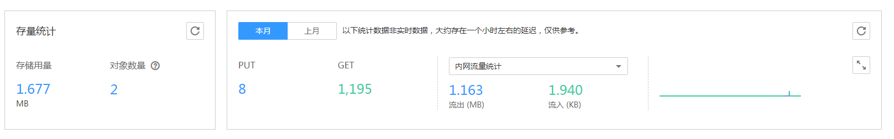

# OBS控制台监控指标

您可在OBS管理控制台上查看桶的流量统计和请求次数，方便您及时了解目前资源的使用状况、并合理规划使用计划。

## 操作步骤

1.  在桶列表中单击待操作的桶，进入“概览”页面。
2.  在“基础数据统计”下可查看桶的流量监控信息，如[图1](#fig2848684117471)所示。

    **图 1**  查看桶的监控信息  
    

    桶级监控可以统计本月和上月的请求次数和流量。

    **表 1**  桶的监控数据参数说明

    
    <table><thead align="left"><tr id="row135142612570"><th class="cellrowborder" valign="top" width="28.999999999999996%" id="mcps1.2.3.1.1">
参数

    </th>
    <th class="cellrowborder" valign="top" width="71%" id="mcps1.2.3.1.2">
说明

    </th>
    </tr>
    </thead>
    <tbody><tr id="row335362611573"><td class="cellrowborder" valign="top" width="28.999999999999996%" headers="mcps1.2.3.1.1 ">
存储用量

    </td>
    <td class="cellrowborder" valign="top" width="71%" headers="mcps1.2.3.1.2 ">
桶中存储的对象占用的存储空间。

    
桶的存储空间默认情况下是没有配额限制的，您也可以通过设置桶配额来设置桶的存储空间，详情请参见<a href="https://support.huaweicloud.com/api-obs/zh-cn_topic_0100846743.html" target="_blank" rel="noopener noreferrer">设置桶配额</a>。

    </td>
    </tr>
    <tr id="row4356142614579"><td class="cellrowborder" valign="top" width="28.999999999999996%" headers="mcps1.2.3.1.1 ">
对象数量

    </td>
    <td class="cellrowborder" valign="top" width="71%" headers="mcps1.2.3.1.2 ">
桶中存储的对象数量，为最新版本和历史版本的对象总和。

    </td>
    </tr>
    <tr id="row143591326135715"><td class="cellrowborder" rowspan="2" valign="top" width="28.999999999999996%" headers="mcps1.2.3.1.1 ">
请求次数

    </td>
    <td class="cellrowborder" valign="top" width="71%" headers="mcps1.2.3.1.2 ">
PUT：所选当月时间，向桶及桶中对象发起的PUT/POST/DELETE请求次数。

    </td>
    </tr>
    <tr id="row153601126125711"><td class="cellrowborder" valign="top" headers="mcps1.2.3.1.1 ">
GET：所选当月时间，向桶及桶中对象发起的GET/HEAD/OPTIONS请求次数。

    </td>
    </tr>
    <tr id="row10362172615718"><td class="cellrowborder" rowspan="2" valign="top" width="28.999999999999996%" headers="mcps1.2.3.1.1 ">
内网流量统计

    </td>
    <td class="cellrowborder" valign="top" width="71%" headers="mcps1.2.3.1.2 ">
内网流出：所选当月时间，桶的所有流出华为云流量。

    </td>
    </tr>
    <tr id="row1836417267577"><td class="cellrowborder" valign="top" headers="mcps1.2.3.1.1 ">
内网流入：所选当月时间，桶的所有流入华为云流量。

    </td>
    </tr>
    </tbody>
    </table>

    > **说明：**   
    >以上统计数据非实时数据，大约存在一个小时左右的延迟，仅供参考。  

