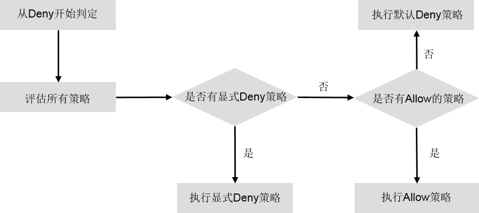
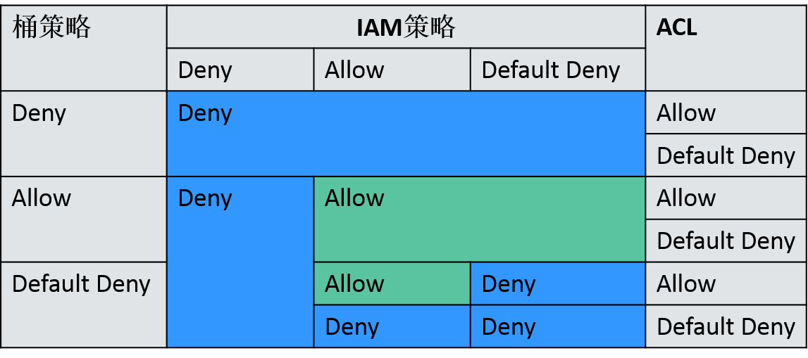

# OBS的访问权限控制

OBS支持通过IAM策略、桶策略和ACL来进行访问权限控制。

## IAM策略

IAM策略是作用于云资源的，IAM策略组定义了允许和拒绝的访问操作，以此实现云资源权限访问控制。

IAM策略的实现机制如下：

1.  创建用户组，为用户组设定IAM权限集。
2.  创建IAM用户，用户加入用户组以获取相关的权限。

对于OBS，IAM策略的OBS权限是作用于OBS所有的桶和对象的。如果要授予IAM用户操作OBS资源的权限，则需要向用户所属的用户组授予一个或多个OBS权限集。

IAM策略的OBS权限详情请参见[用户权限](https://support.huaweicloud.com/productdesc-obs/obs_03_0045.html)。

IAM策略的应用场景如下：

-   使用策略控制整个云资源的权限时，使用IAM策略授权。
-   使用策略控制OBS所有的桶和对象的权限时，使用IAM策略授权。

## 桶策略

桶策略是作用于所配置的OBS桶及桶内对象的。OBS桶拥有者通过桶策略可为IAM用户或其他账号授权桶及桶内对象的操作权限。

桶策略的应用场景如下：

-   不用IAM策略控制访问权限的情况下，允许其他账号访问OBS资源，可以使用桶策略的方式授权其他账号对应的权限。
-   当不同的桶对于不同的IAM用户有不同的访问控制需求时，需使用桶策略分别授权IAM用户不同的权限。
-   桶拥有者允许其他账号访问自己的桶时，可使用桶策略授权其他账号对应的权限。

## ACL

OBS桶和对象的ACL是基于账号的访问控制，默认情况下，创建桶和对象时会同步创建ACL，授权拥有者对桶和对象资源的完全控制权限。

OBS  ACL是基于账号级别的读写权限控制，权限控制细粒度不如桶策略和IAM策略。一般情况下，建议使用IAM策略和桶策略进行访问控制。

> **说明：**   
>对象的拥有者是上传对象的账号，而不是对象所属的桶的拥有者。例如，如果账号B被授予访问账号A的桶的权限，然后账号B上传一个文件到桶中，则账号B是对象的拥有者，而不是账号A。  

## 访问控制机制冲突时，如何工作？

基于最小权限原则，权限控制策略的结果默认为Deny， 显式的Deny始终优先于Allow。例如，IAM策略授权了用户对对象的访问权限，但是桶策略拒绝了该用户访问对象的权限，且没有ACL时，该用户不能访问对象。

没有策略授权Allow权限时，默认情况即为拒绝访问权限。当有策略授权Allow权限，且没有其他策略Deny该权限时，Allow的权限才能允许访问。

**图 1**  访问策略授权过程  

桶策略、IAM策略和ACL的Allow和Deny作用结果如[图2](#fig1251114133010)所示。

**图 2**  桶策略、IAM策略和ACL的Allow和Deny作用结果  

