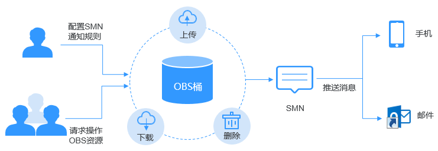

# SMN通知简介

消息通知服务（SMN）是可靠，可扩展，海量的消息通知服务。它大大简化系统的耦合，能够根据用户的需求，向订阅终端主动推送消息，订阅终端可以是电子邮件、短信等。

OBS依赖SMN提供消息通知功能。您可以将OBS桶中对象的上传、删除等操作事件通过SMN发送给指定的订阅终端，以实时掌握OBS桶中发生的关键事件。例如，配置SMN通知，规定当用户往桶中上传对象时，SMN发送消息通知到指定的邮箱。

您可以将通知配置为按对象名称的前缀和后缀进行筛选。例如，您可以添加一个事件，以便仅在将带有“.jpg”后缀的图像文件添加到存储桶时收到通知。或者，您也可以添加一个事件，该配置仅在将带有前缀为“images/”的对象添加到存储桶时收到通知。

支持发送SMN通知的操作事件以及SMN通知的配置方法，请参见[配置SMN通知](配置SMN通知.md)。

**图 1**  SMN通知示意图  

