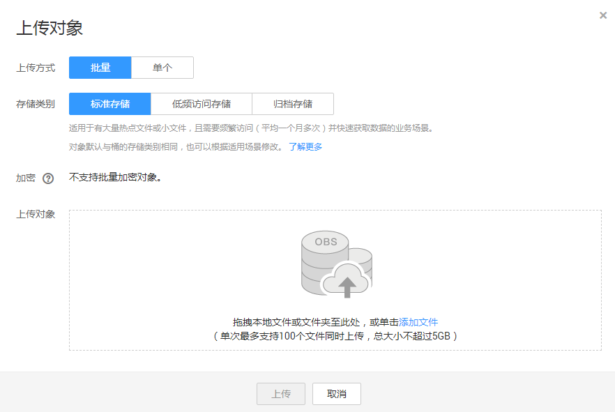
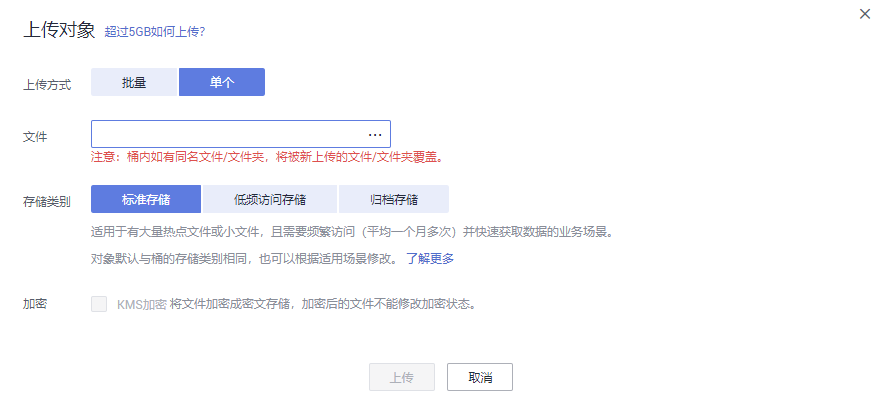

# 上传文件

您可以将本地文件直接通过Internet上传至OBS指定的位置。待上传的文件可以是任何类型：文本文件、图片、视频等。

## 约束与限制

通过OBS管理控制台上传的文件有大小和数量限制，且跟选择的上传方式有关。

-   选择“批量“上传方式

    每次最多支持100个文件同时上传，总大小不超过5GB。

-   选择“单个“上传方式

    每次只能上传1个文件，大小不超过50MB。

所以，对于单个文件而言，在支持批量上传功能的情况下，大小上限为5GB；在不支持批量上传功能的情况下，大小上限为50MB。

如果您有更大量的数据需要上传至OBS，可以参考[搬迁本地数据至OBS](https://support.huaweicloud.com/bestpractice-obs/obs_05_0110.html)和[迁移第三方云厂商数据至OBS](https://support.huaweicloud.com/bestpractice-obs/obs_05_0210.html)。

> **说明：**   
>支持批量上传功能需要同时满足以下两个条件：  
>1.  OBS桶所在区域支持批量上传功能。当前支持的区域有：华北-北京一、华北-北京四、华东-上海二、华南-广州。  
>2.  OBS桶的版本号为“3.0“。桶版本号的查看方法请参见[查看桶的信息](查看桶的信息.md)。  

在未开启多版本控制功能的情况下，如果新上传的文件和桶内文件重名，则新上传的文件会自动覆盖老文件，且不会保留老文件的ACL等信息；如果新上传的文件夹和桶内文件夹重名，则上传后会将新老文件夹合并，合并过程如遇重名文件，会使用新上传的文件夹中的文件进行覆盖。

在开启了多版本控制功能的情况下，如果新上传的文件和桶内文件重名，则会在老文件上新增一个版本。关于多版本的详细介绍请参见[多版本控制简介](多版本控制简介.md)。

## 前提条件

-   至少已创建了一个桶。
-   若您需要将文件归类处理，可以先新建文件夹，然后将相关的文件上传到文件夹中。新建文件夹的步骤请参见[新建文件夹](新建文件夹.md)。

## 操作步骤

1.  在OBS管理控制台左侧导航栏选择“对象存储“。
2.  在桶列表单击待操作的桶，进入“概览”页面。
3.  在左侧导航栏，单击“对象”。
4.  单击“上传对象”，系统弹出“上传对象”对话框。

    您可以选择批量上传文件或上传单个文件。批量上传文件请参见[5](#zh-cn_topic_0045829660_li1175744816528)，上传单个文件请参见[6](#zh-cn_topic_0045829660_li116121536101413)。

    > **说明：**   
    >如果待上传至OBS的文件存放在Microsoft OneDrive中，建议这些待上传文件的名称不要超过32位。  

5.  “上传方式”选择“批量”，单次最多支持100个文件同时上传，总大小不超过5GB。

    您可以拖拽本地文件或文件夹至“上传对象”区域框内添加待上传的文件，也可以通过单击“上传对象”区域框内的“添加文件”，选择本地文件添加。

    **图 1**  批量上传对象  
    

6.  “上传方式”选择“单个”，上传单个文件，单个文件最大不超过50MB。

    单击按钮打开本地文件浏览器对话框，选择待上传的文件后，单击“打开”。

    **图 2**  上传单个对象  
    

7.  指定对象的存储类别。若不指定，默认与桶的存储类别一致。
8.  **可选**：勾选“KMS加密”，用于加密上传文件。详情请参见[使用服务端加密方式上传文件](使用服务端加密方式上传文件.md)。

    批量上传文件时，仅支持对单个不超过16MB或2个不超过8MB的文件进行加密。

    > **说明：**   
    >若桶已开启了默认加密，上传对象会继承桶的KMS加密特性。  

9.  单击“上传”。

## 相关操作

您可以在上传对象时指定对象的存储类别，也可以在上传后修改对象的存储类别，修改步骤如下：

1.  在OBS管理控制台左侧导航栏选择“对象存储“。
2.  在桶列表单击待操作的桶，进入“概览”页面。
3.  在左侧导航栏，单击“对象”。
4.  选中目标对象，并单击右侧“更多\>修改存储类别”。

    > **说明：**   
    >您也可以选中多个文件，单击对象列表上方的“修改存储类别”，批量修改对象的存储类别。  
    >未恢复的归档存储对象，不能加入批量修改存储类别中。  

5.  选择目标存储类别，并单击“确定”。

> **说明：**   
>-   标准存储的对象可以修改为低频访问存储或归档存储的对象。低频访问存储的对象可以修改为标准存储或归档存储的对象。归档存储的对象要先恢复，才可以修改为标准存储或低频访问存储。后两种修改会涉及惩罚费用和取回费用，请根据对象的使用频率和场景择优选择。  
>-   对象存储类别修改为归档存储时，恢复状态为未恢复。  
>-   您也可以通过配置生命周期规则转换对象的存储类别，详情请参见[生命周期管理简介](生命周期管理简介.md)。  

## 后续操作

您可以单击对象后面的“更多\>复制路径”，复制对象的路径。

您可以将获取到路径共享给其他用户，其他用户可以找到存储对象的桶后，在搜索对象框中输入该路径值即可获取到对象。

