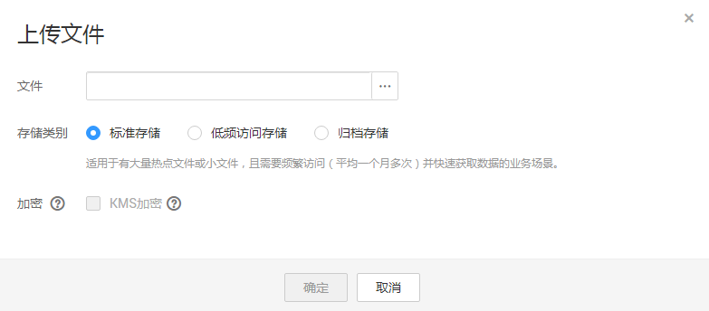

# 上传文件

您可以将本地文件直接通过Internet上传至OBS指定的位置。待上传的文件可以是任何类型：文本文件、图片、视频等。

> **说明：**   
>OBS管理控制台支持上传最大为50MB的单个文件。  

## 前提条件

-   至少已创建了一个桶。
-   若您需要将文件归类处理，可以先新建文件夹，然后将相关的文件上传到文件夹中。新建文件夹步骤如下：
    1.  在OBS管理控制台桶列表中，单击待操作的桶，进入“概览”页面。
    2.  在左侧导航栏，单击“对象”。
    3.  单击“新建文件夹”。
    4.  在“文件夹名称”中输入新文件夹名称。
    5.  单击“确定”。

## 操作步骤

1.  在OBS管理控制台桶列表中，单击待操作的桶，进入“概览”页面。
2.  在左侧导航栏，单击“对象”。
3.  单击“上传文件”，或者选择目标文件夹后单击“上传文件”，系统弹出如[图1](#fig8938417113456)所示对话框。

    **图 1**  上传文件  
    

4.  单击按钮打开本地文件浏览器对话框。
5.  选择待上传的文件后，单击“打开”。
6.  **可选**：指定对象的存储类别。若不指定，默认与桶的存储类别一致。
7.  **可选**：勾选“KMS加密”，用于加密上传文件。详情请参见[使用服务端加密方式上传文件](使用服务端加密方式上传文件.md)。
8.  单击“确定”。

