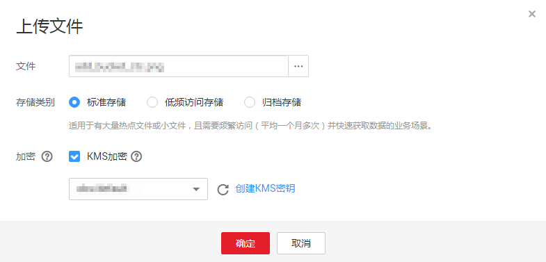

# 使用服务端加密方式上传文件

用户可根据需要对对象进行服务端加密，使对象更安全的存储在OBS中。

## 约束与限制

-   对象的加密状态不可以修改。
-   使用中的密钥不可以删除，如果删除将导致加密对象不能下载。
-   服务端加密的对象不支持分享。
-   对象进行服务端加密后，且未在IAM进行委托的情况下，即使其他账号和用户拥有该对象的读权限，也无法访问该对象。

## 前提条件

已通过IAM服务添加OBS所在区域的**KMS Administrator**权限，权限添加方法请参见[给IAM用户授权](https://support.huaweicloud.com/usermanual-iam/iam_01_0652.html)。如果当前账号或用户是被委托方，也需要在委托中被授予**KMS Administrator**权限。

数据加密服务收费请参见[产品收费详情](https://www.huaweicloud.com/pricing.html?tab=detail#/dew)。

## 操作步骤

1.  在OBS管理控制台左侧导航栏选择“对象存储“。
2.  在桶列表单击待操作的桶，进入“概览”页面。
3.  在左侧导航栏，单击“对象”。
4.  单击“上传对象”，系统弹出“上传对象”对话框。
5.  选择待上传的文件后，单击“打开”。
6.  勾选“KMS加密”，在后面的选择框中选择您在数据加密服务中创建的KMS密钥。

    > **说明：**   
    >若桶已开启了默认加密，上传对象会继承桶的KMS加密特性。  

    当勾选“KMS加密”后，KMS密钥会默认选中“obs/default”。您也可以通过单击“创建KMS密钥”进入数据加密服务页面创建自定义密钥，然后通过KMS密钥的下拉框选中您创建的KMS密钥。

    自定义密钥请参见[创建密钥](https://support.huaweicloud.com/usermanual-dew/dew_01_0178.html)。

    **图 1**  加密上传对象  
    

7.  单击“上传”。

    对象上传成功后，可在对象列表中查看对象的加密状态。

