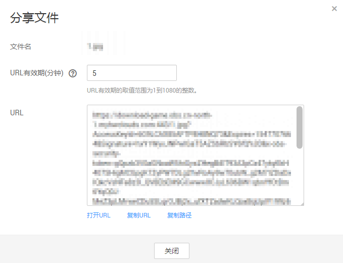

# 分享文件

通过对象分享功能，所有用户通过分享的URL可访问对象数据。

桶版本号为3.0及以上的桶支持文件分享功能。桶版本号可以在桶概览页的“基本信息”中查看。

> **注意：**   
>加密对象不能分享。  
>归档存储需恢复后才能分享。  

## 操作步骤

1.  在OBS管理控制台桶列表中，单击待操作的桶，进入“概览”页面。
2.  在左侧导航栏，单击“对象”。
3.  选中待分享的文件，并单击右侧的“分享”，系统弹出如[图1](#fig15421122341817)所示对话框。

    **图 1**  分享文件  
    

4.  URL相关操作。

    -   单击“打开URL”，将在新页面打开文件。
    -   单击“复制URL”，您可以将该URL分享给所有用户，用户通过该URL可搜索访问此文件。
    -   单击“复制路径”，您可将该路径分享给本账号下其他IAM用户，用户在对应桶中的文件搜索框中输入该路径搜索文件。

    > **说明：**   
    >在“URL有效期”内，任何用户都可以访问该文件。  

5.  单击“关闭”。

