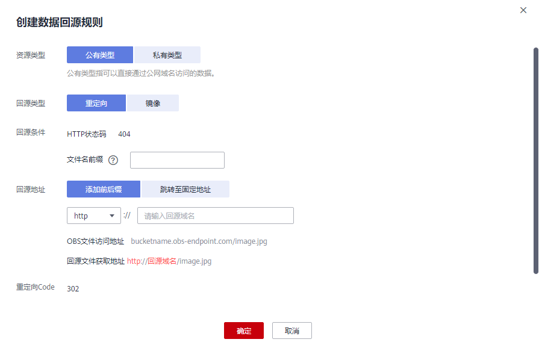

# 创建数据回源规则<a name="obs_03_0006"></a>

## 操作场景<a name="section124576141474"></a>

请参见[数据回源简介](数据回源简介.md)。

## 约束与限制<a name="section85821827134713"></a>

请参见[数据回源简介](数据回源简介.md)。

## 创建镜像回源规则<a name="section1351444312277"></a>

1.  在OBS管理控制台左侧导航栏选择“对象存储“。
2.  在桶列表单击待操作的桶，进入“概览”页面。
3.  在左侧导航栏选中“数据回源”，进入“数据回源”页面。
4.  单击“创建规则”。

    **图 1**  创建镜像回源规则<a name="fig1852615672816"></a>  
    

5.  配置镜像回源规则参数，参数说明如[表1](#table1511264453015)。

    **表 1**  镜像回源规则参数说明

    <a name="table1511264453015"></a>
    <table><thead align="left"><tr id="row41131644103014"><th class="cellrowborder" valign="top" width="27.339999999999996%" id="mcps1.2.3.1.1"><p id="p3113194413304"><a name="p3113194413304"></a><a name="p3113194413304"></a>参数</p>
    </th>
    <th class="cellrowborder" valign="top" width="72.66%" id="mcps1.2.3.1.2"><p id="p1211314448301"><a name="p1211314448301"></a><a name="p1211314448301"></a>说明</p>
    </th>
    </tr>
    </thead>
    <tbody><tr id="row16113194483014"><td class="cellrowborder" valign="top" width="27.339999999999996%" headers="mcps1.2.3.1.1 "><p id="p111131544163011"><a name="p111131544163011"></a><a name="p111131544163011"></a>资源类型</p>
    </td>
    <td class="cellrowborder" valign="top" width="72.66%" headers="mcps1.2.3.1.2 "><p id="p2011364443017"><a name="p2011364443017"></a><a name="p2011364443017"></a>设置回源地址（源站）的类型。镜像回源只支持公有类型，表示源站数据可以通过公网域名访问。</p>
    </td>
    </tr>
    <tr id="row811314493016"><td class="cellrowborder" valign="top" width="27.339999999999996%" headers="mcps1.2.3.1.1 "><p id="p411334416305"><a name="p411334416305"></a><a name="p411334416305"></a>回源类型</p>
    </td>
    <td class="cellrowborder" valign="top" width="72.66%" headers="mcps1.2.3.1.2 "><p id="p1011317440309"><a name="p1011317440309"></a><a name="p1011317440309"></a>选择“镜像”。</p>
    <p id="p4349115312337"><a name="p4349115312337"></a><a name="p4349115312337"></a>客户端发送满足回源条件的请求后，OBS将以镜像回源的方式去源站获取资源，将该资源上传到OBS中并返回给客户端。</p>
    </td>
    </tr>
    <tr id="row1611314493010"><td class="cellrowborder" valign="top" width="27.339999999999996%" headers="mcps1.2.3.1.1 "><p id="p9113114483014"><a name="p9113114483014"></a><a name="p9113114483014"></a>回源条件</p>
    </td>
    <td class="cellrowborder" valign="top" width="72.66%" headers="mcps1.2.3.1.2 "><p id="p1111317447305"><a name="p1111317447305"></a><a name="p1111317447305"></a>设置回源规则的触发条件。</p>
    <p id="p13113164413010"><a name="p13113164413010"></a><a name="p13113164413010"></a>回源条件由<strong id="b151131344153011"><a name="b151131344153011"></a><a name="b151131344153011"></a>HTTP状态码</strong>和<strong id="b1113144443010"><a name="b1113144443010"></a><a name="b1113144443010"></a>文件名前缀</strong>共同确定，表示访问桶中符合文件名前缀要求的对象时，如果对象不存在（返回404错误），则满足回源条件。</p>
    <p id="p110882694518"><a name="p110882694518"></a><a name="p110882694518"></a>文件名前缀输入规则：</p>
    <a name="ul2122184334514"></a><a name="ul2122184334514"></a><ul id="ul2122184334514"><li>不能超过1023个字符。</li><li>不能与已有回源规则配置的文件名前缀存在相互包含或重叠的关系。</li><li>如果不输入，则表示配置到尚未匹配桶内任何回源规则的文件。仅能配置一条文件名前缀为空的回源规则。</li></ul>
    <p id="p611364417306"><a name="p611364417306"></a><a name="p611364417306"></a>示例：配置123/前缀，访问桶中123/456.txt文件时会触发回源规则。</p>
    </td>
    </tr>
    <tr id="row17113194463015"><td class="cellrowborder" valign="top" width="27.339999999999996%" headers="mcps1.2.3.1.1 "><p id="p16113124453014"><a name="p16113124453014"></a><a name="p16113124453014"></a>回源地址</p>
    </td>
    <td class="cellrowborder" valign="top" width="72.66%" headers="mcps1.2.3.1.2 "><p id="p1311384433015"><a name="p1311384433015"></a><a name="p1311384433015"></a>设置回源地址（源站地址）。</p>
    <p id="p1844447163712"><a name="p1844447163712"></a><a name="p1844447163712"></a>格式：http或https://回源域名/固定前缀</p>
    <a name="ul7195132184013"></a><a name="ul7195132184013"></a><ul id="ul7195132184013"><li>回源域名为源站的域名。</li><li>固定前缀为目标文件所在的目录信息，例如固定前缀配置123/，表示目标文件在123/目录下。</li></ul>
    </td>
    </tr>
    <tr id="row1911334453018"><td class="cellrowborder" valign="top" width="27.339999999999996%" headers="mcps1.2.3.1.1 "><p id="p101131444305"><a name="p101131444305"></a><a name="p101131444305"></a>携带请求字符串</p>
    </td>
    <td class="cellrowborder" valign="top" width="72.66%" headers="mcps1.2.3.1.2 "><p id="p1111315441308"><a name="p1111315441308"></a><a name="p1111315441308"></a>开启后，会将请求URL中查询参数传递到源站。</p>
    </td>
    </tr>
    <tr id="row611394403014"><td class="cellrowborder" valign="top" width="27.339999999999996%" headers="mcps1.2.3.1.1 "><p id="p1811310440302"><a name="p1811310440302"></a><a name="p1811310440302"></a>重定向请求响应策略</p>
    </td>
    <td class="cellrowborder" valign="top" width="72.66%" headers="mcps1.2.3.1.2 "><p id="p1438951824414"><a name="p1438951824414"></a><a name="p1438951824414"></a>开启后，如果源站配置了重定向，会跟踪源站的3xx重定向请求，前往重定向的目标获取资源，并将该资源保存到OBS上。最多跟随10次重定向。</p>
    </td>
    </tr>
    <tr id="row470011354318"><td class="cellrowborder" valign="top" width="27.339999999999996%" headers="mcps1.2.3.1.1 "><p id="p170073204313"><a name="p170073204313"></a><a name="p170073204313"></a>HTTP header传递规则</p>
    </td>
    <td class="cellrowborder" valign="top" width="72.66%" headers="mcps1.2.3.1.2 "><p id="p889121855714"><a name="p889121855714"></a><a name="p889121855714"></a>可以通过设置HTTP header传递规则，规定客户端发送给OBS的请求经过镜像回源由OBS传递给源站时，允许传递的HTTP header参数。<a href="#section12897469719">相关参考</a>中提供了一个配置示例供参考，同时列出了不支持的HTTP header。</p>
    <a name="ul144046226578"></a><a name="ul144046226578"></a><ul id="ul144046226578"><li><strong id="b134481620142611"><a name="b134481620142611"></a><a name="b134481620142611"></a>允许传递所有参数/允许传递指定参数</strong>：设置允许传递的HTTP header参数。</li><li><strong id="b19453102214264"><a name="b19453102214264"></a><a name="b19453102214264"></a>禁止传递指定参数</strong>：设置禁止传递的HTTP header参数。当客户端请求携带此header时，OBS不会传递给源站。当禁止和允许规则冲突时，禁止规则优先。</li><li><strong id="b83906248261"><a name="b83906248261"></a><a name="b83906248261"></a>设置自定义参数</strong>：给指定header设置自定义取值，如果客户端请求携带此header，OBS在传递给源站时会将header取值修改为自定义的取值。</li></ul>
    </td>
    </tr>
    <tr id="row145152220434"><td class="cellrowborder" valign="top" width="27.339999999999996%" headers="mcps1.2.3.1.1 "><p id="p5515222434"><a name="p5515222434"></a><a name="p5515222434"></a>IAM委托</p>
    </td>
    <td class="cellrowborder" valign="top" width="72.66%" headers="mcps1.2.3.1.2 "><p id="p145152216434"><a name="p145152216434"></a><a name="p145152216434"></a>镜像回源需使用IAM委托功能，委托OBS获取源站数据。委托需要给OBS服务授予“Tenant Administrator”权限。若无合适的IAM委托，则可创建一个新的IAM委托，请参考<a href="创建IAM委托.md">创建IAM委托</a>。</p>
    </td>
    </tr>
    </tbody>
    </table>

6.  单击“确定”。

## 创建重定向回源规则<a name="section16761853102720"></a>

1.  在OBS管理控制台左侧导航栏选择“对象存储“。
2.  在桶列表单击待操作的桶，进入“概览”页面。
3.  在左侧导航栏选中“数据回源”，进入“数据回源”页面。
4.  单击“创建规则”。

    **图 2**  创建重定向回源规则<a name="fig128361432232"></a>  
    

5.  配置重定向回源规则参数，参数说明如[表2](#table14359557105455)。

    **表 2**  重定向回源规则参数说明

    <a name="table14359557105455"></a>
    <table><thead align="left"><tr id="row40370359105455"><th class="cellrowborder" valign="top" width="27.339999999999996%" id="mcps1.2.3.1.1"><p id="p36309804105455"><a name="p36309804105455"></a><a name="p36309804105455"></a>参数</p>
    </th>
    <th class="cellrowborder" valign="top" width="72.66%" id="mcps1.2.3.1.2"><p id="p55413003105455"><a name="p55413003105455"></a><a name="p55413003105455"></a>说明</p>
    </th>
    </tr>
    </thead>
    <tbody><tr id="row28954986105455"><td class="cellrowborder" valign="top" width="27.339999999999996%" headers="mcps1.2.3.1.1 "><p id="p63652505105455"><a name="p63652505105455"></a><a name="p63652505105455"></a>资源类型</p>
    </td>
    <td class="cellrowborder" valign="top" width="72.66%" headers="mcps1.2.3.1.2 "><p id="p55579269105455"><a name="p55579269105455"></a><a name="p55579269105455"></a>设置回源地址（源站）的类型。</p>
    <a name="ul1055011387455"></a><a name="ul1055011387455"></a><ul id="ul1055011387455"><li>公有类型：源站数据可以通过公网域名访问。</li><li>私有类型：源站数据存储在第三方云厂商（阿里云/七牛云），需要通过AK/SK用户认证才能获取到。</li></ul>
    </td>
    </tr>
    <tr id="row83725501427"><td class="cellrowborder" valign="top" width="27.339999999999996%" headers="mcps1.2.3.1.1 "><p id="p7373165024215"><a name="p7373165024215"></a><a name="p7373165024215"></a>回源类型</p>
    </td>
    <td class="cellrowborder" valign="top" width="72.66%" headers="mcps1.2.3.1.2 "><p id="p1781824075520"><a name="p1781824075520"></a><a name="p1781824075520"></a>选择“重定向”。</p>
    <p id="p0373135012428"><a name="p0373135012428"></a><a name="p0373135012428"></a>客户端发送的满足回源条件的请求将重定向至源站，由源站将对象返回给客户端。</p>
    </td>
    </tr>
    <tr id="row30451373105455"><td class="cellrowborder" valign="top" width="27.339999999999996%" headers="mcps1.2.3.1.1 "><p id="p50642110105455"><a name="p50642110105455"></a><a name="p50642110105455"></a>回源条件</p>
    </td>
    <td class="cellrowborder" valign="top" width="72.66%" headers="mcps1.2.3.1.2 "><p id="p122586463578"><a name="p122586463578"></a><a name="p122586463578"></a>设置回源规则的触发条件。</p>
    <p id="p8370240105455"><a name="p8370240105455"></a><a name="p8370240105455"></a>回源条件由<strong id="b15202125585"><a name="b15202125585"></a><a name="b15202125585"></a>HTTP状态码</strong>和<strong id="b080341320587"><a name="b080341320587"></a><a name="b080341320587"></a>文件名前缀</strong>共同确定，表示访问桶中符合文件名前缀要求的对象时，如果对象不存在（返回404错误），则满足回源条件。</p>
    <p id="p0407639124614"><a name="p0407639124614"></a><a name="p0407639124614"></a>文件名前缀输入规则：</p>
    <a name="ul10407439144617"></a><a name="ul10407439144617"></a><ul id="ul10407439144617"><li>不能超过1023个字符。</li><li>不能与已有回源规则配置的文件名前缀存在相互包含或重叠的关系。</li><li>如果不输入，则表示配置到尚未匹配桶内其他回源规则的文件。一个桶仅能配置一条文件名前缀为空的回源规则。</li></ul>
    <p id="p33091430195912"><a name="p33091430195912"></a><a name="p33091430195912"></a>示例：配置123/前缀，访问桶中123/456.txt文件时会触发回源规则。</p>
    </td>
    </tr>
    <tr id="row57622541413"><td class="cellrowborder" valign="top" width="27.339999999999996%" headers="mcps1.2.3.1.1 "><p id="p109621155544"><a name="p109621155544"></a><a name="p109621155544"></a>源桶名（私有类型）</p>
    </td>
    <td class="cellrowborder" valign="top" width="72.66%" headers="mcps1.2.3.1.2 "><p id="p49657551849"><a name="p49657551849"></a><a name="p49657551849"></a>源站的私有桶名称。长度范围3-63个字符。</p>
    <p id="p66061511962"><a name="p66061511962"></a><a name="p66061511962"></a>示例：target-bucket</p>
    </td>
    </tr>
    <tr id="row12487184611419"><td class="cellrowborder" valign="top" width="27.339999999999996%" headers="mcps1.2.3.1.1 "><p id="p1896713557419"><a name="p1896713557419"></a><a name="p1896713557419"></a>源桶的访问域名（私有类型）</p>
    </td>
    <td class="cellrowborder" valign="top" width="72.66%" headers="mcps1.2.3.1.2 "><p id="p10969655240"><a name="p10969655240"></a><a name="p10969655240"></a>源站私有桶的终端节点（Endpoint），以http或https:开头。</p>
    <p id="p257914134615"><a name="p257914134615"></a><a name="p257914134615"></a>示例：源站的私有桶为阿里云oss-cn-shanghai区域的桶，则配置为https://oss-cn-shanghai.aliyuncs.com</p>
    </td>
    </tr>
    <tr id="row8223298105455"><td class="cellrowborder" valign="top" width="27.339999999999996%" headers="mcps1.2.3.1.1 "><p id="p62107440105455"><a name="p62107440105455"></a><a name="p62107440105455"></a>回源地址</p>
    </td>
    <td class="cellrowborder" valign="top" width="72.66%" headers="mcps1.2.3.1.2 "><p id="p27121336598"><a name="p27121336598"></a><a name="p27121336598"></a>设置回源地址（源站地址）。</p>
    <a name="ul13782145818392"></a><a name="ul13782145818392"></a><ul id="ul13782145818392"><li>公有类型：<p id="p1434952734918"><a name="p1434952734918"></a><a name="p1434952734918"></a><strong id="b133491327104918"><a name="b133491327104918"></a><a name="b133491327104918"></a>添加前后缀</strong>：</p>
    <p id="p2560441154911"><a name="p2560441154911"></a><a name="p2560441154911"></a>当前仅支持配置源站的访问域名，以指定获取对象的源站。格式：http或https://回源域名</p>
    <p id="p15716110912"><a name="p15716110912"></a><a name="p15716110912"></a><strong id="b381735792"><a name="b381735792"></a><a name="b381735792"></a>跳转到固定地址</strong>：</p>
    <p id="p1147291410498"><a name="p1147291410498"></a><a name="p1147291410498"></a>当前支持配置固定对象，当请求的对象不存在时，会返回此固定对象。格式：http或https://回源域名/固定对象名</p>
    </li><li>私有类型：<p id="p204221154966"><a name="p204221154966"></a><a name="p204221154966"></a>仅支持回源到源站私有桶访问域名，回源地址不可修改。</p>
    </li></ul>
    </td>
    </tr>
    <tr id="row44949881105455"><td class="cellrowborder" valign="top" width="27.339999999999996%" headers="mcps1.2.3.1.1 "><p id="p17061708105455"><a name="p17061708105455"></a><a name="p17061708105455"></a>重定向代码</p>
    </td>
    <td class="cellrowborder" valign="top" width="72.66%" headers="mcps1.2.3.1.2 "><p id="p39821145105455"><a name="p39821145105455"></a><a name="p39821145105455"></a>当前仅支持302。</p>
    </td>
    </tr>
    <tr id="row18427101617496"><td class="cellrowborder" valign="top" width="27.339999999999996%" headers="mcps1.2.3.1.1 "><p id="p20427191654914"><a name="p20427191654914"></a><a name="p20427191654914"></a>异步迁移</p>
    </td>
    <td class="cellrowborder" valign="top" width="72.66%" headers="mcps1.2.3.1.2 "><p id="p3427121617490"><a name="p3427121617490"></a><a name="p3427121617490"></a>源站数据重定向回源返回给客户端后，异步迁移到此OBS桶。异步迁移是非实时的，会存在一定的延迟。</p>
    <p id="p1855615222311"><a name="p1855615222311"></a><a name="p1855615222311"></a>如果选择“立即配置”，需要完成如下配置。</p>
    <a name="ul695444620242"></a><a name="ul695444620242"></a><ul id="ul695444620242"><li>IAM委托（必选）<p id="p161918812302"><a name="p161918812302"></a><a name="p161918812302"></a>异步迁移需使用IAM委托功能，委托OBS进行数据迁移。委托需要给OBS服务授予“Tenant Administrator”权限。若无合适的IAM委托，则可创建一个新的IAM委托，请参考<a href="创建IAM委托.md">创建IAM委托</a>。</p>
    </li></ul>
    <a name="ul2049445112519"></a><a name="ul2049445112519"></a><ul id="ul2049445112519"><li>日志桶（可选）<p id="p143541347267"><a name="p143541347267"></a><a name="p143541347267"></a>当配置日志桶后，异步迁移的相关日志会记录到日志桶中。</p>
    </li></ul>
    <p id="p295962373519"><a name="p295962373519"></a><a name="p295962373519"></a>私有类型资源还需要配置源桶服务商、源桶所属区域（七牛云）、源桶所属账号的AK/SK，才能顺利完成异步迁移。</p>
    </td>
    </tr>
    </tbody>
    </table>

6.  单击“确定”。

## 相关参考<a name="section12897469719"></a>

**镜像回源的HTTP header传递规则参数配置示例**

假设参数配置如[图3](#fig10747159131014)所示。

**图 3**  HTTP header传递规则配置示例<a name="fig10747159131014"></a>  


根据上述规则，如果客户端发送到OBS请求的header部分如下所示：

```
GET /ObjectName HTTP/1.1 
Host: bucketname.obs.cn-north-4.myhuaweicloud.com 
aaa:aaa
bbb:bbb
ccc:ccc
```

在触发镜像回源规则后，OBS发送给源站的请求如下：

```
GET /ObjectName HTTP/1.1 
Host: source.com 
aaa:aaa
ccc:111
```

以下HTTP header类型不支持从客户端透传到源站：

1.  以下前缀开头的HTTP header：
    -   x-obs-

2.  所有标准HTTP header，例如：
    -   Content-Length
    -   Authorization2
    -   Authorization
    -   Range
    -   Date


