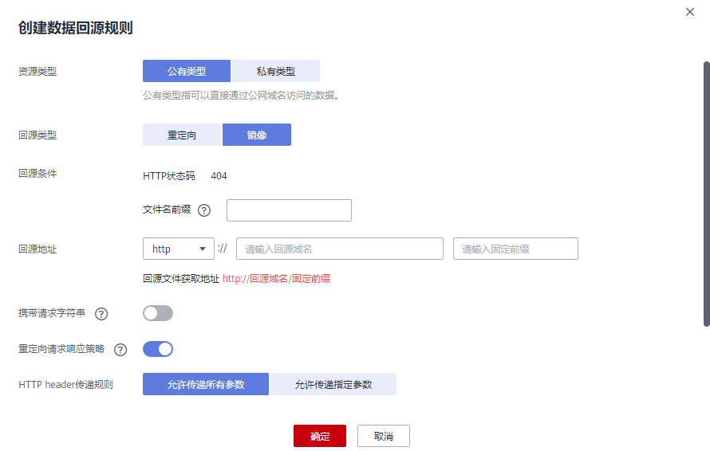
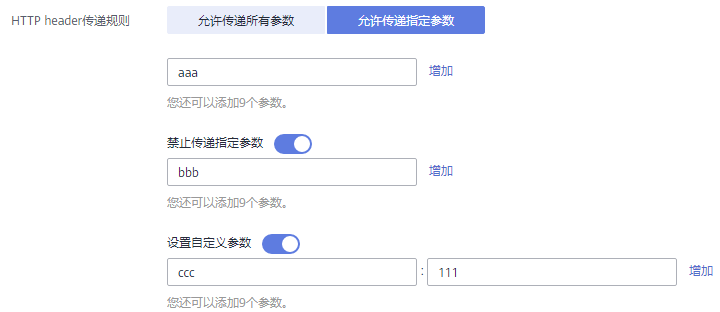

# 创建数据回源规则<a name="obs_03_0006"></a>

## 操作场景<a name="section124576141474"></a>

请参见[数据回源简介](数据回源简介.md)。

## 约束与限制<a name="section85821827134713"></a>

请参见[数据回源简介](数据回源简介.md)。

## 创建镜像回源规则<a name="section1351444312277"></a>

1.  在OBS管理控制台左侧导航栏选择“对象存储“。
2.  在桶列表单击待操作的桶，进入“概览”页面。
3.  在左侧导航栏选中“数据回源”，进入“数据回源”页面。
4.  单击“创建规则”。

    **图 1**  创建镜像回源规则<a name="fig1852615672816"></a>  
    

5.  配置镜像回源规则参数，参数说明如[表1](#table1511264453015)。

    **表 1**  镜像回源规则参数说明

    <a name="table1511264453015"></a>
    <table><thead align="left"><tr id="row41131644103014"><th class="cellrowborder" valign="top" width="27.339999999999996%" id="mcps1.2.3.1.1"><p id="p3113194413304"><a name="p3113194413304"></a><a name="p3113194413304"></a>参数</p>
    </th>
    <th class="cellrowborder" valign="top" width="72.66%" id="mcps1.2.3.1.2"><p id="p1211314448301"><a name="p1211314448301"></a><a name="p1211314448301"></a>说明</p>
    </th>
    </tr>
    </thead>
    <tbody><tr id="row16113194483014"><td class="cellrowborder" valign="top" width="27.339999999999996%" headers="mcps1.2.3.1.1 "><p id="p111131544163011"><a name="p111131544163011"></a><a name="p111131544163011"></a>资源类型</p>
    </td>
    <td class="cellrowborder" valign="top" width="72.66%" headers="mcps1.2.3.1.2 "><p id="p2011364443017"><a name="p2011364443017"></a><a name="p2011364443017"></a>设置回源地址（源站）的类型。镜像回源只支持公有类型，表示源站数据可以通过公网域名访问。</p>
    </td>
    </tr>
    <tr id="row811314493016"><td class="cellrowborder" valign="top" width="27.339999999999996%" headers="mcps1.2.3.1.1 "><p id="p411334416305"><a name="p411334416305"></a><a name="p411334416305"></a>回源类型</p>
    </td>
    <td class="cellrowborder" valign="top" width="72.66%" headers="mcps1.2.3.1.2 "><p id="p1011317440309"><a name="p1011317440309"></a><a name="p1011317440309"></a>选择“镜像”。</p>
    <p id="p4349115312337"><a name="p4349115312337"></a><a name="p4349115312337"></a>客户端发送满足回源条件的请求后，OBS将以镜像回源的方式去源站获取资源，将该资源上传到OBS中并返回给客户端。</p>
    </td>
    </tr>
    <tr id="row1611314493010"><td class="cellrowborder" valign="top" width="27.339999999999996%" headers="mcps1.2.3.1.1 "><p id="p9113114483014"><a name="p9113114483014"></a><a name="p9113114483014"></a>回源条件</p>
    </td>
    <td class="cellrowborder" valign="top" width="72.66%" headers="mcps1.2.3.1.2 "><p id="p1111317447305"><a name="p1111317447305"></a><a name="p1111317447305"></a>设置回源规则的触发条件。</p>
    <p id="p13113164413010"><a name="p13113164413010"></a><a name="p13113164413010"></a>回源条件由<strong id="b151131344153011"><a name="b151131344153011"></a><a name="b151131344153011"></a>HTTP状态码</strong>和<strong id="b1113144443010"><a name="b1113144443010"></a><a name="b1113144443010"></a>文件名前缀</strong>共同确定，表示访问桶中符合文件名前缀要求的对象时，如果对象不存在（返回404错误），则满足回源条件。</p>
    <p id="p110882694518"><a name="p110882694518"></a><a name="p110882694518"></a>文件名前缀输入规则：</p>
    <a name="ul2122184334514"></a><a name="ul2122184334514"></a><ul id="ul2122184334514"><li>不能超过1023个字符。</li><li>不能与已有回源规则配置的文件名前缀存在相互包含或重叠的关系。</li><li>如果不输入，则表示配置到尚未匹配桶内任何回源规则的文件。仅能配置一条文件名前缀为空的回源规则。</li></ul>
    <p id="p611364417306"><a name="p611364417306"></a><a name="p611364417306"></a>示例：配置123/前缀，访问桶中123/456.txt文件时会触发回源规则。</p>
    </td>
    </tr>
    <tr id="row17113194463015"><td class="cellrowborder" valign="top" width="27.339999999999996%" headers="mcps1.2.3.1.1 "><p id="p16113124453014"><a name="p16113124453014"></a><a name="p16113124453014"></a>回源地址</p>
    </td>
    <td class="cellrowborder" valign="top" width="72.66%" headers="mcps1.2.3.1.2 "><p id="p1311384433015"><a name="p1311384433015"></a><a name="p1311384433015"></a>设置回源地址（源站地址）。</p>
    <p id="p1844447163712"><a name="p1844447163712"></a><a name="p1844447163712"></a>格式：http或https://回源域名/固定前缀</p>
    <a name="ul7195132184013"></a><a name="ul7195132184013"></a><ul id="ul7195132184013"><li>回源域名为源站的域名。</li><li>固定前缀为目标文件所在的目录信息，例如固定前缀配置123/，表示目标文件在123/目录下。</li></ul>
    </td>
    </tr>
    <tr id="row1911334453018"><td class="cellrowborder" valign="top" width="27.339999999999996%" headers="mcps1.2.3.1.1 "><p id="p101131444305"><a name="p101131444305"></a><a name="p101131444305"></a>携带请求字符串</p>
    </td>
    <td class="cellrowborder" valign="top" width="72.66%" headers="mcps1.2.3.1.2 "><p id="p1111315441308"><a name="p1111315441308"></a><a name="p1111315441308"></a>开启后，会将请求URL中查询参数传递到源站。</p>
    </td>
    </tr>
    <tr id="row611394403014"><td class="cellrowborder" valign="top" width="27.339999999999996%" headers="mcps1.2.3.1.1 "><p id="p1811310440302"><a name="p1811310440302"></a><a name="p1811310440302"></a>重定向请求响应策略</p>
    </td>
    <td class="cellrowborder" valign="top" width="72.66%" headers="mcps1.2.3.1.2 "><p id="p1438951824414"><a name="p1438951824414"></a><a name="p1438951824414"></a>开启后，如果源站配置了重定向，会跟踪源站的3xx重定向请求，前往重定向的目标获取资源，并将该资源保存到OBS上。最多跟随10次重定向。</p>
    </td>
    </tr>
    <tr id="row470011354318"><td class="cellrowborder" valign="top" width="27.339999999999996%" headers="mcps1.2.3.1.1 "><p id="p170073204313"><a name="p170073204313"></a><a name="p170073204313"></a>HTTP header传递规则</p>
    </td>
    <td class="cellrowborder" valign="top" width="72.66%" headers="mcps1.2.3.1.2 "><p id="p889121855714"><a name="p889121855714"></a><a name="p889121855714"></a>可以通过设置HTTP header传递规则，规定客户端发送给OBS的请求经过镜像回源由OBS传递给源站时，允许传递的HTTP header参数。<a href="#section12897469719">相关参考</a>中提供了一个配置示例供参考，同时列出了不支持的HTTP header。</p>
    <a name="ul144046226578"></a><a name="ul144046226578"></a><ul id="ul144046226578"><li><strong id="b134481620142611"><a name="b134481620142611"></a><a name="b134481620142611"></a>允许传递所有参数/允许传递指定参数</strong>：设置允许传递的HTTP header参数。</li><li><strong id="b19453102214264"><a name="b19453102214264"></a><a name="b19453102214264"></a>禁止传递指定参数</strong>：设置禁止传递的HTTP header参数。当客户端请求携带此header时，OBS不会传递给源站。当禁止和允许规则冲突时，禁止规则优先。</li><li><strong id="b83906248261"><a name="b83906248261"></a><a name="b83906248261"></a>设置自定义参数</strong>：给指定header设置自定义取值，如果客户端请求携带此header，OBS在传递给源站时会将header取值修改为自定义的取值。</li></ul>
    </td>
    </tr>
    <tr id="row145152220434"><td class="cellrowborder" valign="top" width="27.339999999999996%" headers="mcps1.2.3.1.1 "><p id="p5515222434"><a name="p5515222434"></a><a name="p5515222434"></a>IAM委托</p>
    </td>
    <td class="cellrowborder" valign="top" width="72.66%" headers="mcps1.2.3.1.2 "><p id="p145152216434"><a name="p145152216434"></a><a name="p145152216434"></a>镜像回源需使用IAM委托功能，委托OBS获取源站数据。委托需要给OBS服务授予“Tenant Administrator”权限。若无合适的IAM委托，则可创建一个新的IAM委托，请参考<a href="创建IAM委托.md">创建IAM委托</a>。</p>
    </td>
    </tr>
    </tbody>
    </table>

6.  单击“确定”。

## 相关参考<a name="section12897469719"></a>

**镜像回源的HTTP header传递规则参数配置示例**

假设参数配置如[图2](#fig10747159131014)所示。

**图 2**  HTTP header传递规则配置示例<a name="fig10747159131014"></a>  


根据上述规则，如果客户端发送到OBS请求的header部分如下所示：

```
GET /ObjectName HTTP/1.1 
Host: bucketname.obs.cn-north-4.myhuaweicloud.com 
aaa:aaa
bbb:bbb
ccc:ccc
```

在触发镜像回源规则后，OBS发送给源站的请求如下：

```
GET /ObjectName HTTP/1.1 
Host: source.com 
aaa:aaa
ccc:111
```

以下HTTP header类型不支持从客户端透传到源站：

1.  以下前缀开头的HTTP header：
    -   x-obs-

2.  所有标准HTTP header，例如：
    -   Content-Length
    -   Authorization2
    -   Authorization
    -   Range
    -   Date


