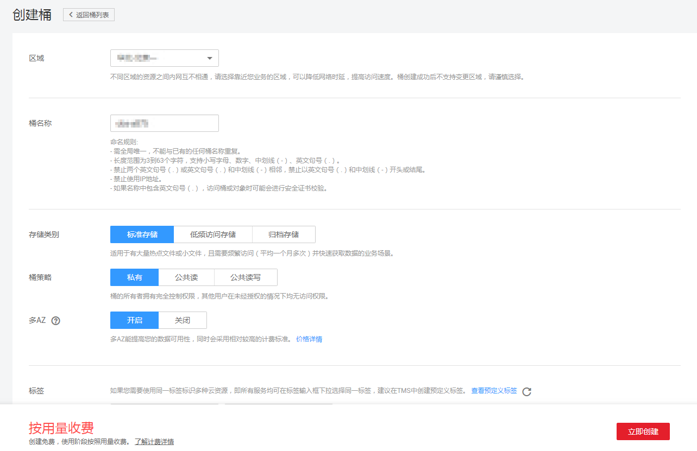

# 创建桶

您可以通过OBS管理控制台创建桶。桶是OBS中存储对象的容器。您需要先创建一个桶，然后才能在OBS中存储数据。

> **说明：**   
>一个账号在控制台上可创建100个桶。  

## 操作步骤

1.  在OBS管理控制台左侧导航栏选择“对象存储“。
2.  在页面右上角单击“创建桶”，系统弹出如[图1](#obs_03_0306_fig132483331152)所示的页面。

    **图 1**  创建桶  
    

3.  配置桶参数。

    **表 1**  桶参数说明

    
    <table><thead align="left"><tr id="obs_03_0306_row13210518113615"><th class="cellrowborder" valign="top" width="20.22%" id="mcps1.2.3.1.1">
参数

    </th>
    <th class="cellrowborder" valign="top" width="79.78%" id="mcps1.2.3.1.2">
描述

    </th>
    </tr>
    </thead>
    <tbody><tr id="obs_03_0306_row721018185364"><td class="cellrowborder" valign="top" width="20.22%" headers="mcps1.2.3.1.1 ">
区域

    </td>
    <td class="cellrowborder" valign="top" width="79.78%" headers="mcps1.2.3.1.2 ">
桶所属区域。请选择靠近您业务的区域，以降低网络时延，提高访问速度。桶创建成功后，不支持变更区域，请谨慎选择。

    
如果希望ECS通过内网访问OBS桶，需要确保桶和ECS属于同一个区域，详情请参见<a href="https://support.huaweicloud.com/bestpractice-obs/obs_05_0410.html" target="_blank" rel="noopener noreferrer">在ECS上通过内网访问OBS</a>。

    </td>
    </tr>
    <tr id="obs_03_0306_row5210191811368"><td class="cellrowborder" valign="top" width="20.22%" headers="mcps1.2.3.1.1 ">
数据冗余存储策略

    </td>
    <td class="cellrowborder" valign="top" width="79.78%" headers="mcps1.2.3.1.2 "><ul id="obs_03_0306_ul1073193410598"><li>多AZ存储：数据冗余存储至多个可用区（AZ），可靠性更高。</li><li>单AZ存储：数据仅存储在单个可用区（AZ），成本更低。</li></ul>
    
请根据业务情况提前规划数据冗余存储策略，桶一旦创建成功，数据冗余存储策略就确定了，后续无法更改。

    
归档存储类别的桶不支持多AZ存储。

    </td>
    </tr>
    <tr id="obs_03_0306_row321061820361"><td class="cellrowborder" valign="top" width="20.22%" headers="mcps1.2.3.1.1 ">
桶名称

    </td>
    <td class="cellrowborder" valign="top" width="79.78%" headers="mcps1.2.3.1.2 ">
桶的名称。需全局唯一，不能与已有的任何桶名称重复，包括其他用户创建的桶。桶创建成功后，不支持修改名称，创建时，请设置合适的桶名。

    
OBS中桶按照DNS规范进行命名，DNS规范为全球通用规则，其具体命名规则如下：

    <ul id="obs_03_0306_ul5989254594432"><li>需全局唯一，不能与已有的任何桶名称重复，包括其他用户创建的桶。</li><li>长度范围为3到63个字符，支持小写字母、数字、中划线（-）、英文句号（.）。</li><li>禁止两个英文句号（.）或英文句号（.）和中划线（-）相邻，禁止以英文句号（.）和中划线（-）开头或结尾。</li><li>禁止使用IP地址。</li><li>如果名称中包含英文句号（.），访问桶或对象时可能会进行安全证书校验。</li></ul>
    </td>
    </tr>
    <tr id="obs_03_0306_row132101185362"><td class="cellrowborder" valign="top" width="20.22%" headers="mcps1.2.3.1.1 ">
存储类别

    </td>
    <td class="cellrowborder" valign="top" width="79.78%" headers="mcps1.2.3.1.2 ">
桶的存储类别。不同的存储类别可以满足客户业务对存储性能、成本的不同诉求。

    <ul id="obs_03_0306_ul386215378248"><li>标准存储：适用于有大量热点文件或小文件，且需要频繁访问（平均一个月多次）并快速获取数据的业务场景。</li><li>低频访问存储：适用于不频繁访问（平均一年少于12次），但需要快速获取数据的业务场景。</li><li>归档存储：适用于很少访问（平均一年一次），且对数据获取速率要求不高的业务场景。</li></ul>
    
更多详情请参见<a href="存储类别简介.md">存储类别简介</a>。

    </td>
    </tr>
    <tr id="obs_03_0306_row162107185362"><td class="cellrowborder" valign="top" width="20.22%" headers="mcps1.2.3.1.1 ">
桶策略

    </td>
    <td class="cellrowborder" valign="top" width="79.78%" headers="mcps1.2.3.1.2 ">
桶的读写权限控制。

    <ul id="obs_03_0306_ul3921758194016"><li>私有：除桶ACL授权外的其他用户无桶的访问权限。</li><li>公共读：任何用户都可以对桶内对象进行读操作。</li><li>公共读写：任何用户都可以对桶内对象进行读/写/删除操作。</li></ul>
    </td>
    </tr>
    <tr id="obs_03_0306_row521061883619"><td class="cellrowborder" valign="top" width="20.22%" headers="mcps1.2.3.1.1 ">
默认加密

    </td>
    <td class="cellrowborder" valign="top" width="79.78%" headers="mcps1.2.3.1.2 ">
开启桶默认加密后，上传到桶中的对象都会被加密，KMS密钥会默认选中“obs/default”。您也可以通过单击“创建KMS密钥”进入数据加密服务页面创建的自定义的密钥加密上传对象，然后通过KMS密钥的下拉框选中您创建的KMS密钥。

    
若桶已开启了默认加密，上传对象会继承桶的KMS加密特性。

    </td>
    </tr>
    <tr id="obs_03_0306_row2210418173619"><td class="cellrowborder" valign="top" width="20.22%" headers="mcps1.2.3.1.1 ">
归档数据直读

    </td>
    <td class="cellrowborder" valign="top" width="79.78%" headers="mcps1.2.3.1.2 ">
通过归档数据直读，您可以直接下载存储类别为归档存储的对象，而无需提前恢复。归档数据直读会收取相应的费用，详见<a href="https://www.huaweicloud.com/pricing.html?tab=detail#/obs" target="_blank" rel="noopener noreferrer">产品价格详情</a>。

    </td>
    </tr>
    <tr id="obs_03_0306_row114484458504"><td class="cellrowborder" valign="top" width="20.22%" headers="mcps1.2.3.1.1 ">
企业项目（可选）

    </td>
    <td class="cellrowborder" valign="top" width="79.78%" headers="mcps1.2.3.1.2 ">
将桶加入到企业项目中统一管理。

    
请参见<a href="https://support.huaweicloud.com/usermanual-em/zh-cn_topic_0108763964.html" target="_blank" rel="noopener noreferrer">创建企业项目</a>先完成企业项目创建，默认为default企业项目。

    
在企业项目界面<a href="https://support.huaweicloud.com/usermanual-em/zh-cn_topic_0108763964.html" target="_blank" rel="noopener noreferrer">创建企业项目</a>，然后将<a href="https://support.huaweicloud.com/usermanual-em/zh-cn_topic_0109989489.html" target="_blank" rel="noopener noreferrer">用户组添加到该企业项目</a>。这时用户组内用户将获得用户组授权的该企业项目下的桶和对象的操作权限。

    
 说明： 

仅企业账号能够配置企业项目。

    
OBS的企业项目用户组的细粒度授权为“OBS ReadOnlyAccess”和“OBS OperateAccess”。

    

    </td>
    </tr>
    <tr id="obs_03_0306_row179244845019"><td class="cellrowborder" valign="top" width="20.22%" headers="mcps1.2.3.1.1 ">
标签（可选）

    </td>
    <td class="cellrowborder" valign="top" width="79.78%" headers="mcps1.2.3.1.2 ">
标签用于标识OBS中的桶，以此达到对OBS中的桶进行分类的目的。OBS以键值对的形式来描述标签，每个标签有且只有一对键值。有关添加标签的信息，请参见<a href="标签简介.md">标签简介</a>。

    </td>
    </tr>
    </tbody>
    </table>

4.  单击“立即创建”。

## 相关操作

您可以在创建桶时指定桶的存储类别，也可以在创建后修改桶的存储类别。修改步骤如下：

1.  在OBS管理控制台左侧导航栏选择“对象存储“。
2.  在桶列表中，选择待操作的桶，并单击右侧的“修改存储类别”。
3.  选择目标存储类别，并单击“确定”。

    > **说明：**   
    >-   修改桶的存储类别后，不会影响已存储在桶内的对象的存储类别。  
    >-   上传对象时，默认的对象存储类别与桶的存储类别一致。当桶存储类别修改后，新上传对象时的默认对象存储类别随之修改。  

